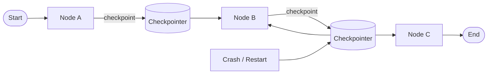

# Durable execution

> **Learning Path:** AI Orchestration
> **Section:** 13.1.14 — LangGraph concepts

**Durable execution**

### 1. The problem

LLM agents are not single request-response calls. They are multi-step workflows with state, tools, and often human-in-the-loop.

The problem appears when:
* A workflow takes minutes to hours and makes expensive LLM + tool calls
* A process crashes, pod restarts, or a user disconnects mid-workflow
* You need to resume exactly where you left off, not re-run from start

Without durability, a crash means lost context, duplicated work, inconsistent side effects, and angry users. Re-running a 20-step agent from scratch wastes money and can produce different results because LLMs are non-deterministic.

Constraints created by AI orchestration:
* State must survive process death
* Side effects must not be repeated
* Progress must be observable and pausable

### 2. Mental model

Think of a state machine with a persistent journal.

Each step in the graph is a node. After the node runs, the machine writes a checkpoint: *which node we were at, what the state was, what inputs produced it*. If the process dies, a new process reads the latest checkpoint and continues from the next edge.

It is not about making the code crash-proof. It is about making execution *replayable*.

### 3. How it works

LangGraph models workflows as a graph of nodes with a shared State. Durable execution is provided by a checkpointer.

Essentially:
* **Thread identity**: `thread_id` identifies a running conversation/workflow instance
* **Checkpoint**: after each node execution, LangGraph serializes the state graph, current node, and metadata to an external store
* **Resume**: on restart, LangGraph loads the latest checkpoint for that thread and re-hydrates the graph, then continues from the next step

The checkpointer is an abstraction. The store can be SQLite for dev, Postgres for production, Redis for low-latency, etc. The graph itself does not change; only the persistence layer does.

This gives you three capabilities architects care about:
* **Crash recovery**: pick up after failure
* **Pause / human-in-the-loop**: wait for external input, then resume
* **Observability**: inspect the exact state history of any run

### 4. Architectural reasoning

When it helps:
* Long-running, multi-step agents with tool calls and external writes
* Workflows that must survive deployments, autoscaling, and node failures
* Compliance/audit requirements where you need a reproducible execution trail

What it solves vs alternatives:
* **In-memory state**: fast, but lost on restart. Fine for stateless chat.
* **Manual persistence**: you can write state yourself after each step, but you reinvent checkpointing, idempotency, and replay logic.
* **General workflow engines like Temporal**: durable by default but heavier operationally. LangGraph's checkpointer gives you durability with a graph-first model tuned for LLM agents.

Decision point: If the cost of re-running is high and the workflow has side effects, durability is not optional. If the workflow is cheap, idempotent, and short-lived, durability adds latency and storage for little benefit.

### 5. Trade-offs and failure modes

* **Latency vs safety**: writing a checkpoint after every node adds I/O. Batching reduces durability granularity.
* **State size**: large state = large checkpoints. Keep state minimal; store large artifacts by reference.
* **Consistency**: a crash mid-write can corrupt a checkpoint. Use transactional stores and versioned checkpoints.
* **Idempotency**: resuming must not double-execute tools. Nodes should be designed to be safely replayable or guarded by the checkpoint.
* **Operational complexity**: you now own a persistence store, its backups, retention, and migration. Checkpoint schema changes require migration planning.

Failure modes architects remember:
* Stale checkpoint after a bug fix -> old logic resumes on new code. Use checkpoint versioning.
* Non-deterministic node output -> replay yields different results. Pin randomness or make nodes deterministic given state.
* Unbounded history -> storage cost and slow loads. Prune old threads.

### 6. Example

Enterprise loan review agent:

1. Ingest application → 2. Call credit API → 3. LLM risk summary → 4. Human review gate → 5. Approve/deny → 6. Write to CRM

Step 4 pauses for hours waiting for a human. The pod is scaled down overnight. With durable execution, the thread resumes in the morning at the human review gate with full context intact, no re-calling credit API. If the service crashes after step 3, it resumes at step 3's checkpoint instead of re-ingesting the application.

### 7. Reasoning challenge

You are designing a customer support chatbot that is stateless per turn, but you want to offer a premium feature: "continue my multi-step refund workflow tomorrow". 

Do you enable durable execution for all users, only premium, or build a separate manual resume flow with summary prompts? What is the cost driver and what failure mode worries you most?

### 8. Key takeaway

* Durable execution exists to make long, stateful LLM workflows survive crashes and pauses without losing work or duplicating side effects
* It is checkpointing of graph state to an external store, not magic fault tolerance
* Choose it when re-run cost, side effects, or human-in-the-loop make restarting unacceptable
* Pay attention to checkpoint latency, state size, idempotency, and store operability
