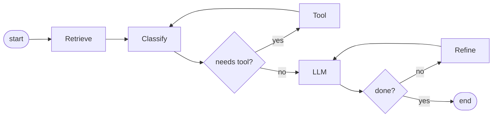

# Workflow engines

> **Learning Path:** AI Orchestration
> **Section:** 13.1.15 — LangGraph concepts

**Workflow engines for AI: LangGraph concepts**

### The problem

A single LLM call is stateless and non-deterministic. Real agents need:
* Multi-step work: retrieve → reason → call tool → reason again
* Branching: if answer is confident → return, else → ask clarification
* Loops: retry a tool, self-correct, iterate until criteria met
* Memory across steps and the ability to resume after failure or human approval

Plain code with `if/else` and global state works for one prototype. It breaks at scale: flows become spaghetti, state is scattered, retries are manual, observability is poor, and you cannot reliably replay or audit a run.

The constraint is not the model, it is control. You need a deterministic control plane over non-deterministic compute.

### Mental model

Think of a workflow engine as a **state machine with a shared state object** that moves through nodes.

Nodes are units of work: LLM call, tool call, human task, condition check.
Edges are the control flow: next node, branch, or loop back.
State is the single source of truth carried between nodes: messages, documents, tools outputs, metadata.

LangGraph is that model for LLM apps: a directed graph where execution is stateful, interruptible, and checkpointed.

The graph is declarative. Execution is managed for you.

### How it works

Three primitives matter:

* **State graph, not linear chain.** Nodes are added, edges define transitions. Cycles are first-class for retries and refinement.
* **State as explicit object.** All data lives in a typed state dict. Nodes read what they need, write what they produce. No hidden globals.
* **Checkpoints.** Every step can be persisted. This gives you pause/resume, human-in-the-loop interrupts, and replay for debugging. The engine knows where you are.

Conditional edges are the decision points. A node returns a routing key, the engine picks the next node. That replaces ad-hoc branching in code.

### Architectural reasoning

When it helps:
* Multi-step agentic flows with tools, retries, and branching
* Need for durability: long running jobs, human approval, crash recovery
* Observability and audit: you need to know which path was taken and with what state
* Reusability: same subgraph used in multiple workflows

Alternatives:
* Simple chain / prompt chaining. Good for one-shot transformations with no branching.
* Orchestration in application code. Works for small, stable flows. Cost grows with complexity.
* General workflow engines like Temporal / AWS Step Functions. Excellent for durable business processes, heavier operational overhead for LLM-specific state like messages.

Choose a graph when control flow is non-trivial and state must survive interruptions. Don't use it to wrap a single LLM call.

### Trade-offs and failure modes

* **Complexity vs flexibility.** Graphs are powerful but add cognitive overhead. Small flows become harder to read than 20 lines of code.
* **State bloat.** State is carried through the whole graph. Unbounded message history or large blobs increase memory, checkpoint size, and latency. You must prune.
* **Non-determinism leaks.** The graph is deterministic, nodes are not. You still need guardrails, timeouts, and retry policies inside nodes.
* **Debugging.** Execution path depends on model output. Logging state transitions and routing decisions is essential, otherwise failures look random.
* **Latency and cost.** Loops and retries multiply LLM calls. You need max iterations and cost controls.

Failure mode to watch: an infinite loop caused by a condition that never becomes true. Always bound loops with counters in state.

### Example

Enterprise support triage:
1. `retrieve` tickets and customer profile
2. `classify` intent via LLM
3. Condition: if high severity → `create_incident` and route to human
4. Else if needs tool → call knowledge base, loop back to classify
5. Else `draft_reply` → `check_quality` → if low confidence → `refine` then loop
6. On success → `send_reply` and persist checkpoint

State holds `messages`, `intent`, `tool_outputs`, `confidence`, `attempts`. Human approval is an interrupt: graph pauses at a node, waits for input, then resumes with updated state.

### Reasoning challenge

You need a one-off nightly summarization of support tickets: fetch tickets, summarize each, write summary to DB. No branching, no tools, no human review, no retries needed.

Would you use LangGraph? Why or why not?

### Key takeaway

* Workflow engines separate **control flow** from **model logic**. The graph is deterministic; nodes can be non-deterministic.
* State + checkpoints give you durability, replay, and human-in-the-loop.
* Use graphs when you need branching, loops, retries, and observable long-running execution. Avoid them for simple linear transformations.
* The main costs are state management, loop safety, and added complexity. Design state schema and iteration bounds first.
