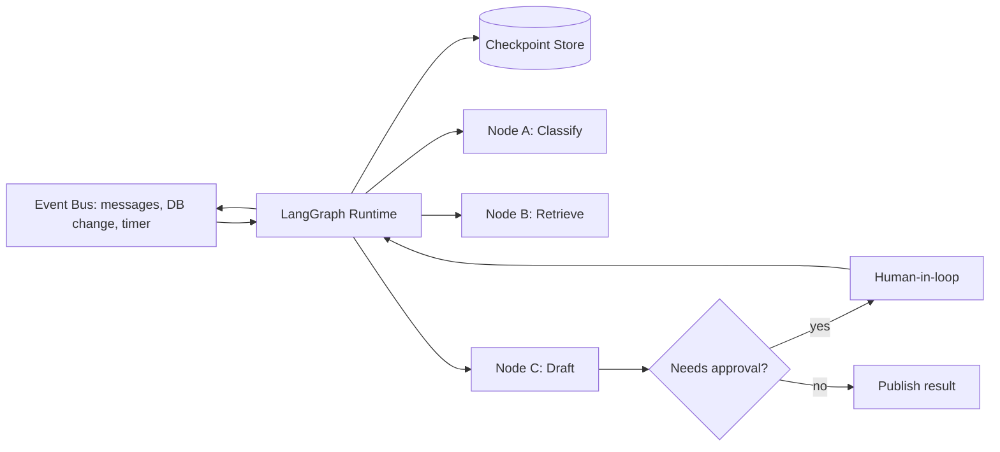

# Event-driven AI

> **Learning Path:** AI Orchestration
> **Section:** 13.1.16 — LangGraph concepts

**Event-driven AI with LangGraph concepts**

### 1. The problem

A request-response chatbot works for a single turn. It fails for production agents.

What appears when you need:
- An agent that stays alive for hours/days and reacts to messages, DB changes, tool results, and human approvals
- Multiple triggers for the same agent: Slack message, support ticket created, payment failed
- Partial work, pause for human input, then resume with context intact
- Retry, replay, and observability after failure

Stateless chains lose context between calls. Polling wastes cost and adds latency. A monolithic loop becomes untestable.

You need reactive execution with durable state.

### 2. Mental model

Think of an agent as a state machine, not a function.

Events push the machine forward. Nodes are actions. Edges are decisions. State persists between events.

LangGraph is the runtime for that machine. It gives you a directed graph of nodes with a shared, checkpointed state. An external event injects into the graph, it resumes from the last checkpoint, runs until a terminal or an interrupt, then waits for the next event.

### 3. How it works

The essential mechanism is **stateful graph + event-driven scheduling**.

* State is explicit and typed. It lives outside the nodes and is persisted to a checkpoint store.
* Nodes are pure functions: `state -> state + output`.
* Edges are conditional. The graph can branch, loop, and revisit nodes.
* Interrupts let the runtime pause execution and wait for an external event: human approval, tool completion, new message.
* The runtime streams tokens and state updates, so producers and consumers are decoupled.

Execution is pull by the runtime, push by the world.

### 4. Architectural reasoning

When it helps:
* Long-running workflows with human-in-the-loop
* Agents that must react to multiple asynchronous sources
* Need for replay, audit, and exact recovery after crash

What it solves vs alternatives:
* Polling + stateless chain: cheap to start, expensive to operate, loses context, hard to resume
* Event-driven graph: higher upfront complexity, but correct handling of partial progress, backpressure, and ordering

Why choose it: you trade simplicity for correctness over time. If the agent must remember what it did, why it did it, and be able to continue after an interruption, a stateful graph is the right primitive.

### 5. Trade-offs and failure modes

* **State management cost.** Every step is checkpointed. Store size, write latency, and consistency matter. Pick the right store for your durability needs.
* **Ordering and idempotency.** Events can arrive out of order or duplicate. Nodes must be idempotent and state transitions must be deterministic given state+event.
* **Complexity of cycles.** Loops are powerful but create infinite loops and livelock if termination conditions are weak.
* **Observability.** Graph execution is harder to debug than a linear chain. You need node-level tracing and state diffs.
* **Latency vs durability.** Strong checkpointing adds latency. Weak checkpointing risks lost work.

Failure modes architects hit: unbounded state growth, missed interrupts causing stuck workflows, and replay storms after a downstream outage.

### 6. Example

Customer support triage agent.

Events: new Zendesk ticket created, Slack escalation, payment failure webhook, human approval.

Graph:
`Classify` -> `Retrieve context` -> `Draft response` -> `Needs approval?` -> `Human review` or `Send`.

The agent is paused at the interrupt until a human approves. The checkpoint stores the draft and context. If the service restarts, the runtime reloads the last checkpoint and resumes waiting. A new event for a different ticket starts a new graph instance with isolated state.

No polling, no lost context.

### 7. Reasoning challenge

You need a real-time fraud detection agent that scores transactions as they stream in, with a manual review step for high-risk scores.

Would you build it as an event-driven LangGraph with interrupts, or as a stateless function invoked per transaction with an external orchestrator handling review?

What happens to state, latency, and replayability in each design?

### 8. Key takeaway

* Event-driven AI is about reacting to external events while preserving durable state across invocations.
* LangGraph provides a stateful, checkpointed graph runtime that makes reactive agents testable and recoverable.
* Choose it when longevity, human-in-the-loop, and replay matter more than minimal latency and simplicity.
* Design for idempotent nodes, explicit state, and bounded loops. Expect to pay for state storage and observability.
