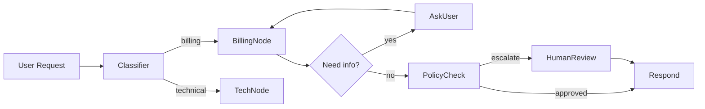

# n8n-style automation

> **Learning Path:** AI Orchestration
> **Section:** 13.1.18 — LangGraph concepts

**The problem**

In n8n you wire nodes: Trigger → HTTP → Transform → DB. The workflow is explicit, state flows through, and you can branch, loop, and retry.

With LLM agents the first attempts look similar: Prompt → LLM → Tool → LLM. That works until you need real control.

What breaks:
* Non-determinism: the same input can route to different tools.
* State loss: each LLM call forgets prior reasoning unless you manually re-prompt.
* Loops: an agent needs to retry a failed tool, ask clarifying questions, or revisit a decision.
* Observability: you need to know *why* the agent took a path, not just the final output.

Linear chains and ad-hoc orchestration code become spaghetti when you add branching, human-in-the-loop, and recovery.

**Mental model**

Think n8n, but the nodes are agent capabilities.

* Node = a unit of work: LLM call, tool call, human approval, guardrail check.
* Edge = how execution moves, often conditional on state.
* State = the shared execution context that persists across nodes.

LangGraph is that model formalized for agents: a stateful directed graph where execution is a walk through nodes with persistent state, not a one-shot chain.

Same wiring mental model as n8n, different node types.

**How it works**

Three primitives matter architecturally:

* **State object:** Typed dict that lives for the whole execution. Nodes read and write to it. This replaces re-prompting the whole history.
* **Nodes:** Pure functions `state -> state`. Can be LLM, tool, or code.
* **Conditional edges:** Routing is a function of state, e.g. `if state.confidence < 0.8: go to clarify`. This gives you deterministic control over non-deterministic LLM output.

A checkpointer persists state between steps, enabling pause/resume, retries, and long-running workflows. Execution is just `while graph hasn't terminated: next node = policy(state)`.

**Architectural reasoning**

When it helps:
* Multi-step agents with loops and backtracking, e.g. research → summarize → verify.
* Workflows requiring human-in-the-loop or external approvals.
* Need for replay/observability: you can inspect state at each node.

Alternatives:
* Linear LangChain chains: simpler, faster to prototype, but no branching/loops.
* Custom orchestration code: maximum flexibility, maximum maintenance.
* General workflow engines like n8n/Airflow: great for deterministic ops, weak for LLM state and conditional reasoning.

Choose LangGraph when the *logic of control* is as important as the LLM calls themselves. If you only need prompt → tool → answer, don't pay the graph tax.

**Trade-offs and failure modes**

* Complexity cost: Graphs are easy to draw, hard to debug when cycles are unbounded. You need explicit termination conditions.
* State design is load-bearing: a poorly designed state schema creates coupling and silent bugs. Treat state as a contract.
* Latency and cost: each node is a hop. Checkpointing adds persistence overhead.
* Failure modes: infinite loops from bad conditional edges, state bloat from storing large artifacts, and non-idempotent tools causing drift on retry.

Operability matters: you need tracing per node, versioned graphs, and tests for routing logic, not just LLM outputs.

**Example**

Enterprise support triage:

State = `{messages, intent, ticket_data, needs_clarification, approved}`
Nodes = `ClassifyIntent`, `RetrieveKB`, `DraftReply`, `PolicyCheck`, `AskUser`, `HumanReview`.

Execution: Classify → Retrieve → Draft. PolicyCheck reads state and routes to HumanReview if refund > $500. If KB confidence low, AskUser runs, then loop back to Draft. State persists the conversation and retrieved docs, so the LLM doesn't re-summarize each time.

This is n8n-style wiring applied to an agent: visible flow, retryable steps, and a single source of truth for state.

**Reasoning challenge**

You need an agent that can generate a sales proposal, run pricing calculations, and get manager approval before sending. Pricing must be recalculated if the customer negotiates, and the whole flow must survive a 30-minute human review pause.

Would you model this as a linear chain with manual re-prompting, a LangGraph with a checkpointer, or an n8n workflow with LLM nodes? What state do you *not* want to persist?

**Key takeaway**

* Agents need explicit control flow, not just better prompts.
* LangGraph gives you n8n-style nodes + edges with persistent, typed state for LLM workflows.
* Use it when branching, loops, retries, and human-in-the-loop are first-class requirements.
* Design the state schema first, keep nodes pure, and make termination and observability explicit.
