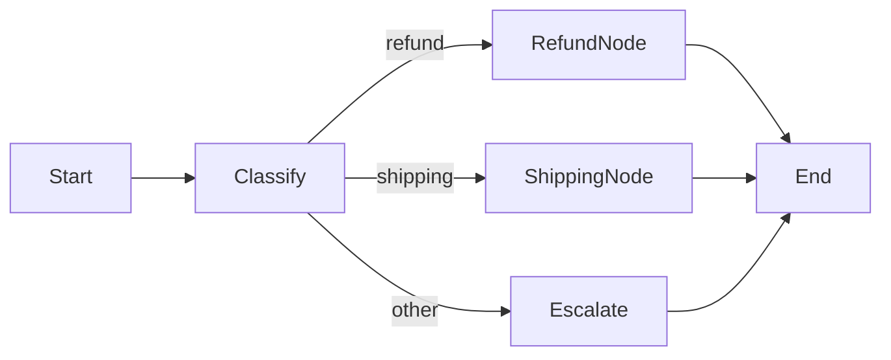
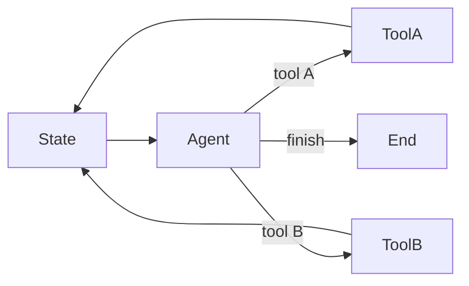

# Deterministic vs agentic orchestration

> **Learning Path:** AI Orchestration
> **Section:** 13.1.19 — LangGraph concepts

**Deterministic vs agentic orchestration**

### 1. The problem

AI workflows need to be both reliable and flexible. Early LLM pipelines were linear: prompt → model → output. That breaks when you need branching, retries, tool use, or stateful conversation.

Two constraints emerge:

* **Predictability:** You need auditability, testability, bounded cost and latency for production systems.
* **Adaptability:** Real user inputs are messy. You need the system to decide which tools to call, when to stop, or how to recover from failure.

Deterministic orchestration solves the first. Agentic orchestration solves the second. The architectural decision is where to draw the line.

### 2. Mental model

Think of a train network vs an autonomous vehicle fleet.

* **Deterministic orchestration** is the railway. The graph of nodes and edges is defined up front. The runtime only decides *which pre-defined track* to take based on data. The control flow is fixed, the data is variable.
* **Agentic orchestration** is the fleet. The LLM itself is a router and actor. It decides the next action, which tool to call, and when to stop. The control flow is variable, and the data is variable.

In LangGraph both live in the same framework. The difference is who owns the decision of *what happens next*.

### 3. How it works

LangGraph models a workflow as a graph of nodes with typed state.

**Deterministic:**
Nodes are tools, transforms, or LLM calls. Edges are conditional but the set of possible edges is fixed at build time.

The `Classify` node may be an LLM, but its output is mapped to a known enum. Routing logic is code, not the model.

**Agentic:**
A loop with a supervisor/agent node that reads state and emits an action. The action can be `call_tool`, `ask_user`, or `finish`. The graph is technically fixed, but the *effective* path is chosen by the model at runtime.

State persists across iterations. The agent can self-correct, re-plan, and use tools in any order.

### 4. Architectural reasoning

Use deterministic orchestration when:

* Output must be reproducible and auditable. Finance, compliance, regulated workflows.
* Cost and latency must be bounded. You can count max nodes visited.
* You need strong testing. You can unit test each path and assert state transitions.

Use agentic orchestration when:

* The task is open-ended and tool set is large. Research, coding assistance, multi-step personalization.
* You need recovery from ambiguity. The model can decide to ask for clarification or try another approach.
* You value flexibility over strict guarantees.

Hybrid is common. A deterministic outer shell with an agentic inner loop: e.g., `Triage → deterministic routing → bounded agent for research → deterministic validation → output`.

### 5. Trade-offs and failure modes

**Deterministic**
*Pros:* Predictable latency, testable, observable, cheaper. Easy to reason about failure modes.
*Cons:* Brittle to unexpected inputs. New requirements mean graph changes and redeploys. Can't handle novel tool combinations.

Failure mode: The classifier mislabels and you route to wrong path with no recovery. Mitigation: explicit fallback edges and validation nodes.

**Agentic**
*Pros:* Handles ambiguity, can compose tools dynamically, self-corrects.
*Cons:* Non-deterministic, hard to test, can loop or hallucinate tool calls. Cost and latency are unbounded. Observability is harder.

Failure mode: Infinite loops, tool abuse, context overflow, and prompt injection changing behavior. Mitigation: max iterations, tool allowlists, state schema validation, and deterministic guardrails around the loop.

### 6. Example

Enterprise support ticket handling.

Deterministic core: `Ingest → Classify intent → PII redaction → Route`. Classification outputs `refund, shipping, account`. Each branch is a fixed subgraph with SLAs and audit logs.

Agentic sub-workflow for `refund`: an agent with access to order DB, policy checker, and email tool can decide to verify order, check fraud signals, and draft response. It is bounded: max 3 iterations, must end with `refund_approved` or `escalate`.

You get predictability at system level and adaptability where it matters.

### 7. Reasoning challenge

You are designing a loan pre-qualification assistant.

Constraints: Must log every decision for audit, latency < 2s p95, and the model must be able to ask clarifying questions when income data is missing.

Do you build a fully agentic loop, a fully deterministic graph, or a hybrid? What are the failure modes you must guard against in your chosen design?

### 8. Key takeaway

* Deterministic orchestration fixes *control flow* and varies data. Agentic orchestration varies both.
* Choose deterministic for compliance, cost control, and testability. Choose agentic for open-ended tasks and recovery.
* Most production systems are hybrid: deterministic scaffolding with bounded agentic loops inside.
* Architect for observability first. If you cannot trace why a path was taken, you cannot operate it safely.
