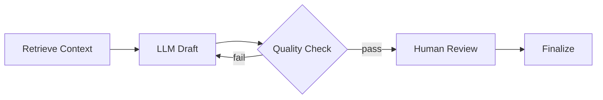

# Nodes

> **Learning Path:** AI Orchestration
> **Section:** 13.1.2 — LangGraph concepts

**13.1.2 — LangGraph concepts: Nodes**

### 1. The problem

A single LLM call is easy. A real AI workflow is not.

You need conditional branching, loops for retry/refinement, parallel tool calls, human-in-the-loop, and persistence across steps. With a linear chain you get:

* No clean way to say "if output is bad, go back"
* State has to be manually threaded through every step
* No recovery if a node fails mid-workflow
* No clear place to insert observability, retries, or guardrails

You want the control you get from an orchestration engine, but with the statefulness and determinism you need for LLM work.

### 2. Mental model

Think of a factory floor with a shared conveyor belt.

Nodes are processing stations. The belt is the graph state. Each station takes the belt contents in, does one well-defined transformation, and puts it back on the belt.

The graph is the routing rules: which station next, when to loop, when to split to parallel stations, when to stop.

This gives you composability: stations are small, testable, and replaceable. Routing is declarative.

### 3. How it works

In LangGraph a Node is a callable with a single contract:

`(state) -> state`

Input and output are the same typed state object. The node is pure in the sense that all side effects go through state.

The graph defines edges between nodes. Edges can be static or dynamic: a node can return the name of the next node to go to. That enables conditional routing, loops, and branching.

State is managed by LangGraph, not you. It is checkpointed, so a workflow can be paused, resumed, and recovered after failure.

Nodes: Retrieve, Draft, Check, Review, Finalize. State flows through all of them.

### 4. Architectural reasoning

**When it helps**

* Workflows with branching and loops: retry, self-correction, multi-step planning
* Stateful long-running processes: conversations, agents with memory, batch jobs
* Need for observability and control: each node is an instrumentation point
* Human-in-the-loop: pause at a node, wait for input, resume

**Alternatives**

* Simple chain / pipeline: fine for linear, one-shot transformations. No branching.
* Custom orchestration with queues: more control, much more boilerplate. You re-implement checkpointing and routing.
* LLM as sole controller: prompt the model to decide next step. Cheap, but non-deterministic and hard to test.

Choose nodes when you need explicit control over flow and state, not just data transformation.

### 5. Trade-offs and failure modes

* **Complexity tax.** A graph is easier to reason about than nested conditionals, but harder than a chain. Small workflows may not need it.
* **State size.** Everything lives in shared state. Large payloads like documents or images bloat checkpoints and increase latency/cost. Keep state minimal; store large artifacts by reference.
* **Loop safety.** Dynamic edges make infinite loops possible. You need a max iteration guard or a termination condition in state.
* **Testing surface.** Nodes are easy to unit test, but integration tests for routing logic are essential. A wrong edge name silently drops the workflow.
* **Coupling to state schema.** Changing state shape is a breaking change across all nodes. Version your state.

### 6. Example

Enterprise support triage.

State: `messages, ticket, tools_output, classification, resolution_draft, needs_human`

Nodes:
* `retrieve_history` - loads past tickets
* `classify_intent` - LLM node with tools
* `fetch_kb` - tool node
* `draft_reply` - LLM node
* `quality_gate` - deterministic check for policy violations
* `human_handoff` - pause workflow, wait for agent

Routing: `classify_intent` -> `draft_reply` -> `quality_gate`. If gate fails, route back to `draft_reply` with feedback. If confidence low, route to `human_handoff`. Once approved, finalize.

You get retry, audit trail, and pause/resume without building it yourself.

### 7. Reasoning challenge

You need a research agent that can browse, summarize, and produce a report. Browsing can take 5-30 seconds per query and may fail. Summarization needs the full set of results.

Do you model browsing as one node with a loop inside it, or as a separate node per query with a fan-out/fan-in pattern? What changes in your failure handling and state design?

### 8. Key takeaway

* Nodes exist to make non-linear, stateful LLM workflows explicit and controllable.
* A node is a state-in / state-out transformation; the graph is the routing policy.
* Use nodes when you need branching, loops, retries, and persistence, not for simple chains.
* Keep state small, guard loops, and test routing as carefully as business logic.
