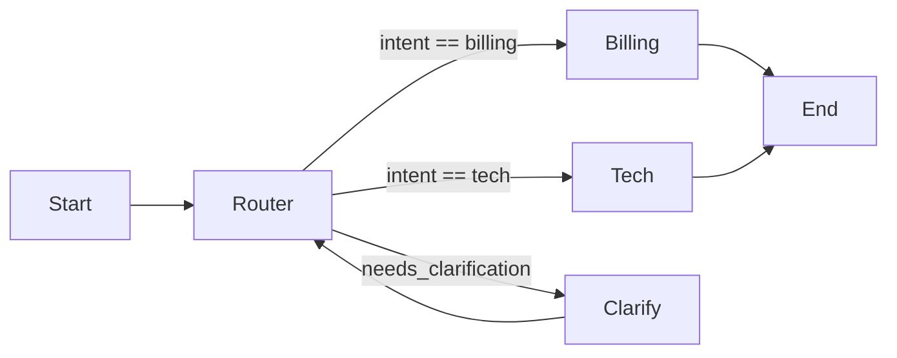

# Edges

> **Learning Path:** AI Orchestration
> **Section:** 13.1.3 — LangGraph concepts

### 1. The problem

You have built a graph of agent nodes. Nodes are good for encapsulation, but a linear chain is not enough.

Real workflows need:
* Branching based on state: *Is the user asking about billing or tech support?*
* Loops for refinement: *Does the answer need another round of research?*
* Termination and error handling: *Stop if the user is abusive, or retry on failure.*

Without a routing primitive you end up putting that logic inside nodes. Nodes become bloated, control flow is hidden, and you cannot visualize or test the path the agent actually took.

Edges exist to externalize routing.

### 2. Mental model

Nodes are cities. Edges are roads with traffic rules.

An unconditional edge is a one-way road: `A -> B` always.

A conditional edge is a roundabout with a sign: the car looks at its current state and chooses the exit.

The edge function receives the current graph state and returns the name of the next node. The graph itself stays declarative; the routing stays inspectable.



### 3. How it works

In LangGraph a graph is defined by nodes and edges.

* `add_edge(source, target)` - unconditional. Next step is fixed.
* `add_conditional_edges(source, condition_fn, mapping)` - dynamic.

`condition_fn(state) -> str` returns a key. The mapping translates that key to a node name.

The condition function is pure routing logic. It should not do work, it should read state and decide.

That separation is intentional: nodes transform state, edges decide flow.

Cycles are allowed. A conditional edge can point back to a previous node to create a retry or refinement loop. LangGraph tracks visited path and supports interrupts for human-in-the-loop.

### 4. Architectural reasoning

Edges solve control flow externalization.

**When it helps**
* Dynamic routing based on LLM output, tool results, or business rules.
* Loops with explicit exit conditions, e.g. `max_iterations`.
* Error and fallback paths without polluting node logic.

**Alternatives**
* Put routing inside a node and call `graph.update_state` then return next node name. Works but hides the flow graph and makes testing harder.
* Use a single mega-node with internal if/else. Loses observability, reusability, and parallelization.

Choose conditional edges when the decision is *which* node to run next, not *what* to do in the node.

### 5. Trade-offs and failure modes

* **Complexity grows fast.** A graph with many conditional edges is a state machine. Document the conditions or it becomes untestable.
* **Dead ends and non-termination.** A condition that returns a key not in the mapping causes a runtime error. A loop without a progress check causes infinite retries.
* **Implicit coupling to state schema.** Edge functions depend on keys in state. Rename a key and routing silently breaks. Keep the state contract explicit.
* **Observability cost.** Conditional routing is harder to reason about than a linear pipeline. You need logging of which edge was taken and why.

### 6. Example

Enterprise support triage.

Nodes: `ingest`, `router`, `billing_agent`, `tech_agent`, `clarify`, `finalize`.

`router` reads `state.intent` and `state.confidence`.

```python
def route(state):
    if state.confidence < 0.6:
        return "needs_clarification"
    if state.intent == "billing":
        return "billing"
    return "tech"

graph.add_conditional_edges("router", route, {
    "needs_clarification": "clarify",
    "billing": "billing_agent",
    "tech": "tech_agent"
})
```

`clarify` asks one follow-up question, then the graph returns to `router`. The loop is explicit, testable, and capped by a `tries` counter in state.

The routing rule lives in one place, not inside `billing_agent`.

### 7. Reasoning challenge

You need a graph that retries a tool call up to 3 times on transient error, otherwise escalates to human.

Would you implement the retry counter and decision inside the tool node, or as a conditional edge after the node? Why?

### 8. Key takeaway

* Edges are routing policy, nodes are work. Keep them separate.
* Conditional edges make control flow explicit, testable, and observable.
* Loops and branching belong in edges, not hidden inside nodes.
* Design edges first: define the states and transitions, then fill in node logic.
