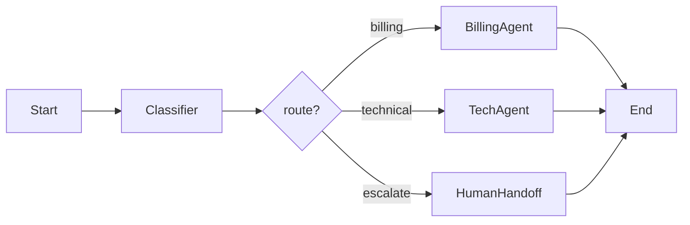

# Conditional routing

> **Learning Path:** AI Orchestration
> **Section:** 13.1.4 — LangGraph concepts

**Conditional routing in LangGraph**

### 1. The problem

Linear chains work for RAG. They fail for agents.

You have a workflow where the *next* step is not known at design time. It depends on runtime data: LLM output, tool result, confidence score, user intent, guardrail verdict.

Hard-coding `if` logic inside a node hides the control flow. You lose a single view of the system, replayability, and observability. You also couple routing decisions to business logic.

The constraint is: you need dynamic branching *and* a declarative, inspectable graph.

### 2. Mental model

Conditional routing is a traffic controller for a state machine.

Nodes are processing stations. Edges are roads. A conditional edge is a road sign that reads the current state and chooses which road to take. The graph stays static; the decision moves to a small, pure function.

### 3. How it works

In LangGraph a node writes to a shared `State`. A conditional edge is a function `state -> next_node_name` registered with `add_conditional_edges`.



The controller is not the LLM. The LLM produces data. The routing function interprets that data deterministically.

Pseudo:
```
classifier -> {intent, confidence}
route(state):
  if state.intent == "billing" and state.confidence > 0.8: return "billing"
  if state.intent == "technical": return "tech"
  return "escalate"
```

The graph engine calls `route`, gets a string, and moves tokens. State is preserved across branches.

### 4. Architectural reasoning

When it helps:
* Intent classification / triage before specialist agents
* Guardrails: route to safe fallback if policy violation detected
* Tool orchestration: retry, alternative tool, or abort based on result
* Human-in-the-loop: confidence threshold decides auto vs human

Alternatives:
* Branch inside a node with imperative code. Faster to write, impossible to visualize, untestable in isolation.
* Separate graphs per path. Duplicates nodes, state schema diverges.
* Always run all branches and merge. Wastes cost/latency.

Why choose conditional edges: the flow is explicit, testable, and observable. You can log every routing decision with the state that caused it. You can replay a run and see exactly why it took a path.

### 5. Trade-offs and failure modes

* **State coupling.** Routing functions depend on schema. Add a field, break routes. Keep the routing predicate minimal and pure.
* **Branch explosion.** Too many conditions = spaghetti. If you need > 4-6 branches, refactor into a sub-graph or a router node.
* **Non-determinism.** LLM outputs are noisy. Route on raw text fails. Route on structured output + confidence + guardrails.
* **Dead ends / missing routes.** Every conditional edge must have a default. Unmatched return = runtime error. Always define a fallback.
* **Testability cost.** You now test graph topology *and* routing logic. Unit test the predicate with fixtures, integration test the graph paths.

### 6. Example

Enterprise support triage.

Nodes: `classify_intent`, `route`, `billing_agent`, `tech_agent`, `human_handoff`, `end`.

`classify_intent` calls LLM with structured output: `{intent: billing|technical|other, confidence}`. 

`route` is pure:
```
billing -> billing_agent if confidence >= 0.7
technical -> tech_agent if confidence >= 0.6
else -> human_handoff
```

The graph is one artifact in version control. Ops can see in LangSmith that 23% of requests routed to human due to low confidence, and adjust threshold without touching agent logic.

### 7. Reasoning challenge

You are building a finance assistant that can `get_balance`, `transfer`, and `explain_fee`.

Regulations require human review for transfers > $10k. Low confidence intent should go to clarification.

Design the routing. Where does the decision live? Should the LLM decide to route, or should a separate deterministic function decide based on LLM output?

What state fields do you need to make the routing safe and auditable?

### 8. Key takeaway

* Conditional routing exists to make dynamic agent flow explicit and observable, not to hide branching in code.
* Keep routing functions pure, small, and based on structured state, not raw LLM text.
* Always provide a default/fallback branch; design for non-deterministic inputs.
* Use conditional edges when the next step depends on runtime data and you need a single, replayable graph; avoid them when flow is static.
