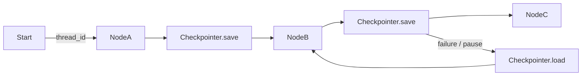

# Checkpoints

> **Learning Path:** AI Orchestration
> **Section:** 13.1.5 — LangGraph concepts

**Checkpoints in LangGraph**

### The problem

An AI agent is not a request/response function. It is a long-running, stateful workflow that crosses LLM calls, tools, human input, and retries.

What breaks without persistence:
* A node fails mid-graph. You lose all work and must restart from scratch.
* The LLM is non-deterministic and expensive. You cannot afford to re-run steps you already paid for.
* You need human-in-the-loop. The graph must pause, wait hours/days, then resume exactly where it left off.
* You need audit, replay, and debugging. You must reconstruct *why* the agent took a path.

Stateless HTTP + ephemeral process memory = you lose all of that.

### Mental model

Think of a save game.

A checkpoint is a durable snapshot of the agent's *entire* execution context at a safe point: which nodes have run, what the state is, what the next node is, and metadata about the run.

With a checkpoint you can:
* resume after crash or pause
* time-travel to a previous state
* branch from a past state to try a different path

The graph itself is the logic. The checkpoint is the durable cursor into that logic.

### How it works

LangGraph executes a graph as a sequence of node transitions. A checkpointer sits alongside the graph and is invoked on every transition.

Essentially:
* **thread_id** identifies one logical conversation / agent run.
* After each node completes, the current `state` + graph pointer + metadata is written.
* On next invocation, the checkpointer loads the latest checkpoint for that thread_id and the graph continues from there.

The checkpointer is pluggable: in-memory for tests, SQLite/Postgres for production. The important part is not the store, it's the contract: *every transition is recordable and replayable*.

### Architectural reasoning

When it helps:
* Long-running agents with tools, retries, and human handoffs
* Cost-sensitive LLM workflows where re-execution is wasteful
* Need for observability, replay, and branching experiments
* Fault tolerance in distributed deployments

What it solves:
* **Resilience.** Crash of a worker does not lose the run.
* **Pause/resume.** Human approval, SLA windows, rate limits.
* **Idempotency.** Safe retries without duplicate side effects.
* **Audit.** Full history of state evolution per thread.

Alternatives:
* Application-level DB writes in each node. Works, but you duplicate graph semantics and lose atomicity of the transition.
* External workflow engines. More general, heavier operational cost.
* No persistence. Acceptable only for short, cheap, stateless prompts.

Choose a checkpointer when the workflow value is in the *continuity* of state, not just a single LLM call.

### Trade-offs and failure modes

* **Durability vs latency.** Writing a checkpoint on every step adds I/O. Batch or async writes reduce latency but increase loss window.
* **Store size.** State snapshots grow with graph size and run length. You need pruning/retention policies, otherwise cost and query time explode.
* **Consistency.** Partial writes or concurrent updates to the same thread_id can corrupt a run. You need per-thread serialisation or optimistic locking.
* **State bloat.** Developers tend to dump everything into state. Large blobs = slow loads and expensive storage. Keep state minimal and reconstructable.
* **Replay != determinism.** LLM outputs are non-deterministic. Replay from a checkpoint will re-execute downstream nodes, so you may get different results unless you also checkpoint tool outputs and LLM responses.

The most common failure is treating checkpoints as a black-box log. They are a durability and control plane. If you need strong exactly-once semantics for side effects, you still need idempotent tools and an outbox pattern.

### Example

Enterprise support triage agent:

1. Ingest ticket → Node: Classify
2. Retrieve customer history via tool → Node: Enrich
3. Draft response → Node: Generate
4. If confidence < threshold → pause for human review
5. On approval → Node: Send

With checkpoints, step 4 can wait 8 hours for a human. The worker can be recycled, the pod can crash, and on resume the graph loads the checkpoint after Enrich, skips Classify, and continues at Generate. The team can also load the checkpoint before human review and branch it to test a different prompt variant without re-running the expensive retrieval.

### Reasoning challenge

You are building a high-throughput classification pipeline that processes 10k messages/minute. Each run is 3 nodes and completes in <200ms. You want observability but not durable pause/resume.

Do you enable persistent checkpoints for every run? What do you change if a downstream node must call a payment API that must not be retried?

### Key takeaway

* Checkpoints exist to make non-deterministic, long-running agent graphs durable, resumable, and observable.
* They decouple graph logic from execution continuity.
* The core architectural decision is *what to persist, how often, and for how long* — not which database you use.
* Trade-offs to remember: write latency, storage growth, partial failure, and state bloat vs resilience, cost avoidance, and human-in-the-loop.
