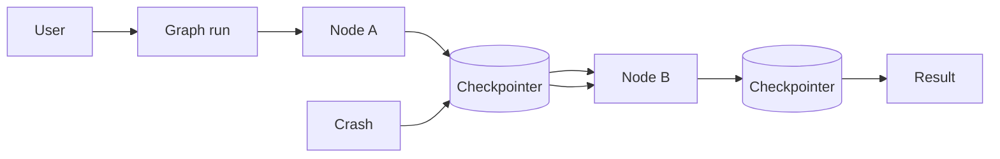

# Persistence

> **Learning Path:** AI Orchestration
> **Section:** 13.1.6 — LangGraph concepts

**Persistence in LangGraph**

### 1. The problem

An agentic workflow is stateful and multi-step. Each step is a stateless LLM call, tool call, or human decision. The graph itself is ephemeral.

What breaks without persistence:
* A crash or deployment kills the whole run. You restart from zero.
* Long-running work with human-in-the-loop can't pause and resume.
* You can't inspect or replay what happened for debugging.
* Expensive steps get re-executed because nothing was saved.

The constraint is not the model, it's durability of execution state across time and failures.

### 2. Mental model

Think of a checkpoint as a save point in a video game.

LangGraph executes a graph of nodes. Persistence stores the entire graph state — node outputs, channel values, metadata — after each step. The `thread_id` is the save file name.

On resume, the runtime loads the last checkpoint, re-hydrates the graph, and continues from the next node. No re-computation, no lost context.

### 3. How it works

Execution is checkpointed, not the LLM.

```
User request -> LangGraph run -> Node A -> Checkpoint -> Node B -> Checkpoint -> ...
```



A Checkpointer implements `put` and `get` for `thread_id`. On each node completion the state is serialized and written. On start, if a checkpoint exists for that thread, it is restored and the graph resumes from the next step.

This is durable execution, not just caching.

### 4. Architectural reasoning

Persistence solves three architectural needs:

* **Fault tolerance.** Server crashes, pod restarts, or timeouts don't lose progress. The run resumes from last checkpoint.
* **Human-in-the-loop.** A node can wait for human approval for hours/days. The state is stored externally, and the graph wakes when input arrives.
* **Observability and control.** You can list runs, inspect intermediate state, and replay or branch from a previous checkpoint.

Alternatives:
* In-memory only. Fast, zero ops overhead. Lost on restart. Only for toy demos.
* Manual re-hydration via your own DB. Works but you must manage serialization, ordering, and resume logic yourself.

Choose a checkpointer when the workflow is longer than one request, has side effects, or must survive process death.

### 5. Trade-offs and failure modes

* **Latency vs durability.** Writing a checkpoint on every node adds I/O. Batch or async writes reduce latency but increase risk of loss on crash.
* **Storage cost vs recompute cost.** Storing large state — documents, tool outputs — grows quickly. You trade storage and GC complexity for avoiding re-execution.
* **Consistency.** A checkpoint is a snapshot. If a node writes external side effects — e.g., sends an email — restoring to a previous checkpoint creates divergence. You need idempotent nodes or outbox patterns.
* **Schema drift.** Changing the graph shape invalidates old checkpoints. Version your state schema and plan migrations.
* **Leakage.** Checkpoints contain PII and prompts. Treat the store as sensitive data with encryption and retention policies.

### 6. Example

Enterprise support triage agent.

Graph: `classify -> retrieve KB -> draft reply -> human review -> send`

Classification and retrieval are cheap. Drafting is expensive. Human review can take hours.

Without persistence, a pod restart during review forces the user to restart the whole flow and lose the draft.

With `PostgresSaver` keyed by `thread_id = ticket_id`, the run pauses at `human_review`. On resume, state is loaded, the draft is shown to the reviewer, and after approval the graph continues to `send`. No re-classification, no re-retrieval.

Implementation is minimal:
```python
from langgraph.checkpoint.postgres import PostgresSaver

checkpointer = PostgresSaver(postgres_conn)
checkpointer.setup()

graph = builder.compile(checkpointer=checkpointer)

graph.invoke({"query": "..."}, config={"thread_id": "ticket-123"})
```

The first call creates a checkpoint. Subsequent calls with same `thread_id` resume.

### 7. Reasoning challenge

You have a 20-step research agent that runs for ~10 minutes, calls expensive search APIs, and ends with a final report. It runs on serverless with 15-minute max execution. Do you checkpoint every node, only after expensive nodes, or not at all? What do you store and what do you recompute?

### 8. Key takeaway

* Persistence externalizes workflow state so execution can survive crashes, pauses, and deployments.
* Checkpoints enable durable, resumable agents and safe human-in-the-loop.
* The decision is durability vs latency/cost, and consistency of side effects vs replay safety.
* Design nodes to be idempotent and keep checkpoints small; treat the checkpointer as a first-class reliability component.
