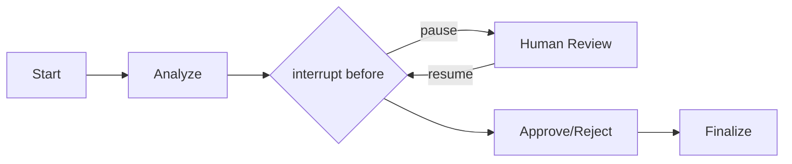

# Interrupts

> **Learning Path:** AI Orchestration
> **Section:** 13.1.7 — LangGraph concepts

**Interrupts in LangGraph**

### 1. The problem

An autonomous agent graph can run for many steps, call tools, update state, and make decisions. In production it hits cases where it must not proceed automatically:

* A tool output is ambiguous and needs clarification
* An action is high-risk and requires human approval
* Compliance requires a human signature before money moves
* The user wants to change the goal mid-run

If you block the node with a synchronous wait, you tie up workers and lose the execution context. If you kill the run and restart, you lose all intermediate state and force the agent to re-derive everything.

You need a way to **pause a running graph deterministically, persist its state, and resume later with new input** without re-executing prior work.

### 2. Mental model

Think of an interrupt as a save-point in a video game.

The graph is running. At a chosen boundary you press pause, the entire state is checkpointed, and execution stops. The system waits for an external signal containing the missing data or approval. When it arrives, the graph resumes from exactly that point with the saved state intact.

The pause is explicit and controlled by the architect, not an error or timeout.

### 3. How it works

LangGraph couples interrupts with checkpointing. A node can be configured to interrupt *before* it runs or *after* it runs.

* **Declarative:** `interrupt_before: ["approve_node"]` or `interrupt_after: ["risk_check"]` in graph config
* **Programmatic:** `interrupt()` inside a node to raise an interrupt with optional value
* On interrupt the graph transitions to `INTERRUPT` state, the checkpointer saves the full state, and the run ends gracefully
* To resume you call the same thread with new input via `graph.update_state` or by providing the interrupt response. The graph continues from the paused node, not from start.

The interrupt carries a name and a slot in state where the resumed value will be written, so the resumption is typed and predictable.

### 4. Architectural reasoning

When it helps:
* Human-in-the-loop for compliance, safety, or cost
* Clarification loops where the model cannot decide without user context
* Multi-step approvals where downstream work is expensive to redo

What it solves vs alternatives:
* **Polling loop:** wastes compute and complicates state
* **Kill + restart:** loses context and is racy
* **External webhook with manual state management:** you reinvent checkpointing

Why choose it: you keep the graph as a single source of truth for flow, while making the pause/resume boundary explicit and testable.

### 5. Trade-offs and failure modes

* **Latency for throughput.** Paused threads occupy a checkpoint slot. Long human wait times can accumulate state and increase storage cost.
* **State bloat.** The entire graph state is persisted on interrupt. Large messages or tool outputs grow checkpoints. Architects must prune state before pausing.
* **Orphaned interrupts.** If the resume never arrives, you need TTL, alerting, and a dead-letter path to clean up.
* **UX coupling.** The graph now depends on an external human response schema. Changing the interrupt contract is a breaking change.
* **Determinism risk.** Resuming with a value that the node does not expect can corrupt downstream logic. Validate the resume payload at the interrupt boundary.

### 6. Example

Loan triage agent.

`ingest -> extract -> risk_score -> interrupt_before[approve] -> approve -> disburse`

The `risk_score` node produces a score and explanation. The graph interrupts *before* `approve`. A human reviewer sees the score, notes, and document evidence in a UI, then clicks Approve / Reject / Request Info.

If Request Info, the resume value is written to `clarification_needed` in state. The graph routes back to `extract` for a targeted follow-up question, then re-interrupts for a second human review.

No work is repeated. The agent does not need to re-parse the application.

### 7. Reasoning challenge

You are building a customer support agent that can issue refunds up to $500 automatically, and escalate larger amounts. Where would you place an interrupt, and would you interrupt *before* or *after* the decision node?

Consider: do you want the human to see the agent's reasoning before it commits, or review an already-made decision? What happens to the refund tool call if you interrupt after it?

### 8. Key takeaway

* Interrupts are save-points for long-running stateful agents, not generic pauses
* Use them to insert deterministic human-in-the-loop boundaries without losing context
* Place interrupts at the cheapest safe point before irreversible actions
* Design resume payloads as explicit contracts and clean up orphaned interrupts
* The trade is safety and control for latency, state cost, and operational complexity
