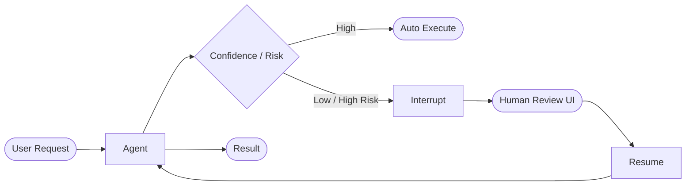

# Human-in-the-loop

> **Learning Path:** AI Orchestration
> **Section:** 13.1.8 — LangGraph concepts

**Human-in-the-loop**

### 1. The problem

Autonomous agents can draft, summarize, and decide fast. They also hallucinate, miss context, and make irreversible mistakes.

The problem isn't accuracy in isolation. It's risk asymmetry. A wrong answer in a chat toy is fine. A wrong answer in loan underwriting, medical triage, content moderation, or a financial trade is expensive, illegal, or unsafe.

You can't just add more guardrails and hope. At some point you need a human judgment that the model cannot replicate: legal liability, brand risk, ethical nuance, or rare-world knowledge.

That creates a design constraint: keep the system autonomous where it's cheap and safe, and inject a human exactly where risk is high, without breaking the workflow.

### 2. Mental model

Think of the agent as a state machine, not a single call. Human-in-the-loop is a pause node in that graph.

The agent runs until it hits a decision point with insufficient confidence or high impact. Execution suspends, state is persisted, and a human is asked for a specific, bounded decision. The human response becomes input to resume the graph.

Human is not a fallback. Human is a first-class node with defined inputs, outputs, and timeouts.

### 3. How it works

In orchestration frameworks like LangGraph, this is an interrupt.

The graph owns state. A node can call `interrupt()` and emit a `Command` that pauses execution and returns control to an operator UI. The state checkpoint is saved. When the human replies, the graph resumes from that exact point with the updated state.

Essential mechanism:
* **Trigger**: confidence threshold, policy flag, cost, or explicit tool result
* **Pause**: checkpoint state, surface a minimal review task
* **Human action**: approve/reject/edit, with an audit trail
* **Resume**: feed decision back as state, continue downstream

The human never sees the whole graph. They see a scoped task: "Approve this summary for external send?" with context, not a raw prompt.

### 4. Architectural reasoning

When it helps:
* **High-stakes, low-frequency decisions** where latency is acceptable
* **Compliance boundaries** where a human must sign off
* **Uncertain inputs** the model cannot resolve without private data
* **Model capability gaps** for rare domains or new policies

What it solves: it converts an unbounded autonomous risk into a bounded human review cost.

Alternatives:
* **Full automation** with stronger guardrails. Cheaper, faster, but risk remains.
* **Human-out-of-the-loop review** after the fact. Cheaper to build, but damage is already done.
* **Human-in-the-loop always**. Safest, but kills throughput and user experience.

Choose HITL when the cost of a false positive/negative exceeds the cost of human wait time, and when the review can be scoped to a 30-90 second decision.

### 5. Trade-offs and failure modes

* **Latency vs safety.** Every interrupt adds minutes to hours. If you interrupt too often, users abandon the flow. Use tiered thresholds, not binary.
* **Cognitive load.** Humans make bad decisions when presented with raw model output. You must present a clear question, context, and suggested action. Poor UI = rubber-stamping.
* **State consistency.** If the graph resumes with stale state, you get inconsistent decisions. Checkpointing and versioning of the state are mandatory.
* **Operational scaling.** Human review is a queue with SLA. You need routing, escalation, and backpressure. If the queue backs up, the whole system stalls.
* **Audit and non-repudiation.** Who decided what, when, and why? The decision must be immutable and attributable. This is architectural, not an afterthought.

Failure mode to watch: the "approval bottleneck". Teams start with HITL for everything, then the queue grows, SLAs slip, and humans start auto-approving. That's automation theater.

### 6. Example

Enterprise procurement assistant.

User uploads a vendor contract. Agent extracts clauses, flags risky terms, drafts a summary.

Graph path: Parse -> Extract -> Risk Classifier -> If risk score > 0.8 or clause is "liability cap", interrupt.

Human reviewer sees: clause excerpt, model explanation, suggested redline, and one button: Approve / Request Change / Escalate.

If approved, graph resumes to generate final redline and send to legal. If rejected, graph routes to a clarification loop.

Result: 80% of contracts auto-process, 20% get human review, zero high-risk clauses slip through, and audit log is complete.

### 7. Reasoning challenge

You are designing a customer support agent for a bank. It can refund up to $100 automatically, $100-$1000 with manager approval, and >$1000 requires compliance review.

Where do you place the interrupt points, and what state do you need to persist to make the resume safe? What happens if the manager does not respond within 2 hours?

Think about thresholds, queue routing, and user messaging during pause.

### 8. Key takeaway

* HITL is a control point in an agent graph, not a failure mode.
* Interrupt early on risk, not on every uncertainty; design scoped review tasks.
* State must be checkpointed and resumable; the human decision is just another input.
* Operate the human queue like a service: SLA, routing, backpressure, audit.
* Use HITL to convert unbounded model risk into bounded operational cost.
