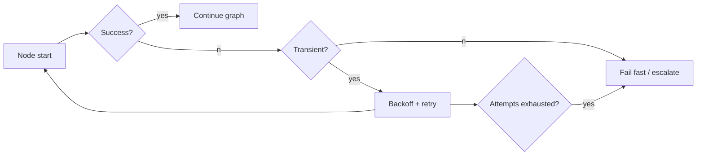

# Retries

> **Learning Path:** AI Orchestration
> **Section:** 13.1.9 — LangGraph concepts

**Retries in LangGraph**

### 1. The problem

AI orchestration graphs are built from unreliable parts. LLM calls timeout, APIs return 429, network blips happen, tool calls are slow. In a stateful graph like LangGraph, one transient failure aborts the entire run and loses work already done.

Without retries you get:
* Spurious failures from transient faults
* Poor user experience for recoverable errors
* Manual replays that re-execute expensive upstream nodes

The constraint is specific to orchestration: nodes have side effects, the graph is stateful, and re-executing from start is expensive.

### 2. Mental model

A retry is a *bounded re-attempt of the same logical operation with the same inputs*, not a fix for bad logic.

Think of it as a shock absorber for the graph. You want to absorb transient noise, not mask permanent faults.

In LangGraph the unit of retry is a node execution against a checkpointed state. The state is already materialized, so a retry can be scoped to one node without replaying the whole graph.

### 3. How it works

Essential mechanism:
* **Classification:** Is the error transient? Timeouts, 5xx, 429, connection reset = retryable. Validation error, bad prompt, business rule violation = not retryable.
* **Bounded attempts with backoff:** Exponential backoff + jitter prevents thundering herd.
* **Idempotency by checkpoint:** LangGraph checkpoints state before a node runs. A retry replays the node with the same input state, not the whole path.
* **Scoping:** Retry is applied at the Runnable/node level. You can set `max_attempts`, `backoff`, and which error types trigger retry.

That is the difference from naive re-run: retry preserves downstream state and cost.

### 4. Architectural reasoning

When it helps:
* LLM provider transient errors and rate limits
* Tool calls to external services with flaky networks
* Brief downstream outages in a multi-step agent

What it solves: raises effective availability without changing business logic.

Alternatives:
* **Fail fast + human-in-the-loop:** Cheaper, correct for permanent errors
* **Dead letter queue + manual replay:** Good for non-idempotent work
* **Circuit breaker:** Stops retry storms when a dependency is down

Choose retry when the operation is *safe to repeat* and failure is *likely transient*. In LangGraph, the checkpoint makes the safe-to-repeat property more likely, but you still own idempotency for side effects outside the graph.

### 5. Trade-offs and failure modes

* **Cost vs reliability.** Each retry costs LLM tokens, latency, and rate limit budget. Retrying a 2k token generation 3x is not free.
* **Latency amplification.** Backoff adds tail latency. In interactive agents this matters.
* **Masking real bugs.** Retrying on non-transient errors hides logic defects. Classify errors explicitly.
* **Non-idempotent side effects.** If a node writes to a database or calls a payment API, a blind retry duplicates work. You need idempotency keys or outbox pattern.
* **Retry storm.** Many concurrent runs retrying the same failing dependency can overload it further. Jitter and max attempts bound this, circuit breakers stop it.

Most common failure mode in AI graphs: retrying an LLM node that failed because the prompt was invalid. You will retry forever and burn cost.

### 6. Example

Enterprise support agent graph:
`Classify -> Retrieve -> Summarize -> ToolCall -> Respond`

`ToolCall` hits internal billing API. API intermittently returns 502. With retry configured on that node with max_attempts=3, exponential backoff 1s,2s,4s, the graph absorbs the blip and continues. State is checkpointed after `Summarize`, so on retry only `ToolCall` re-executes, not the LLM calls.

If `Classify` raises a schema validation error, retry is disabled. The graph fails fast to a human review node.

### 7. Reasoning challenge

Your graph has a node `generate_answer` that calls an LLM. You see two failure types: `429 Too Many Requests` and `OutputValidationError` because the model output doesn't match the required JSON schema.

Where do you put retries, and what additional guard do you need?

### 8. Key takeaway

* Retries exist to absorb transient faults in unreliable dependencies, not to fix bad logic.
* In LangGraph, checkpointing lets you retry a single node without replaying the whole graph, but idempotency of external side effects is still your responsibility.
* Classify errors: retry only transient ones, fail fast on permanent ones.
* Bound retries with max attempts, backoff + jitter, and consider circuit breaking to avoid cost and storms.
