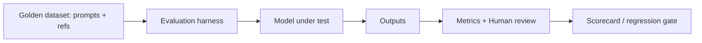

# Offline evaluation

> **Learning Path:** AI Evaluation
> **Section:** 14.1.1 — Evaluation

**Offline evaluation**

### 1. The problem

You have a model change and you need to know if it is safe to ship. You cannot test it on real users.

Constraints:
* Production traffic is expensive and risky. A bad model causes bad answers, hallucinations, and support cost.
* You need a fast feedback loop before release, without waiting for live metrics to accumulate.
* You need reproducibility for regression testing and audit.

The problem is not “how to measure accuracy”. It is: *how do you get a confident, cheap, repeatable signal about quality before you expose the model to users?*

That need creates offline evaluation.

### 2. Mental model

Offline evaluation is a lab test. You freeze a representative dataset, run the model against it, and score the outputs with metrics and human judgments.

Online evaluation is the field test. You ship to a slice of users and measure real outcomes.

Lab test first, field test second. Skipping the lab is reckless. Relying only on the lab is naive.

### 3. How it works

The essential mechanism is a closed loop:

Core components:
* **Evaluation set.** Curated prompts covering core intents, edge cases, and failure modes. For RAG: questions with ground truth docs and expected answers. For agents: tasks with success criteria.
* **Scoring.** Automated proxies: exact match, ROUGE, BLEU, factuality checks, embedding similarity. Human judgments for nuance: helpfulness, safety, style.
* **Harness.** Reproducible run that logs prompts, outputs, scores, and model version. This is your regression baseline.

You do not need exhaustive coverage. You need targeted coverage of the decisions you care about.

### 4. Architectural reasoning

When it helps:
* Pre-deployment gating. Block a release if offline score drops > threshold.
* Comparing candidates cheaply. A/B of prompts, retrievers, or fine-tunes on the same set.
* Debugging. Failure analysis on specific clusters: hallucinations, refusals, latency.

What it solves:
* Fast, deterministic signal without user exposure.
* Reproducible history for compliance and model cards.

Alternatives:
* **Online evaluation / shadow mode.** Run model in production, log outputs, score later. Captures real distribution but slower and riskier.
* **Human-in-the-loop.** Real users rate outputs. Ground truth but expensive and non-repeatable.

Decision rule: Use offline as the first gate, online as the final gate. Offline tells you *if* you should ship. Online tells you *whether* you actually improved.

### 5. Trade-offs and failure modes

* **Distribution shift.** Offline set is static. Real user prompts drift. A model that scores well offline can fail live. Mitigate with continuous collection and periodic refresh of the golden set.
* **Metric gaming.** Models optimize for the proxy, not the user. ROUGE can go up while helpfulness goes down. Use multiple metrics and human spot-checks.
* **Stale gold.** If the evaluation set is not maintained, it becomes a vanity benchmark. Ownership and refresh cadence matter.
* **Cost vs coverage.** High-quality human judgments are expensive. Architect a tiered system: cheap automated metrics on every PR, sampled human review on releases.
* **False confidence.** Passing offline tests does not prove safety. It only proves you did not regress on what you measured.

### 6. Example

Enterprise RAG assistant for HR policy.

You maintain an offline set of 500 questions: 300 in-distribution, 100 adversarial, 100 known failure cases.

Pipeline on every model change:
1. Run retrieval + generation against the set.
2. Compute automated scores: citation recall, answer correctness vs reference, latency.
3. Sample 50 outputs for human review on tone and compliance.
4. Gate release if citation recall drops >2% or human score <4/5.

This catches regressions in retrieval or prompt changes in minutes, before any employee sees a wrong policy answer. Live rollout still uses shadow mode for 5% traffic to validate real prompt distribution.

### 7. Reasoning challenge

You are about to ship a new LLM fine-tune that improves offline benchmark score by 8%. Offline safety metrics are flat. In production, the model is used for customer support summarization.

Do you ship directly, or what do you do first? What signal are you missing?

*Think about distribution shift, metric gaming, and the type of risk in summarization.*

### 8. Key takeaway

* Offline evaluation gives you a fast, reproducible, safe signal before production. It is a lab test, not proof of real-world quality.
* Design the set for the decisions you need to make, not for maximal coverage. Include edge cases and known failures.
* Use tiered scoring: cheap automated metrics for speed, human judgment for nuance.
* Offline passes are necessary but not sufficient. Always pair with online validation for distribution and user impact.
* Treat the golden set as a product artifact: versioned, refreshed, and owned.
