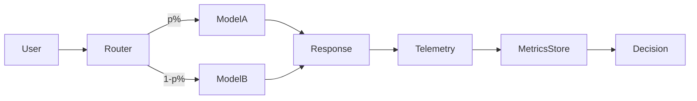

# Online evaluation

> **Learning Path:** AI Evaluation
> **Section:** 14.1.2 — Evaluation

**Online evaluation**

### 1. The problem

Offline evaluation tells you how a model scores on a static test set. Production tells you how it behaves on live users.

The gap is real: distribution shift, prompt drift, long-tail queries, latency constraints, and business outcomes are not captured by BLEU/ROUGE/accuracy. A model can improve on the benchmark and degrade in production because the benchmark does not match the live input distribution or user intent.

You need feedback that is *causal* and *in production*, not correlational and in a lab. Offline eval is fast and safe. Online eval is slow, risky, and true.

### 2. Mental model

Offline eval = wind tunnel test. Controlled, repeatable, cheap.

Online eval = test drive on real roads with real drivers. Messy, expensive, but the only way to know if it actually works.

Online evaluation means measuring model variants against live traffic using real user signals and business outcomes, with controlled exposure.

### 3. How it works

The core loop is route, observe, attribute.

* Routing: traffic split via feature flags, A/B, interleaving, or shadow mode. Shadow = run candidate, log output, do not serve.
* Instrumentation: log request, context, model outputs, latency, cost, and downstream user actions.
* Attribution: tie signals to variant. Click, conversion, retention, human rating, or a learned reward model.
* Analysis: statistical comparison with guardrails for non-stationarity, seasonality, and multiple testing.

Counterfactual logging helps when you cannot re-serve: log the policy that would have been used and re-weight offline.

### 4. Architectural reasoning

When it helps
* Model quality is sensitive to real prompt distribution.
* User behavior, not proxy metrics, is the actual objective.
* You need fast iteration with measurable business impact.

What it solves
* Closes offline-online gap.
* Detects regressions caused by latency, formatting, or edge cases.
* Provides causal evidence for promotion.

Alternatives
* Offline eval only: cheap, safe, but blind to drift.
* Human evaluation: high fidelity, slow and expensive.
* Online eval: truthful, but requires experiment infra and risk control.

Choose online when the cost of being wrong in production outweighs the cost of running a controlled experiment. Choose offline when exploring large model spaces or when live exposure is unsafe.

### 5. Trade-offs and failure modes

* Risk vs learning speed. Live traffic can harm users. Use ramp, kill switches, and shadow first.
* Statistical power vs cost. Rare events need large samples and long run times. Bandits can accelerate but add complexity.
* Metric gaming. Optimizing clicks can hurt long-term satisfaction. Need composite guardrail metrics.
* Contamination and leakage. Users see both variants, prompt changes over time, and non-stationarity break assumptions.
* Privacy and compliance. Logging real prompts requires PII handling, retention limits, and consent.

Common failure: declaring a winner on a proxy metric like average latency reduction while conversion drops due to subtle quality change.

### 6. Example

Enterprise RAG assistant for support tickets.

Offline eval shows new retrieval model improves MRR on a curated test set. Online experiment routes 5% of agents to the new retriever.

Telemetry captures: resolution time, agent override rate, and customer satisfaction score.

After a week, MRR improvement holds but override rate rises 12%. Root cause: new retriever returns more technically correct but less actionable passages, increasing agent friction. Offline metric missed actionability.

Decision: reject promotion, add actionability to offline evaluation.

### 7. Reasoning challenge

You have an LLM summarizer for internal documents. Offline ROUGE is up 8% after fine-tuning. You can run A/B with 50/50 traffic. Product wants to ship this week.

What would you measure online, what guardrails would you set, and under what condition would you *not* ship despite the offline gain?

### 8. Key takeaway

* Offline eval optimizes for benchmarks; online eval optimizes for users.
* Real traffic is the only source of causal, business-relevant signal.
* Good online evaluation requires routing, instrumentation, and statistical rigor, not just a dashboard.
* Ship decisions require both primary business metrics and guardrail metrics, with explicit risk controls.
