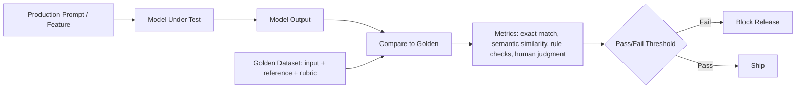

# Golden datasets

> **Learning Path:** AI Evaluation
> **Section:** 14.1.3 — Evaluation

**Golden datasets**

### 1. The problem

You ship a model update and it “feels better”. Next week support says it now hallucinates prices. How do you know you regressed, and where?

LLM evaluation has three problems:
* **Non-determinism and subjectivity.** Same prompt can be valid with multiple outputs. Traditional accuracy is not enough.
* **Slow feedback.** Full human evaluation or large-scale A/B tests take days and cost real users.
* **Moving target.** Data distribution drifts, prompts change, and the model itself changes.

You need a fast, reproducible signal that the model still does the things it must do, and a way to stop a bad release before it ships.

### 2. Mental model

A golden dataset is a small, curated unit-test suite for a model.

It is not a training set. It is a human-verified set of inputs with expected outputs or acceptability criteria, chosen to cover critical behaviors. Think of it as a contract: *for these representative cases, the model must behave this way.*

Small = hundreds to low thousands of examples. High quality > high quantity. Curated by domain experts, not scraped.

### 3. How it works

Essentially:
* **Inputs:** real prompts from production, edge cases, safety scenarios.
* **References:** ideal output, acceptable variants, or a rubric for scoring.
* **Evaluator:** deterministic checkers for facts, format, tool calls; semantic similarity for paraphrase; human review for judgment calls.
* **Gate:** a threshold on metrics per category, not a single average.

It runs in CI/CD for models, just like unit tests for code.

### 4. Architectural reasoning

When it helps:
* You have **non-negotiable behaviors**: do not leak PII, always output JSON with specific schema, never hallucinate a product price.
* You need **fast regression detection** before expensive human eval or live traffic.
* You need **auditable evidence** for compliance and model governance.

What it solves vs alternatives:
* **Synthetic benchmarks** give broad coverage but are generic and gameable.
* **Live eval / A/B** is realistic but slow, noisy, and risks user impact.
* **Human-in-the-loop scoring** is accurate but not scalable for every commit.

Golden datasets sit in the middle: cheap, fast, targeted, and human-grounded.

Architecturally, they become part of your model evaluation plane:
Model registry -> Candidate -> Golden eval -> Metrics store -> Promotion policy -> Production.

### 5. Trade-offs and failure modes

* **Coverage vs cost.** Curation is expensive. A tiny set misses drift; a huge set becomes unmaintainable. You need sampling strategy focused on risk, not representativeness.
* **Overfitting / gaming.** Teams optimize for the golden set, not real performance. Rotate examples, keep a hidden holdout, and never train on goldens.
* **Staleness.** Real user prompts evolve. Goldens rot. You need a refresh loop from production logs and incident reviews.
* **Leakage.** If goldens contain data seen in training, you measure memorization, not capability. Version goldens and track provenance.
* **Subjectivity.** For open-ended tasks, a single reference is wrong. Use rubrics, multiple acceptable answers, or LLM-as-judge with calibrated prompts, not just exact match.

### 6. Example

Enterprise RAG for support.

Golden set of 400 Q&A pairs curated from past tickets:
* 80 fact-retrieval questions with verified citations
* 60 format checks: must return JSON with `answer`, `sources[]`
* 50 safety cases: requests for internal policy, PII
* 100 multilingual prompts
* 110 edge cases: ambiguous queries, contradictory docs

On every model or retrieval index change:
* Run golden eval in <5 min.
* Fail if citation recall <95%, format error >1%, or any safety violation.
* Results are stored with the model version for audit.

This catches a broken retriever or a prompt change that drops citations before it reaches customers.

### 7. Reasoning challenge

You have a customer-facing summarization model. You can afford 1,000 human-labeled goldens. Do you:

A) Build one broad set covering many domains, or
B) Build a small critical set per domain and update it monthly from production failures?

What would you measure, and what failure mode are you most worried about?

### 8. Key takeaway

* Golden datasets are a regression test suite for model behavior, not a benchmark for leaderboard ranking.
* They trade breadth for speed and trust: small, human-verified, risk-focused.
* Use them to gate releases, not to train models.
* Keep them fresh, versioned, and separated from training data; otherwise you measure memorization and staleness.
* The real value is architectural: a deterministic signal in an otherwise non-deterministic system.
