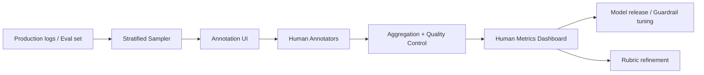

# Human evaluation

> **Learning Path:** AI Evaluation
> **Section:** 14.1.4 — Evaluation

**Human evaluation**

### 1. The problem

Automated metrics are cheap and fast, but they optimize for proxies. BLEU, ROUGE, perplexity, even LLM-as-judge correlate with quality only on narrow tasks. For open-ended generation, safety, style, brand voice, factual nuance, and user satisfaction, the metric you can compute is not the metric you care about.

The problem is alignment: you need to know if the model output is *good for the user in context*, not if it matches a reference string. That requires judgment.

### 2. Mental model

Human evaluation is sampling real outputs and asking trained humans: does this meet the spec?

Think of it as a ground-truth probe. You cannot evaluate everything, so you build a small, high-signal measurement set that acts as a proxy for production quality. The system you build around it is a measurement instrument, not a batch job.

### 3. How it works

Essential mechanism, not tooling:

* **Define the target.** One clear question per task, e.g. "Is the response factually correct and complete?" not "Is it good?"
* **Rubric + examples.** 3-5 point scale with anchored examples. Pairwise comparison is often more reliable than absolute scores.
* **Sampling strategy.** Stratify by risk, user segment, and model behavior. Keep a golden set of edge cases fixed over time.
* **Annotation design.** Short context, blind to model, randomized order, intermix gold controls.
* **Calibration.** Pilots, adjudication, and agreement metrics. Measure Krippendorff's alpha or pairwise Cohen's kappa, not just average score.
* **Aggregation.** Per-annotator bias correction, majority vote or weighted mean, confidence intervals. Track drift over time.

Architecture sketch:

### 4. Architectural reasoning

When it helps:
* Safety, toxicity, brand safety, legal compliance
* Subjective quality: tone, helpfulness, creativity
* New tasks where automated metrics are unvalidated
* Final gate before production rollout

Alternatives:
* **Automated metrics** for speed and coverage. Use them for dev loops.
* **LLM-as-judge** for scale. Use it as a filter, not a source of truth.
* **Human evaluation** for fidelity on the things that matter.

Decision rule: use human evaluation where cost of being wrong > cost of labeling. That is usually a small, high-leverage set measured continuously, not full coverage.

### 5. Trade-offs and failure modes

* **Cost vs fidelity.** Humans are expensive and slow. You get signal, not scale. Budget for ~hundreds to low thousands of judgments per release, not millions.
* **Reliability.** Annotators disagree. Without calibration, rubric ambiguity, and context collapse, you measure noise. Inter-rater agreement is a first-class metric.
* **Bias and drift.** Demographic bias, priming, fatigue, and model identity leakage shift scores. Blind A/B and regular re-calibration are required.
* **Operational burden.** Annotation UI, task routing, QA, and versioning of rubrics become a system. Treat it like a data product with SLOs.
* **Gaming.** Models can overfit to the human eval set. Keep a held-out golden set and rotate prompts.

Common failure: treating human scores as a single number. You need distribution, disagreement, and per-segment breakdowns.

### 6. Example

Enterprise RAG assistant for internal support.

Automated metrics show high retrieval recall. Human evaluation reveals the problem: answers are technically correct but hallucinate policy details and use an overly formal tone that agents reject.

Design: stratified sample of 300 queries across 5 products. Rubric: factual correctness, completeness, and tone appropriateness, 1-3 scale with examples. Three annotators per item, blind to model version. Weekly golden set of 50 known risky queries.

Result: model release blocked because tone score < threshold for customer-facing segment, even though ROUGE improved. Rubric refined to separate "correct" from "usable".

### 7. Reasoning challenge

You have a chatbot with 2M daily conversations. Automated guardrails catch obvious policy violations. You suspect subtle refusals on pricing questions are hurting conversion.

Do you run a full human review of all pricing conversations, build an LLM-as-judge classifier, or sample 500 conversations with a focused rubric and three annotators? What do you measure to decide if the fix works, and what do you do about annotator disagreement?

### 8. Key takeaway

* Human evaluation exists because proxies break on subjective, safety-critical, and user-facing quality.
* Design it as a measurement instrument: clear question, calibrated rubric, stratified sample, agreement tracking.
* Use it sparingly as the ground truth for decisions, not as a dev loop metric.
* The cost is real; protect it with blind, controlled annotation and a held-out golden set.
* If you cannot explain *what human judgment you are buying* and *why automated metrics cannot replace it*, you are collecting noise.
