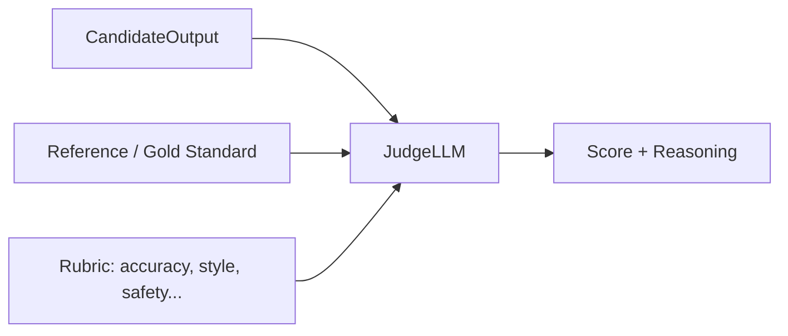

# LLM-as-judge

> **Learning Path:** AI Evaluation
> **Section:** 14.1.5 — Evaluation

**The problem**

You ship an LLM-powered feature. How do you know it's getting better?

Human evaluation is gold standard but slow, expensive, and inconsistent across reviewers. Rule-based metrics like BLEU, ROUGE, exact match work for narrow tasks but break on open-ended generation, tone, helpfulness, or factual correctness.

You need automated evaluation that correlates with human judgment at scale, and you need it in the training loop and CI/CD.

That creates the need for a judge that is cheap enough to run thousands of times and good enough to be directionally correct.

**Mental model**

LLM-as-judge is using a language model as a reviewer. You give it a rubric, context, and two outputs, and ask it to score or pick a winner with a short justification.

Think of it as hiring a senior engineer to grade junior work: not perfect, but consistent and fast. The judge is not the system under test; it's a separate model, often larger or differently prompted, with an explicit scoring contract.

**How it works**

The essential mechanism is structured prompting, not magic.

You provide:
* Task and criteria. e.g., "Rate factual accuracy 1-5, penalize hallucinations"
* Input/context
* Candidate output to evaluate, optionally a reference
* Output format constraint: JSON with score and rationale

Common patterns:
* **Single score**: `score = f(input, output, rubric)`
* **Pairwise**: `pick A vs B` - reduces scale issues
* **Multi-dimensional**: decompose into accuracy, completeness, style, safety

The judge returns a score and a short justification. You log both. The justification is for debugging, not for final truth.

**Architectural reasoning**

When it helps:
* You need continuous automated evaluation for prompts, fine-tunes, or RAG retrieval quality
* Human annotation is bottleneck for A/B tests and regression detection
* You need a signal that captures semantic quality, not just token overlap

What problem it solves:
* Scales evaluation to thousands of examples
* Provides a consistent reviewer across time
* Gives explainable feedback for developers

Alternatives:
* **Rule-based metrics**: cheap, deterministic, blind to semantics
* **Human evaluation**: high validity, low throughput, non-repeatable
* **Task-specific classifiers**: accurate for narrow signals like toxicity, but need labeled data

Why choose LLM-as-judge:
You trade absolute validity for speed and coverage. It is appropriate when the cost of a bad signal is lower than the cost of no signal. For product iteration, it's a leading indicator. For safety-critical release gates, it's a filter before human review.

**Trade-offs and failure modes**

* **Bias and self-preference.** Judges favor longer answers, certain styles, or outputs from the same model family. A judge trained on similar data will systematically prefer its own style.
* **Prompt sensitivity.** Score distribution shifts with minor wording changes in the rubric. You must version prompts like code.
* **Cost and latency.** Running a strong judge on every request is expensive. Architects often sample, use a smaller judge for screening, and escalate borderline cases.
* **Reasoning vs accuracy.** Judges can produce plausible-sounding rationales for wrong scores. Don't trust justification as proof.
* **Goodharting.** Optimizing model outputs to please the judge degrades real quality. The judge becomes the target.

Mitigations: use multiple judges and average, pairwise comparison over absolute scoring, calibrate against a human-labeled holdout set, and lock rubric + temperature = 0.

**Example**

Enterprise support chatbot.

You have 10k real user queries per day. You want to know if a new retrieval prompt improves answers.

Pipeline:
`Query -> RAG system -> Candidate answer -> LLM Judge` with rubric: factual accuracy vs knowledge base, completeness, and tone.

Judge runs offline on sampled traffic nightly. Scores drop for a retrieval change? Flag for human review. Scores improve consistently vs human-labeled calibration set? Promote.

You keep a small human-reviewed golden set to compute correlation: Spearman rank correlation between judge scores and human scores. If correlation < 0.7, you re-tune the rubric or judge model.

**Reasoning challenge**

You need to evaluate safety policy violations in production outputs. False negatives are unacceptable, latency must stay under 200ms, and you have a budget for ~1M judgments per month.

Do you use LLM-as-judge inline, an offline judge with sampling, or a lightweight classifier as first pass? What would you measure to decide if the judge is still valid over time?

**Key takeaway**

* LLM-as-judge exists to replace slow human review with a fast, consistent semantic signal for model quality.
* It is a trade-off: correlation with human judgment for speed and scale, not ground truth.
* Validity decays with prompt drift, model updates, and Goodharting. Calibrate continuously against human labels.
* Use it as a leading indicator and triage tool, not as a final safety arbiter.
