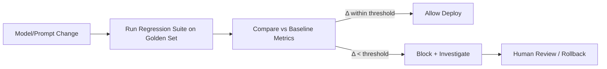

# Regression testing

> **Learning Path:** AI Evaluation
> **Section:** 14.1.6 — Evaluation

**Regression testing** is not about proving a model is good. It is about proving a change didn't make it worse.

### 1. The problem

AI systems change constantly: new model version, retraining on fresh data, prompt edit, retrieval index update, feature flag toggle. Each change can improve one behavior and silently degrade another.

In traditional software, regression is binary: the unit test fails. In AI, regression is statistical and non-obvious. A new LLM might be 3% better on summarization and 8% worse on refusal safety. Latency improves but hallucination rate rises. No single request tells you.

Without a safety net, teams ship on intuition and spotty manual checks. The result is silent quality decay, trust loss, and expensive rollbacks.

### 2. Mental model

Think of regression testing as a time machine for quality.

You freeze a representative set of inputs and expected quality signals. When you change the system, you re-run the same inputs and compare the distribution of results to the frozen baseline. The goal is not absolute score, it is delta.

The core question is always: *Did this change move us away from the behavior we already shipped?*

### 3. How it works

The mechanism is simple, the discipline is hard.

* **Golden evaluation set:** A curated, versioned set of inputs covering critical intents, edge cases, and failure modes. For AI this includes prompts, documents, and expected properties not just exact outputs.
* **Baseline metrics:** A snapshot of key metrics on that set for the currently released version: task accuracy, safety rate, latency, cost per request, etc.
* **Automated harness:** On every candidate change, run the golden set through the candidate and the baseline. Compute per-metric deltas with confidence intervals.
* **Gate:** Deploy only if deltas are within an acceptable band, or if degradations are intentional and reviewed.

For generative systems you compare embeddings, rubric scores, or classifier judgments, not string equality.

### 4. Architectural reasoning

Regression testing enables safe iteration at speed.

**When it helps**
* Model or prompt is updated frequently.
* System has multiple quality dimensions that trade off.
* Cost of bad behavior in production is high: safety, compliance, revenue.
* You need a defensible release decision for stakeholders.

**Alternatives and why they fail**
* Manual spot checks: low coverage, bias, not repeatable.
* Production A/B only: you learn after users are impacted.
* Unit tests on code: they don't catch behavioral drift in model outputs.

Regression testing is the architectural decision that decouples *improvement* from *damage control*. It lets you ship faster because you have an automated signal for silent degradation.

### 5. Trade-offs and failure modes

* **Cost vs coverage.** Full golden set evaluation is expensive. Architects sample strategically: high-risk intents fully, long-tail sampled, with periodic full runs.
* **Stability vs realism.** A frozen set can become stale. Rotate examples, keep a holdout set untouched, and refresh periodically with production examples that are manually reviewed.
* **Metric gaming.** Optimizing for the golden set can overfit. Mitigate with separate validation set and diversity constraints.
* **False confidence.** Passing regression does not mean the model is good, only that it is not worse than before on the things you measured. You still need broader evaluation.
* **Test leakage.** If the golden set is used in training or prompt tuning, regression will be meaningless. Strict data separation is required.

### 6. Example

Enterprise customer support agent.

Release v1 is gated by: intent classification accuracy >=92%, average resolution rate >=78%, safety refusal rate >=99.5%, p95 latency <800ms.

Before shipping v2 with a new retrieval index and system prompt, the regression harness runs 2,000 golden conversations spanning billing, refunds, policy edge cases, and jailbreak attempts. The harness reports: resolution rate +2%, intent accuracy -0.3% within noise, safety refusal rate -1.2% to 98.3%.

The change is blocked despite overall improvement, because safety regressed beyond threshold. The team investigates and finds the new prompt is more permissive. Regression testing prevented a silent safety degradation.

### 7. Reasoning challenge

You have budget for 5,000 eval calls per candidate change. Your golden set is 50,000 examples. A new model shows +4% average win rate on a sampled 5k subset, but the safety classifier flags a 0.5% absolute drop in refusal rate on that sample.

Do you ship, expand the safety slice, or block? What would you need to decide?

### 8. Key takeaway

* Regression testing for AI is about detecting silent degradation across multiple quality dimensions, not proving correctness.
* It requires a versioned golden set, baseline metrics, and automated delta comparison as a release gate.
* The value is speed with safety: you can iterate confidently because you can prove you didn't break what already worked.
* It fails when the set is stale, leaky, or too narrow. Maintain separation, diversity, and periodic refresh.
* Pass means no regression on measured behavior, not that the system is good.
