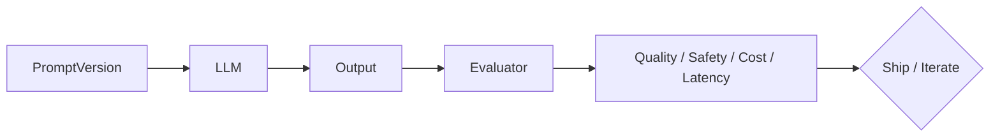

# Prompt evaluation

> **Learning Path:** AI Evaluation
> **Section:** 14.1.7 — Evaluation

**Prompt evaluation**

### 1. The problem

A prompt is production code that has no compiler, no types, and no deterministic output.

You ship a prompt for customer support triage. A small wording change improves empathy on one query and breaks classification on another. You cannot spot-check your way to confidence.

Constraints you hit:
* Output quality is non-deterministic and sensitive to phrasing, temperature, and context length
* Business risk is real: hallucination, bias, leakage, wrong tool calls, cost blow-up
* Manual review does not scale with prompt versions, model updates, and traffic

Without evaluation you are flying blind on quality, safety, and cost.

### 2. Mental model

Think of a prompt as a function with natural language input/output.

Prompt evaluation is a test harness for that function. You define a contract: what good looks like for this task, on this data, under these constraints.

You measure the contract continuously, not once.

### 3. How it works

The core loop is simple:

You need three things:

* **Evaluation set.** A curated, versioned set of inputs with expected behavior. Golden outputs for reference tasks, or just input + constraints for open tasks. Keep edge cases, adversarial cases, and production samples.
* **Metrics.** Task-specific and model-agnostic where possible.
  * Task correctness: exact match, classification accuracy, tool-call validity
  * Semantic quality: LLM-as-judge for coherence, helpfulness, style adherence
  * Safety: refusal rate, PII leakage, jailbreak success
  * Efficiency: tokens per request, latency, cost
* **Judges.** 
  * Reference-based: BLEU/ROUGE/BERTScore for generation similarity
  * Rule-based: regex, JSON schema validation, unit tests on structured output
  * Model-based: a stronger LLM as judge with rubric scoring
  * Human: sampled review for calibration and safety

Evaluation runs offline on the set for prompt iteration, and online on production traffic via shadow evaluation and sampling for drift.

### 4. Architectural reasoning

When it helps:
* You have a business-critical LLM workflow with SLAs on quality and safety
* Prompts are versioned and change frequently
* You need to compare prompt variants, models, or context strategies with confidence

What it solves: replaces subjective debate with measurable deltas before rollout.

Alternatives:
* Ad-hoc manual testing. Cheap initially, fails at scale and model change.
* Production monitoring only. You learn after damage.
* A/B testing on live users. Valid for final signal, expensive and risky for safety issues.

Decision pattern: offline evaluation gates the change, online monitoring validates reality.

Architecture implication: treat prompts like artifacts. Version prompt, dataset, and evaluation config together. Store evaluation results as artifacts in your CI.

### 5. Trade-offs and failure modes

* **Metric vs intent mismatch.** LLM-as-judge correlates with human preference but can be gamed. A prompt can optimize for the rubric and degrade real use.
* **Overfitting to the set.** Prompt engineering to the benchmark improves scores, not users. Mitigate with held-out sets and production sampling.
* **Cost.** Evaluation is itself LLM calls. Use cheap judges for screening, expensive judges for final gate.
* **Stability.** Non-determinism means scores fluctuate. Use multiple samples and report distributions, not point estimates.
* **Latency.** Online evaluation adds overhead. Run async, sample, or use lightweight rule checks in path.

Failure mode to remember: a green evaluation suite does not guarantee safety. Evaluation is necessary but not sufficient.

### 6. Example

Bank loan summarizer. Prompt takes application notes and produces a 3-bullet summary for underwriters with a risk flag.

Evaluation set: 200 real applications with human-written summaries and risk labels, plus 50 edge cases with missing data and PII.

Metrics:
* Task: risk flag accuracy vs human label
* Structure: JSON schema valid, exactly 3 bullets
* Safety: no customer PII copied into summary
* Quality: LLM judge scores factuality and completeness 1-5

Prompt v2 improves style score but drops risk accuracy from 0.91 to 0.84. Decision: do not ship. The evaluation caught a regression that manual spot checks missed.

### 7. Reasoning challenge

You are launching a medical triage chatbot. You can run offline evaluation with a 500-example set judged by an LLM, or shadow 1% of production traffic and have clinicians review 100 samples per week.

Which do you use for the pre-launch gate, and what do you use for ongoing monitoring? What metric would you refuse to ship on?

### 8. Key takeaway

* Prompt evaluation is test-driven development for prompts: define the contract, measure it, gate on it.
* Offline evaluation enables safe iteration; online sampling detects drift and real-world failure.
* Prefer task-specific, business-relevant metrics over generic similarity scores.
* Version prompts, data, and evaluations together. A passing suite is a requirement, not a guarantee.

You now understand why evaluation exists, how to build it, when it matters, and what can go wrong.
