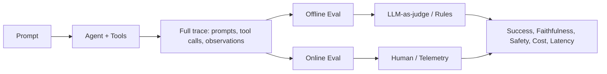

# Agent evaluation

> **Learning Path:** AI Evaluation
> **Section:** 14.1.9 — Evaluation

**Agent evaluation**

### The problem

A single LLM call can be unit tested. An agent cannot.

An agent is non-deterministic, multi-step, tool-using, and stateful. It plans, calls tools, retries on failure, and produces different traces for the same prompt. You need to know not just *is the final answer right*, but *did it use the right tools in the right order, respect policy, stay within cost/latency, and not hallucinate*.

Without evaluation you are shipping a black box that degrades silently as tools, prompts, and data change.

### Mental model

Think of agent evaluation as observability for behavior, not just output.

You need three signals:
* **Task success** - Did the agent achieve the user's intent?
* **Process quality** - Was the reasoning and tool use correct and safe?
* **Operational fitness** - Latency, cost, error rate, retries.

Evaluation is continuous: offline for design decisions, online for production health.

### How it works

Evaluation is a loop around the agent trace, not just the final answer.

**Offline evaluation** uses a curated or synthetic dataset with expected outcomes.
* Golden set: real user prompts with human-annotated ideal tool calls and answers.
* Synthetic set: generated edge cases for safety, tool failure, ambiguity.
* Metrics are rule-based where possible, LLM-as-judge where needed.

**Online evaluation** runs in production.
* Shadow traffic, canary, A/B tests compare agent versions on real users.
* Telemetry captures tool success rate, retries, hallucinated parameters, guardrail triggers.
* Human review samples high-risk or low-confidence traces.

The core artifact is the trace. Log the full reasoning, tool inputs/outputs, and final response so you can score both outcome and process.

### Architectural reasoning

Use offline eval to decide *what to ship*. Use online eval to know *if it still works*.

When it helps:
* Tool-using agents where correctness depends on calling the right API with right arguments
* Agents with policy constraints, e.g., no PII disclosure, must cite sources
* High-cost agents where latency and token usage matter

Alternatives:
* Unit tests on model outputs. Fails for non-determinism and multi-step behavior.
* Manual QA only. Too slow, doesn't scale, misses regressions.
* Model-only benchmarks. They don't measure tool use, retries, or system integration.

Choose agent evaluation when the system has emergent behavior from composition.

### Trade-offs and failure modes

* **Coverage vs cost.** Realistic golden sets are expensive to build. Synthetic data is cheap but can be gamed. You need both.
* **Automation vs accuracy.** LLM-as-judge is fast and scalable but has bias and can be fooled by confident wrong answers. Use rule-based checks for tool calls and structured fields, reserve judges for open-ended quality.
* **Offline vs online.** Offline is safe and reproducible but lags reality. Online is ground truth but risky and noisy. Good architectures run both.
* **Reward hacking.** Agents optimize for the eval metric, not the task. If you score only final answer match, agents learn to skip steps. Score intermediate actions.

Failure modes to watch:
* Eval set drift. The distribution of production prompts changes; metrics stay green while quality drops.
* Judge bias toward longer or more verbose answers.
* Missing negative tests. You test happy paths but not tool errors, rate limits, or ambiguous intent.

### Example

Enterprise support agent that creates tickets and checks order status.

Offline eval set contains 200 prompts: happy path, missing info, ambiguous product, tool error simulation.

Metrics:
* Task success: correct ticket created with right priority and tags
* Tool accuracy: correct order ID extracted, correct API called, parameters valid
* Safety: no PII leakage, refuses disallowed requests
* Ops: p95 latency < 3s, cost per task < $0.12

Weekly synthetic generation adds new failure modes, e.g., API returns 429. The harness flags a regression where the agent loops on retry instead of asking the user.

Online, 5% traffic is shadowed to a canary. Human review samples low-confidence traces. Dashboard shows success rate and cost per task by prompt type.

### Reasoning challenge

Your customer research agent just passed offline eval with 94% task success. In production, cost per task doubled and success rate dropped to 78% for queries about new products.

What do you check first, and what evaluation change do you make?

### Key takeaway

* Evaluate the trace, not just the final answer. Tool calls, reasoning steps, and safety matter.
* Offline eval is for design decisions; online eval is for production truth.
* Use rule-based checks for structure and automated judges for quality, but validate judges.
* If you only measure final output, the agent will learn to game it.
