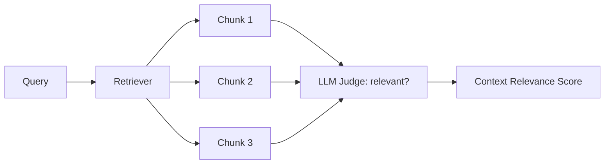

# Context relevance

> **Learning Path:** AI Evaluation
> **Section:** 14.2.3 — RAG metrics

**The problem**

A RAG system can generate a perfect answer from bad context, and a bad answer from perfect context. End-to-end metrics like answer correctness hide where the failure happened.

If the retriever returns irrelevant chunks, the LLM is forced to hallucinate or refuse. If the retriever returns relevant chunks but the generator ignores them, that's a different failure. You need a metric that isolates retrieval quality from generation quality.

Context Relevance is that isolation. It answers: *Did we give the model useful material to work with?*

**Mental model**

Think of retrieval as a briefing for the model. Context Relevance is the precision of that briefing.

High relevance = every retrieved chunk helps answer the query.
Low relevance = chunks are on-topic in embedding space but useless in practice, or the retriever over-fetches.

It is not about whether the answer is correct. It is about whether the context is *necessary and sufficient* for a correct answer.

**How it works**

For a query q and top-k retrieved chunks C1..Ck:

1. Score each chunk for relevance to q.
2. Aggregate.

Scoring is done with:
* **LLM-as-judge:** Prompt the model: "Is this chunk relevant to answering the query? Score 0-1 and justify." This captures semantic relevance beyond cosine similarity.
* **Embedding similarity:** Cosine between query embedding and chunk embedding. Cheap, fast, correlates poorly with true utility.
* **Human annotation:** Gold standard for calibration, too expensive for continuous evaluation.

RAGAS defines Context Relevance as the average relevance score of the retrieved set. Related metrics:
* Context Precision: relevance of retrieved chunks, penalizing irrelevant ones higher up.
* Context Recall: fraction of gold relevant chunks that were retrieved.

**Architectural reasoning**

When it helps:
* Tuning the retriever: hybrid vs vector-only, chunk size, overlap.
* Deciding on a reranker. If relevance is low, a cross-encoder reranker or query expansion will help more than prompt engineering.
* Setting k. More chunks increases recall but dilutes relevance and hurts latency and cost.

What it solves vs alternatives:
* Answer Relevancy tells you if the final output is good. It conflates retrieval and generation failures.
* Context Relevance isolates the retriever. You can improve retrieval without touching the generator.

Decision signal: If Context Relevance is high but Faithfulness/Answer Relevancy is low, fix the prompt, grounding, or generation. If Context Relevance is low, fix retrieval, indexing, or chunking.

**Trade-offs and failure modes**

* **Judge cost vs fidelity.** LLM-as-judge is expensive and non-deterministic. Embedding similarity is cheap but misses nuance like negation and temporal constraints. Most teams use embeddings for online monitoring and LLM judge for offline evaluation.
* **Relevance ≠ completeness.** A chunk can be relevant but too small to answer. You need Context Recall for that. Optimizing only for relevance leads to over-filtering.
* **Position bias.** Judges and models over-weight early chunks. A relevant chunk at rank 10 may never be used. Context Precision captures this; raw relevance does not.
* **Prompt sensitivity.** The judge prompt defines "relevant". Vague prompts produce inflated scores. Calibrate with human labels on a small set.

**Example**

Enterprise support RAG over 200k internal tickets.

Initial eval: Answer Relevancy 0.62, Context Relevance 0.41 at k=10. Chunks look related by vector similarity but contain generic troubleshooting steps not specific to the query.

Decision: Add query decomposition for multi-intent questions and a cross-encoder reranker. Re-evaluate: Context Relevance rises to 0.78, Answer Relevancy to 0.81. Latency increases 120ms per query, acceptable for support use case. Without Context Relevance, they would have blamed the LLM and wasted cycles on prompt tuning.

**Reasoning challenge**

You ship a RAG product with Context Relevance 0.85 and Context Recall 0.35 on a benchmark. Your users complain answers are incomplete. Do you increase k, change chunking, or add a reranker? What metric would you watch to avoid degrading relevance?

**Key takeaway**

* Context Relevance measures retrieval precision, not answer quality. It isolates the retriever from the generator.
* Use it to decide if you should fix retrieval, reranking, or generation. High relevance + low answer quality = generator problem. Low relevance = retrieval problem.
* LLM-as-judge gives semantic signal, embeddings give cheap signal. Use both with different cadence.
* Optimize relevance together with recall and latency. More context is not better if it dilutes relevance.
