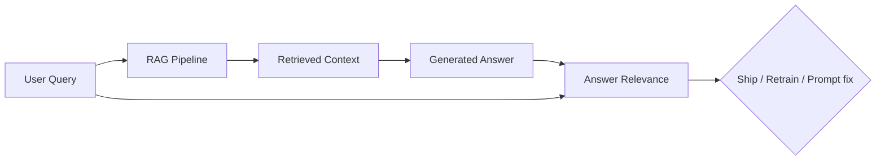

# Answer relevance

> **Learning Path:** AI Evaluation
> **Section:** 14.2.7 — RAG metrics

**Answer Relevance — RAG metric 14.2.7**

### 1. The problem

A RAG system can retrieve perfect documents and still give a bad answer.

Retrieval can be great: top chunks contain the answer. Generation can still drift: the model summarizes the wrong section, answers a different interpretation of the query, or produces a generic safe response.

If you only measure retrieval Recall@k, you miss the last mile: does the final answer actually satisfy the user’s intent?

Without a signal for this, you ship systems that look good on retrieval benchmarks and fail in production.

### 2. Mental model

Answer Relevance measures alignment between **query intent** and **generated answer**, independent of the source documents.

Think of it as a conversation check, not a citation check.

* Context Relevance = are the retrieved chunks relevant to the query?
* Faithfulness = is the answer supported by the retrieved chunks?
* Answer Relevance = does the answer respond to what the user asked?

You need all three. A faithful but irrelevant answer is still useless. A relevant but unfaithful answer is dangerous.

### 3. How it works

There is no single ground truth score like Recall. Answer Relevance is a semantic judgment.

Two practical approaches:

**Embedding similarity.** Embed query and answer, compute cosine similarity. Fast and cheap. Good for trend detection, bad for nuance. “What is our refund policy?” vs “We have a refund policy” scores high but is unhelpful.

**LLM-as-judge.** Prompt a strong model: given query Q and answer A, rate relevance 1-5 with a rubric. This captures intent, completeness, and conciseness.

Typical rubric:
1 = off-topic / answers different question
3 = partially addresses query, missing key aspects
5 = directly answers query, complete and concise

In practice, teams run both: embeddings for cheap online monitoring, LLM judge for offline evaluation and CI gates.

### 4. Architectural reasoning

When it helps:
* You need a generation-level quality gate in eval. Retrieval metrics alone will not catch prompt drift.
* You run A/B tests on prompts, system messages, or rerankers and need a user-facing signal.
* You want automated regression testing without human labeling every change.

What it solves: it closes the loop from retrieval to user value.

Alternatives:
* Human evaluation: gold standard, expensive, slow.
* Exact match / keyword overlap: brittle for paraphrase.
* User satisfaction proxy: click-through, thumbs up. Lagging and noisy.

Choose LLM-as-judge when you need semantic judgment at scale and can tolerate judge variance. Choose embedding similarity when you need cheap, real-time monitoring.

### 5. Trade-offs and failure modes

* **Relevance ≠ Faithfulness.** A highly relevant answer can hallucinate. You must evaluate both together. Optimizing only for relevance encourages the model to invent plausible answers.
* **Judge bias.** LLM judges prefer longer, confident answers. They are sensitive to prompt wording and model choice. Calibrate with a small human-labeled set.
* **Generic answers score deceptively high.** “The refund policy varies by product” is relevant to almost any refund query but useless. Rubrics need to penalize vagueness.
* **Cost.** LLM-as-judge at scale is expensive. Sample strategically: evaluate on a stratified query set, not every request.

### 6. Example

Enterprise support RAG for a SaaS product.

Query: “How do I export my data to CSV in the new dashboard?”

Retrieved chunks contain correct steps. A bad generation: “You can export data from your account settings.” Relevant topic, wrong UI, incomplete.

Answer Relevance score ~2. Context Relevance score ~5, Faithfulness ~4.

Architectural fix: add query-aware instruction in system prompt and measure Answer Relevance per intent cluster. The metric drops on “export” intents, prompting a targeted prompt revision rather than retraining the retriever.

### 7. Reasoning challenge

You ship a RAG chatbot. Retrieval Recall@5 improves from 0.72 to 0.88 after adding a reranker. Answer Relevance judged by LLM stays flat at 3.1/5.

What do you investigate first?

### 8. Key takeaway

* Answer Relevance measures query-to-answer alignment, not retrieval quality or citation correctness.
* Use it alongside Context Relevance and Faithfulness; together they diagnose where the pipeline fails.
* LLM-as-judge gives semantic signal at scale, embeddings give cheap monitoring. Both have blind spots.
* Optimize for relevance without faithfulness, and you reward plausible hallucinations.

You should be able to reason: “Is my metric measuring the right failure mode, and what would a drop in Answer Relevance tell me to change in the architecture?”
