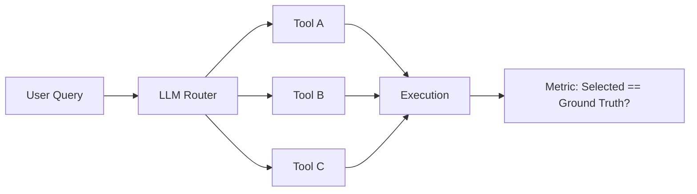

# Tool selection accuracy

> **Learning Path:** AI Evaluation
> **Section:** 14.3.2 — Agent metrics

**Tool selection accuracy**

### The problem

An agent can only be as good as its routing. When an agent has 2 tools it can guess. With 20-100 tools, plus overlapping capabilities, the LLM must decide *which* tool to call, with what parameters, and in what order.

The failure isn't always a wrong answer. It's a correct answer from the wrong tool, or an unnecessary tool call that wastes cost/latency, or a hallucinated tool that crashes the run.

Tool selection accuracy measures how often the agent picks the right tool for the user intent, not whether the final response sounds plausible.

### Mental model

Think of the agent as a router sitting in front of a toolbox.

User intent -> Router -> Tool choice -> Execution -> Result

The router is the LLM. Tool selection accuracy is the hit rate of that router.

It is not the same as task success. An agent can pick the wrong tool but still retrieve something plausible, or pick the right tool with wrong arguments and fail. Accuracy isolates the routing decision.

### How it works

You need a ground truth for what tool *should* have been called for a given query.

For evaluation you log:
* query + context
* tools available in that turn
* tool actually selected by agent
* tool that a human/ideal router would select

Tool Selection Accuracy = correct selections / total selection attempts

Variants matter:
* **Strict accuracy:** exact tool match. No partial credit.
* **Hierarchical accuracy:** credit if parent tool family is correct, e.g., `crm.search.customer` vs `crm.search.order`.
* **Multi-tool accuracy:** for multi-step tasks, does the agent select the correct sequence/set of tools.

You can also measure precision/recall per tool to find blind spots.

### Architectural reasoning

High tool selection accuracy enables larger, safer toolsets. Low accuracy forces you to shrink the set or add guardrails.

When it helps:
* **Broad toolset.** Customer support with CRM search, ticket create, refund, knowledge base, billing lookup. Overlapping intent.
* **Cost-sensitive tools.** Calling an expensive vector DB or external API when a cheap lookup would suffice.
* **Safety-critical tools.** Creating a refund vs issuing a refund. Selecting wrong tool has business impact.

Alternatives and why you choose them:
* **Smaller toolset per session.** Route by domain first, then expand. Improves accuracy at cost of extra hop.
* **Tool router / classifier model.** A small classifier pre-selects candidates, LLM ranks them. Improves accuracy, adds latency.
* **Tool descriptions and schemas.** Better prompting reduces mis-selection. Diminishing returns after a point.
* **Execution-time validation.** Allow the agent to try and fail, then recover. Hides routing errors but increases cost and latency.

Decision rule: If tool selection accuracy < ~80-90% for production, fix routing before adding more tools.

### Trade-offs and failure modes

* **Accuracy vs coverage.** Restricting to top-k candidate tools improves accuracy but can miss rare intents. You trade recall for precision.
* **Ambiguous intent.** "Check my order" could be status lookup or tracking. Accuracy metric will be noisy without disambiguation step. You need clarification policy.
* **Description drift.** Tool names and descriptions change, LLM was trained on old wording. Accuracy drops silently.
* **Overfitting to evaluation set.** Agent learns to match phrasing in test set, not true intent. Need out-of-distribution queries.
* **Partial credit problem.** Selecting `search_products` when ground truth is `search_products_by_sku` is wrong but useful. Strict accuracy punishes this; hierarchical accuracy captures it.

The most common failure mode: accuracy looks fine on simple queries, collapses when tools overlap. e.g., `get_user_profile` vs `get_user_preferences` vs `get_user_subscription`.

### Example

Enterprise support agent with 4 tools:
* `kb.search`
* `crm.find_customer`
* `ticket.create`
* `refund.initiate`

Query: "I was charged twice last week"

Ideal selection: `crm.find_customer` then `refund.initiate`. Common errors:
* Agent calls `kb.search` for "charged twice" -> plausible answer, wrong tool
* Agent calls `ticket.create` immediately -> task succeeds but costs human review

Tracking tool selection accuracy per intent cluster shows refund requests are mis-routed to ticket.create 35% of the time. Fix: add explicit examples in tool description and add a pre-filter router for financial intents.

### Reasoning challenge

You have an agent with 80 tools. Tool selection accuracy is 92% on a 500-query test set, but production logs show 40% of runs involve ≥3 tool calls and average cost is high. Latency SLA is breached.

Do you add more tools, improve descriptions, add a router classifier, or change the metric? What data would you check first?

### Key takeaway

* Tool selection accuracy measures routing correctness, not final answer quality.
* It degrades with tool count, overlap, and ambiguous intent.
* Fix accuracy before scaling toolset; otherwise cost, latency, and risk grow.
* Track per-tool precision/recall and multi-step sequence accuracy, not just overall hit rate.
* High accuracy enables safe, broad agents; low accuracy forces you to narrow scope or add explicit routing layers.
