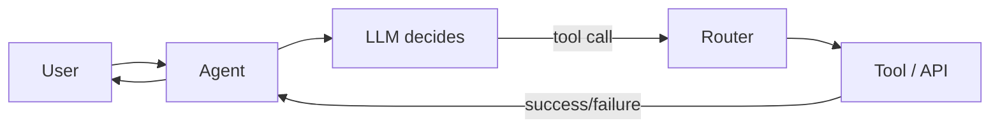

# Tool execution success

> **Learning Path:** AI Evaluation
> **Section:** 14.3.3 — Agent metrics

## The problem

An agent looks good in a demo. It reasons, it chooses tools, it returns answers. In production it fails silently: the LLM emits a perfect tool call, the downstream API times out, the database rejects the query, the auth token is expired, or the parameters are subtly wrong.

Without visibility, you can't tell if the agent is bad at reasoning or if your infrastructure is unreliable. Hallucinated parameters, bad tool selection, and flaky execution all collapse into "agent didn't help."

You need a metric that separates agent decision quality from tool execution reliability.

## Mental model

**Tool execution success** = the fraction of tool invocations that complete and return a usable result for the agent to continue.

It measures the system, not just the model.

```
Successful executions / Total tool invocations
```

Usable means: call completed within SLA, returned a response the agent can process, no unrecoverable error. It does not mean the agent used the tool correctly, only that the tool ran.

This is distinct from:
* **Tool call accuracy**: did the agent call the right tool with valid arguments?
* **Task success**: did the agent ultimately solve the user request?

Execution success sits between them. It's the reliability of the execution layer.

## How it works

The agent loop creates a natural measurement point.



Count every tool call attempt. Classify the outcome:

* **Success**: HTTP 2xx, valid schema returned, within timeout.
* **Recoverable failure**: transient error, rate limit, timeout -> retried and eventually succeeded.
* **Unrecoverable failure**: auth error, validation error, schema mismatch, business logic rejection.

Log: tool name, parameters fingerprint, latency, error code, retry count, agent session id. Success is a boolean per invocation, aggregated per tool, per agent version, per time window.

## Architectural reasoning

When it helps:
* You operate multiple tools with different reliability profiles.
* Tools are external, owned by other teams, or rate limited.
* You need to know if degradation is model-side or infra-side.

What it solves:
* Isolates blame. Low success on a specific tool points to downstream reliability, auth, or schema drift, not prompt engineering.
* Drives retry and fallback design. If success is 98% with one retry, you save cost vs over-engineering.
* Informs tool selection. The agent can prefer high-success tools for critical paths.

Alternatives:
* Only measure end-to-end task success. Hides where failures happen.
* Only measure LLM output quality. Misses operational failures.
* Only measure tool latency. Misses correctness and error handling.

Choose tool execution success when you need operational observability for an agentic system with real tool dependencies.

## Trade-offs and failure modes

* **Success ≠ usefulness.** A tool can return 200 with empty data because the agent passed wrong parameters. Track success alongside call accuracy.
* **Retry inflation.** Blind retries raise success but increase latency and cost. Define success after max retries.
* **Aggregation hides skew.** Overall 99% success can mask one critical tool at 70%. Slice by tool, parameter shape, and user segment.
* **Transient vs systemic.** A spike in timeouts may be a downstream incident, not an agent bug. Correlate with downstream SLOs.
* **Success gaming.** Teams may broaden "usable" definition to look good. Keep definition strict and versioned.

## Example

Enterprise support agent with three tools: Knowledge Base Search, Zendesk Ticket Create, Internal Pricing API.

Week 1 dashboard shows overall tool execution success 92%. Drilled down:
* KB Search: 99.8%
* Zendesk: 94%
* Pricing API: 71%

Pricing API failures are 400 validation errors. The LLM is generating `currency_code` as free text instead of ISO code. That's a call accuracy problem, not API reliability. Fix: constrain output with a schema and add a parameter validator before dispatch.

After fix, Pricing API success rises to 97%. Task success for pricing-related requests rises from 68% to 89%.

## Reasoning challenge

Your agent shows tool execution success of 85% for the Payments API. Latency p95 is fine. Error codes are 50% 429 rate limit, 50% 401 unauthorized. Agent retries with exponential backoff already in place.

Is this an agent problem, a tool reliability problem, or an architecture problem? What metric would you check next and what decision would you make?

## Key takeaway

* Tool execution success measures the reliability of the execution layer, not agent reasoning.
* Separate execution success from call accuracy and task success to find the real failure mode.
* Slice by tool, error type, and agent version; aggregate alone hides critical problems.
* Use it to drive retry policy, fallback design, and tool selection, not just dashboards.
