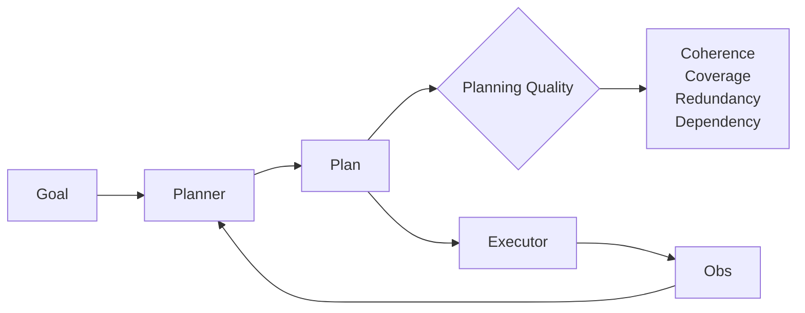

# Planning quality

> **Learning Path:** AI Evaluation
> **Section:** 14.3.4 — Agent metrics

**Planning quality**

### The problem

An agent can get the right answer for the wrong reasons.

With outcome-only evaluation you reward a lucky execution path: a bad plan that happens to stumble into success, or a good plan that fails because a tool timed out. In production you need to know if the agent *reasoned* correctly before it acted.

This matters when plans are multi-step, tool-dependent, and costly to execute. Re-running a bad plan wastes tokens, API calls, and latency. A plan that is logically sound but fails at step 3 is cheaper to fix than one that is incoherent from step 1.

### Mental model

Planning quality is the fitness of the *plan* independent of final success.

Think of it as code review for a plan before it runs. You are asking: does the plan decompose the goal correctly, respect dependencies, use the right tools in the right order, and avoid waste?

It is not the same as task success. Success = plan quality + execution quality + environment luck.

### How it works

You evaluate the plan artifact, not just the trace.

Core signals architects track:

* **Validity**: each step is executable with available tools and data. No hallucinated APIs.
* **Coherence**: steps follow logically. No contradictions, no circular dependencies.
* **Coverage**: the plan addresses all constraints of the goal. Missing required information is a coverage gap.
* **Minimality**: no redundant steps. Redundancy inflates cost and error surface.
* **Ordering**: dependencies are respected. You don't call `book_flight` before `search_flights`.
* **Contingency awareness**: plan acknowledges uncertainty where it exists, e.g., fallback if a tool fails.

Evaluation is usually hybrid:
* Rule-based checks for schema, tool existence, dependency graph.
* LLM-as-judge for semantic coherence and coverage against the goal.
* Human review for a gold set to calibrate the judge.

Planning quality is measured per plan and can be tracked over time as a distribution, not a single score.

### Architectural reasoning

Use planning quality when:

* Plans are expensive to execute. You want to filter or rewrite bad plans before tool calls.
* You need debuggability. A bad plan explains *why* an agent failed, not just *that* it failed.
* You are improving the planner. Outcome metrics are noisy; plan metrics give faster feedback loops for prompt, fine-tuning, or verifier changes.

Alternatives:

* **Outcome-only**: simple, cheap. Fails when success is rare or stochastic.
* **Step-level correctness**: finer than outcome, but still confuses planning errors with execution errors.
* **Human evaluation only**: accurate, not scalable.

Choose planning quality when you need to separate reasoning from luck and you can afford a verifier in the loop.

### Trade-offs and failure modes

* **Verifier cost vs signal.** LLM-as-judge adds latency and cost. You typically sample or run it asynchronously.
* **Overfitting to the metric.** Optimizing for plan neatness can produce overly conservative plans that avoid necessary exploration.
* **False positives.** A coherent plan can still be wrong about the world. Planning quality does not guarantee ground truth.
* **Brittleness.** Strict dependency checks penalize valid replanning mid-execution. You need to distinguish planning quality from execution adaptation.
* **Evaluation drift.** The judge model can be lenient or harsh. You need a held-out human-labeled calibration set.

### Example

Travel planning agent: "Book a 3-day trip to Lisbon under $800 with a vegetarian restaurant."

Bad plan: 
1. Book hotel
2. Search flights
3. Book restaurant

Issues: ordering violation, hotel booked before budget is known, restaurant booked without dates.

Good plan:
1. Get travel dates and budget constraints
2. Search flights, filter by price
3. Search hotels near chosen flights, filter by budget
4. Find vegetarian restaurants for those dates
5. Book in dependency order

Outcome could be identical in both cases if the user is flexible, but planning quality separates them. In production you would reject or rewrite the first plan before any API calls.

### Reasoning challenge

An agent returns the correct itinerary but its internal plan contains an unused step to check visa requirements, and it calls `search_hotels` before confirming flight dates exist.

Do you reward the plan? Would you reward it more if the task was simple and cheap, versus if it involved real bookings with fees?

### Key takeaway

* Planning quality measures the plan, not the outcome. It isolates reasoning from execution luck.
* Track validity, coherence, coverage, minimality, and ordering. These drive cost and reliability.
* Use it to filter bad plans before execution and to give faster, cleaner feedback to the planner.
* It trades verifier cost and complexity for earlier failure detection and better debuggability.
