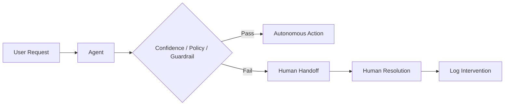

# Human intervention rate

> **Learning Path:** AI Evaluation
> **Section:** 14.3.7 — Agent metrics

### The problem

You ship an autonomous agent. Offline benchmarks look good. In production it still creates bad outcomes: hallucinated refunds, toxic outputs, compliance violations, silent failures.

Accuracy on a test set does not measure what you actually care about: **does the agent operate safely without a human?**

You need a live signal that captures real-world failure modes the model cannot self-detect — ambiguity, novel inputs, policy edge cases, tool misuse. Human intervention rate is that signal.

### Mental model

Human intervention rate = how often the agent cannot be trusted to finish alone.

It is a rate, not a score. It measures autonomy in production, not capability in lab.

Think of it as a proxy for residual risk. A low rate means the agent’s decision boundary aligns with your acceptable risk. A rising rate means drift, scope creep, or degraded tools.

Formula:
`Human Intervention Rate = Interventions / Total agent-handled tasks`

Intervention = human takes over, overrides, edits, or escalates to fix or complete the task. Measure it per task type and per risk tier.

### How it works

The agent runs with an explicit escalation policy. On each task it either:

1. Completes autonomously
2. Self-escalates due to low confidence / guardrail hit
3. Gets externally escalated by user feedback / monitoring

You instrument the handoff point and count.

The metric is tracked over a rolling window and segmented by intent, channel, and risk level. It is a lagging indicator of model quality, prompt stability, tool reliability, and data drift.

### Architectural reasoning

When it helps:
* Production agents with real cost/safety impact
* Human-in-the-loop / human-on-the-loop designs where you need a quantitative autonomy target
* Compliance domains where you must prove oversight

What problem it solves:
* Translates vague “trust” into an operational KPI you can alert on
* Gives a feedback loop for where guardrails are too loose or too tight
* Enables cost modeling: human time per 1000 tasks

Alternatives:
* **Task success rate alone**: misses silent failures and subjective quality
* **Human review rate**: reviews all outputs, expensive, not risk-based
* **Confidence score**: model is poorly calibrated; confidence ≠ correctness

Why choose it:
You need a single, business-meaningful metric that ties model behavior to operational cost and risk. Human intervention rate is directly tied to both.

### Trade-offs and failure modes

* **Gaming the metric.** Teams can lower the rate by making the agent overly conservative and refuse tasks, or by silently absorbing errors. Track refusal rate and user abandonment alongside it.
* **Human fatigue.** A low rate can hide overloaded humans handling escalations poorly. Pair with intervention resolution time and human error rate.
* **Threshold pressure.** Setting a target like <5% can incentivize under-escalation on high-risk tasks. Segment by risk tier, not aggregate.
* **Latency vs safety.** Faster auto-resolution reduces intervention rate but may increase bad outcomes. Use it with outcome-based metrics.

Most important: intervention rate rises for many reasons. You need a taxonomy: model error, ambiguous input, tool failure, policy gap, user abuse. Without root cause tagging, the metric is a smoke alarm with no location.

### Example

Enterprise customer support agent for returns.

Target: <8% intervention rate for standard returns, <2% for high-value orders with manual approval.

Architecture:
Agent tries retrieval + tool calls. Guardrails check: order age >180 days → escalate. Refund >$500 → escalate. Confidence <0.7 on intent → escalate. User explicitly requests agent → human.

Observability logs every intervention with reason code. Weekly review shows intervention rate climbing from 6% to 14% on “partial refund” intents after a catalog price change broke the refund calculator tool. Fix tool, rate drops.

The metric enabled a decision to keep the agent live for standard returns while routing high-value returns to human-on-the-loop.

### Reasoning challenge

Your finance summarization agent has a 3% human intervention rate and is praised for autonomy. However, users report that 20% of summaries are “close enough but not usable” and they re-do them manually without escalating. What is wrong with relying only on human intervention rate, and what would you measure next?

### Key takeaway

* Human intervention rate measures real-world autonomy and residual risk, not benchmark accuracy.
* Use it as an operational control, segmented by task risk and root cause, not as a single vanity number.
* It enables a deliberate autonomy dial: lower rate = more automation cost savings, higher rate = more safety/quality, with explicit trade-offs.
* Pair it with refusal rate, user abandonment, and outcome quality to avoid gaming and hidden failures.
