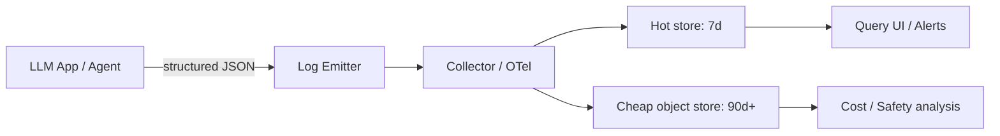

# Logs

> **Learning Path:** LLMOps / AI Observability
> **Section:** 15.1.1 — Observability

**Logs in LLMOps / AI Observability**

### 1. The problem

An LLM app is non-deterministic and stateful across steps. The same user prompt can produce different answers, trigger different tools, and cost different amounts depending on model version, temperature, retrieval results, and prompt version.

When it fails in production you cannot reproduce it by re-running the prompt. You need an immutable record of *what actually happened*: exact prompt sent, system prompt version, retrieved context, tool calls made, model parameters, latency, tokens, cost, and final output.

Metrics tell you *that* something is wrong. Traces tell you *where* in the workflow it went wrong. Logs tell you *why* with the full input/output evidence.

### 2. Mental model

Think of logs as the forensic audit trail of an AI system.

A trace is the skeleton of a request: `ingest -> retrieve -> generate -> respond`. A log is the tissue on that skeleton: the actual prompt text, the top-k documents returned, the tool arguments, the raw completion.

Without logs you can see p95 latency spike, but you cannot tell if it was a bad retrieval, a prompt regression, or a new tool failing.

### 3. How it works

In LLM systems logs must be structured, correlated, and redacted.

The essential fields are not free text. They are:
* `request_id / trace_id` to join across services
* `session_id / user_id` for user journey
* `model`, `model_version`, `temperature`, `max_tokens`
* `prompt_version`, `system_prompt_hash`
* `prompt_tokens`, `completion_tokens`, `cost`
* `tools_called`, `retrieval_query`, `retrieval_results_ids`
* `latency_ms` per stage
* `output` and `error` if any

Logs are emitted as JSON, shipped via a collector, stored cheaply in object storage, indexed for recent queries.

Correlation is key. One `trace_id` spans the API gateway, orchestrator, vector DB, LLM provider, and tools. Without it you cannot reconstruct a single generation.

### 4. Architectural reasoning

Logs help when you need replayability and compliance.

Choose detailed request logs when:
* You need to debug hallucinations or bad tool use post-hoc
* You need to audit prompts/outputs for safety and PII
* You need to measure cost and token usage per feature
* You need to evaluate prompt changes with real production data

Choose less logging when:
* You only need SLOs. Use metrics.
* You need request timing across services. Use traces.

Alternatives: pure metrics lose context, pure traces lose content. Logs bridge the gap. Sampling is common: log 100% of errors, 1-10% of successes, and always log token/cost fields.

### 5. Trade-offs and failure modes

* **Volume and cost.** LLM logs are large because prompts and outputs can be thousands of tokens. Unbounded retention bankrupts storage. Decide hot vs cold storage and TTL per field. Store full prompt/output in cold, keep metadata hot.
* **Privacy and security.** Logs contain PII and potentially sensitive user data. Redact or tokenize PII at emit time, enforce access controls, and set retention limits. Logging secrets is a common failure.
* **Cardinality and searchability.** High-cardinality fields like full prompt text make log search expensive. Index only IDs and metadata; keep text in object storage.
* **Loss.** If logs are best-effort and async, you lose the exact evidence for failures. For critical paths, make logging synchronous or at least durable with backpressure.

### 6. Example

RAG chatbot with prompt versioning.

User asks a question. The orchestrator logs one structured event with `trace_id`, `prompt_version=v3.2`, `retrieval_query`, `retrieval_doc_ids=[a1,b4]`, `model=gpt-4o`, `tokens_in=1240`, `tokens_out=312`, `latency_ms`, and the final answer.

Two weeks later answer quality drops. Using `prompt_version` and `retrieval_doc_ids` you query logs, find that v3.2 started using a new embedding model that returned irrelevant docs, and cost per request rose 18%. You can replay the exact prompts with the old retrieval set to confirm.

Without those logs you would only see “satisfaction down”.

### 7. Reasoning challenge

You are launching an agent that calls external tools and handles PII. Your budget allows 30 days of hot logs.

What do you log in hot storage vs cold storage, and what do you never log? How do you correlate a multi-step agent run across tool calls?

### 8. Key takeaway

* Logs provide the *what actually happened* evidence that metrics and traces cannot.
* In LLM systems logs must be structured, correlated by `trace_id`, and include model, prompt version, tokens, cost, and tool calls.
* Log for replay and audit, not for real-time alerting. Use metrics/traces for that.
* Design retention, sampling, and redaction first. Volume and privacy are the architectural constraints.
