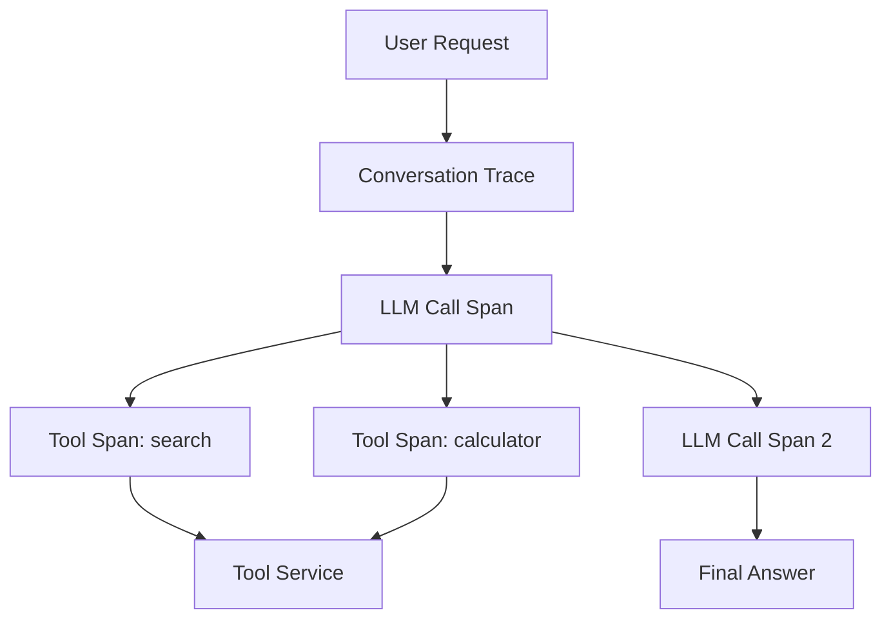

# Tool traces

> **Learning Path:** LLMOps / AI Observability
> **Section:** 15.1.10 — Observability

**Tool traces**

### 1. The problem

An LLM request is no longer a single RPC. The model decides to call tools, waits for results, then reasons again. The final answer can be wrong because of a bad tool result, a bad argument the model generated, a timeout, or an infinite tool loop.

Without observability you only see: input prompt → output text. You cannot answer why the agent hallucinated, why latency spiked, or why costs doubled. Traditional request logs miss the agent's control flow.

The need is to observe the *decision + execution* of tool use, not just the LLM call.

### 2. Mental model

A tool trace is a child span of an LLM call span inside a conversation trace.

Think of it as distributed tracing for agents: the parent is the user request, the LLM call is one span, each tool invocation is a child span with its own inputs, outputs, latency, and error state. The trace shows the reasoning loop, not just the text.

### 3. How it works

Capture the agent execution as a trace tree:

* **Parent**: conversation/request id, user id, model, prompt
* **LLM span**: model, tokens in/out, latency, cost, system prompt hash
* **Tool span**: tool name, invocation id, arguments schema, output schema, status = success/error/timeout, latency, retries, token delta if model re-runs

The essential attributes are: `tool.name`, `tool.input`, `tool.output`, `tool.error`, `tool.latency_ms`, `tool.round`. The trace links tool output to the next LLM input so you can replay the exact reasoning chain.

Implementation is instrumentation at the agent framework boundary, not inside the model. Emit OpenTelemetry spans on `tool_start` / `tool_end`, propagate trace context to the tool service, and redact PII before export.

### 4. Architectural reasoning

When it helps:
* Multi-step agents with 2+ tool rounds
* Production debugging of wrong answers or cost spikes
* Safety and policy review of what data the agent accessed
* Performance SLOs where tool latency dominates

Alternatives:
* Raw prompt logs only → you lose causality between tool result and model output
* Tool logs only → you lose which LLM decision triggered them
* Full conversation replay with no structure → unqueryable at scale

Choose structured tool traces when you need to reason about *why* an agent acted, not just *what* it said. The architectural decision is to treat tool calls as first-class operations in your observability plane, same as HTTP requests in microservices.

### 5. Trade-offs and failure modes

* **Cardinality and cost.** Tool arguments can be large JSON and high cardinality. Storing full inputs/outputs for every call explodes storage and makes queries slow. Sample or summarize, and store full payloads only on error.
* **PII and security.** Tool inputs often contain user data, IDs, or query terms. Logging them creates compliance risk. Redact, hash, or store with restricted access. Never log secrets as arguments.
* **Trace explosion.** Agents can loop or fan out. A single request can generate 10+ tool spans. Without limits you saturate collectors and dashboards become noise.
* **Correlation drift.** If tool services don't propagate trace context, you lose end-to-end latency. You see the agent waited 800ms but not why.
* **Non-determinism.** Same inputs can yield different tool calls. Traces give you the *actual* path taken, but you still need deterministic replay for debugging.

### 6. Example

Enterprise support agent with `search_kb`, `create_ticket`, `get_account`.

A user asks "Why is my invoice delayed?". Trace shows:

* LLM1 → tool `search_kb` with query "invoice delay policy" → 120ms success
* LLM2 → tool `get_account` with account_id → 90ms success
* LLM3 → tool `create_ticket` with payload → 400ms timeout, retried, success

Without tool traces you see a 2s response and a generic answer. With traces you see the timeout caused the latency SLO breach and that the model created a ticket even though KB already had an answer. You fix retry policy and add a guardrail.

### 7. Reasoning challenge

Your agent uses a `payments` tool that receives full credit card numbers in arguments. Compliance requires no card data at rest in observability. You need to debug a production failure where the tool returned 500 errors for 5% of calls.

Do you log full tool arguments for all calls, sample them, or log only metadata + error payloads? What do you keep to still be able to reproduce the failure without violating policy?

### 8. Key takeaway

* Tool traces make agent control flow observable; they are spans, not logs.
* You need tool name, input/output schema, latency, status, and linkage to the LLM span that produced them.
* Observability must balance debuggability with PII, cost, and cardinality; redact and sample aggressively.
* The decision to instrument tool calls enables root cause analysis, cost attribution, and safety review for autonomous agents.
