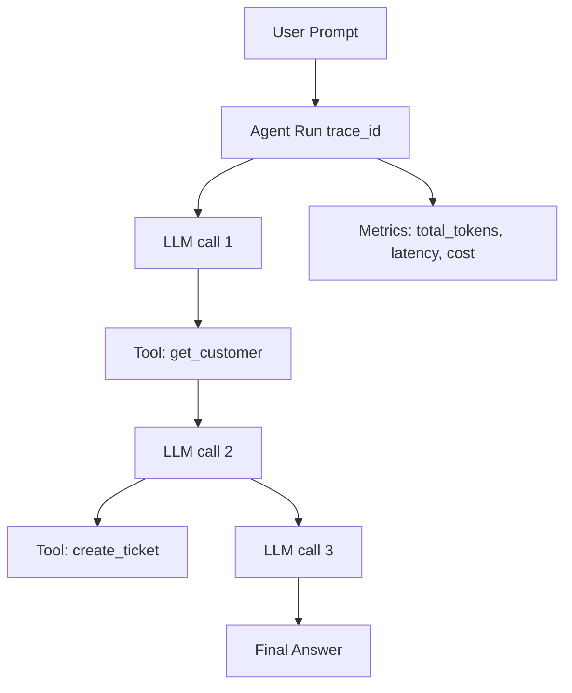

# Agent traces

> **Learning Path:** LLMOps / AI Observability
> **Section:** 15.1.11 — Observability

**Agent traces**

### 1. The problem

Traditional observability works for deterministic request/response systems. An API call either succeeds or fails, latency is measurable, and logs are enough.

Agents break that model. One user prompt triggers:
* multiple LLM calls with non-deterministic outputs
* tool calls with side effects
* conditional branching based on model reasoning
* retries, fallbacks, and parallel execution

When a customer says "the agent gave a wrong refund", you cannot debug with a log line. You need to reconstruct *why* it decided to call `refund_tool` with amount $500 instead of $50, which tool output it hallucinated, how many tokens it burned, and where latency accumulated.

Without a trace, you have symptoms, not causation.

### 2. Mental model

An agent trace is an execution record of one agent run, from root prompt to final answer.

Think of it as a distributed trace for a single conversation, where the spans are not HTTP services but reasoning steps:
* LLM invocation
* Tool invocation
* Retrieval step
* Sub-agent delegation

Each span captures inputs, outputs, metadata, and timing. The whole tree is linked by a trace ID.

You can replay the exact reasoning path, not just the final output.

### 3. How it works

Instrumentation sits at the agent framework / LLM client layer. For each step it records:

* **Context:** prompt, system message, conversation history, model + params
* **Execution:** tool name + args, retrieval query + results, sub-agent task
* **Outcome:** LLM output, tool response, token usage, latency, error
* **Linkage:** parent-child span IDs to reconstruct the tree

Traces are emitted as structured events to an observability backend. You can query by user_id, session, trace_id, or error type, and correlate with metrics and logs.

This is not free-form logging. It's a schema enforced across the agent runtime so you can aggregate: average steps per task, tool failure rate, cost per intent.

### 4. Architectural reasoning

Agent traces solve a specific observability gap: *causal explanation of non-deterministic multi-step behavior*.

When it helps:
* Production debugging of bad agent decisions
* Performance tuning: where does latency/cost accumulate?
* Guardrail evaluation: did the agent follow policy, use the right tool?
* Regression testing: compare traces of same prompt before/after model change

Alternatives:
* **Logs only:** cheap, but unstructured and not queryable by step. You can see what happened, not why.
* **Metrics only:** good for SLOs, blind to root cause.
* **Session replay:** shows UI, not internal reasoning.

Choose traces when you need to reason about *why* an agent behaved a certain way and you have enough volume to justify storage cost.

### 5. Trade-offs and failure modes

* **Privacy and PII:** traces contain full prompts and tool data. You need redaction, data retention policies, and access control. Storing verbatim user data is a compliance risk.
* **Volume and cost:** a single user turn can generate 5-20 spans. At scale this is GBs/day. Sampling and aggressive retention are required.
* **Noise:** LLM outputs are large. Storing full completions is expensive; store summaries or hashes for diffing.
* **Instrumentation drift:** if the agent framework changes, span schemas break. Standardize on OpenTelemetry + agent-specific semantic conventions early.
* **False confidence:** a trace shows what the model *did*, not what it *thought*. It won't prove correctness, only reconstruct behavior.

### 6. Example

Enterprise support agent.

A customer asks: "I was overcharged last month." The agent should retrieve invoices, identify overcharge, and create a refund ticket.

Trace reveals:
* LLM call 1 correctly extracted customer_id
* Tool `get_invoices` returned 3 invoices, latency 1.2s
* LLM call 2 hallucinated an invoice amount because retrieval returned truncated data
* Tool `create_ticket` was called with wrong amount

Without trace: you'd see "refund created" and a complaint. With trace: you see retrieval truncation caused hallucination, and you can fix the tool schema or add validation span.

### 7. Reasoning challenge

You are launching a high-volume chat agent for tier-1 support. Product wants full traces for every conversation for 90 days for compliance. Engineering worries about cost and PII.

What do you store in full, what do you sample, and what do you redact? What is the minimal schema you need to retain debuggability?

### 8. Key takeaway

* Agent traces exist because agent execution is non-deterministic and multi-step; logs can't explain decisions.
* A trace is a tree of spans for LLM calls, tools, retrievals with inputs/outputs, latency, and cost.
* Use them for debugging, performance, and policy verification, not for vanity metrics.
* Major trade-offs are storage cost, PII risk, and schema maintenance vs. operational visibility and faster root cause.
