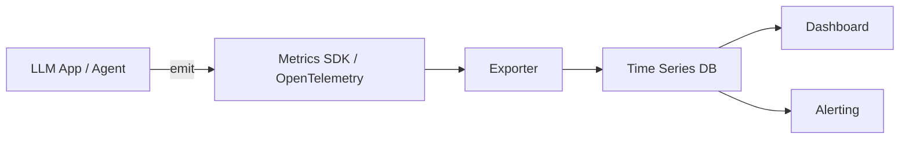

# Metrics

> **Learning Path:** LLMOps / AI Observability
> **Section:** 15.1.2 — Observability

**Metrics in LLMOps / AI Observability**

### 1. The problem

You ship an LLM app that works in dev. In production you get:
* Users say it’s slow, but you can’t tell if it’s the model, the network, or your RAG retrieval.
* The bill spikes 3x overnight with no clear cause.
* Quality degrades gradually. Prompts start getting rejected by guardrails more often.

Logs give you individual requests. Traces give you one request’s path. Both are high-fidelity but noisy and expensive to query at scale.

You need a compressed, continuous signal that answers: *Is the system healthy right now, and is it drifting?* That is what metrics provide.

### 2. Mental model

Metrics are aggregated, time-series measurements of system behavior, sampled regularly.

Think of a dashboard dial, not a transcript. A counter only goes up: requests total. A gauge is a point-in-time value: active requests, queue depth. A histogram summarizes a distribution: latency p50/p95/p99, tokens per request.

For AI systems you need both system metrics and AI-specific metrics. The latter are what make LLMOps different from normal ops.

### 3. How it works

Instrumentation emits named measurements with labels, at high volume, low overhead. Collectors aggregate them into time series and push to a store. Dashboards and alerts read the aggregates.

Essential mechanism for AI: you tag every metric with the dimensions that let you reason about AI behavior, e.g. `model`, `deployment`, `route`, `tool`, `guardrail`. Then you aggregate over time windows.

Example AI metrics:
* `llm.request.duration` histogram by model/route
* `llm.tokens.used` counter by input/output
* `llm.cost.usd` counter derived from tokens * price
* `rag.retrieval.latency` histogram
* `guardrail.violations` counter by type
* `agent.tool_calls` counter by tool name

### 4. Architectural reasoning

Metrics help when you need fast, cheap answers about trends and anomalies across many requests.

When to choose metrics:
* SLO monitoring: p95 latency < 2s, error rate < 1%
* Cost control: cost per user, cost per successful task
* Capacity planning: throughput, queue length
* Drift detection: average tokens/request rising, success rate falling

Alternatives:
* Logs: needed for *why* a single request failed. Too high volume for trends.
* Traces: needed for *where* latency is spent in a single request. Expensive to store.

Decision: use metrics for operational health and business signals, logs/traces for diagnostics. They complement, they don’t replace.

### 5. Trade-offs and failure modes

**Cardinality explosion.** Adding high-cardinality labels like `user_id` or `prompt_hash` to metrics creates millions of series, crashes your TSDB and costs explode. Keep labels to dimensions you aggregate by, not per-request identifiers.

**Lossy aggregation.** Histograms lose the exact request context. You can see p99 latency rose, but not which prompt caused it. That’s the trade-off for cheap storage.

**Sampling bias.** If you sample metrics emission, rare but costly events like huge token usage get missed.

**Wrong aggregation window.** 1-minute averages hide 10-second spikes that cause timeouts. Choose windows that match your SLO.

**Metric vs event.** Don’t emit a metric per request for things you need to join later. That’s a log. Metrics are for counting and distributing.

### 6. Example

Enterprise RAG chatbot with model routing: cheap model for simple queries, expensive model for complex ones.

You instrument:
* `llm.request.duration` histogram by `model` and `route`
* `llm.tokens.used` counter by `model`
* `rag.retrieval.hits` counter
* `guardrail.blocked` counter by `reason`

Dashboard shows p95 latency for cheap model suddenly rises at 10am. Cost per request also rises. Drilling into labels shows `route=complex` is being misrouted to cheap model, causing retries and higher token use. You fix the router and set an alert on `cost per request > threshold`.

Without metrics you would be grepping logs.

### 7. Reasoning challenge

You are launching a multi-agent workflow with 3 tools. Do you emit one metric `agent.step.duration` with a `tool` label, or separate metrics per tool?

Think about cardinality, alerting granularity, and what you need to reason about cost and latency. What breaks if you add `user_id` as a label?

### 8. Key takeaway

* Metrics are aggregated time-series signals for *is the system healthy now* and *is it drifting*, not for debugging a single request.
* In AI observability, pair system metrics with AI-specific metrics: latency, tokens, cost, quality signals, guardrail violations.
* Design labels for the questions you will ask, not for perfect reconstruction. High cardinality kills cost and usability.
* Use metrics for SLOs, alerting, and cost control. Use logs/traces for root cause.
