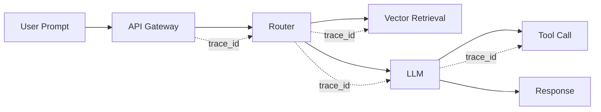

# Traces

> **Learning Path:** LLMOps / AI Observability
> **Section:** 15.1.3 — Observability

**Traces**

### The problem

A single user prompt in an AI system rarely hits one service. It fans out: auth, router, retrieval from vector DB, embedding call, LLM inference, tool call to code execution or search, then post-processing and streaming back.

Logs tell you what happened inside one service. Metrics tell you that latency spiked. Neither tells you *which path* a specific request took, how long each hop contributed, or why this prompt cost $0.12 and the next cost $1.40.

Without causality you cannot debug a slow response, attribute cost, or reproduce a hallucination.

### Mental model

A trace is the causal story of one request.

It is a tree of spans. The root span is the incoming request. Child spans are the work it triggers: retrieval, LLM call, tool call. Each span has start/end time, duration, status, and attributes.

Think of it as a flight recorder for one request, not a dashboard of averages.

### How it works

Distributed tracing relies on context propagation.

1. A trace ID is created at entry and propagated via headers, e.g. `traceparent`.
2. Each service starts a span for the work it does, links it as child of the incoming span.
3. Spans are exported to a backend like Tempo/Jaeger, or OTel Collector, and indexed by trace ID.

For AI systems spans are enriched with domain attributes: `llm.model`, `llm.prompt_tokens`, `llm.completion_tokens`, `retrieval.query`, `tool.name`, `rag.documents_retrieved`. That turns a generic trace into an AI cost and quality trace.

One trace ID connects all of them.

### Architectural reasoning

Use traces when you need request-level causality across service boundaries.

It helps when:
* Latency is composed of many variable hops, e.g. LLM inference + retrieval + tools
* Cost is per-token and depends on prompt size, retries, and model choice
* Failures are intermittent and non-deterministic, requiring reproduction of the exact input and path

Alternatives:
* Logs: good for forensic details, bad for correlation at scale
* Metrics: good for aggregates, bad for root cause on one request
* Traces + logs + metrics together form observability. Traces provide the skeleton, logs provide the flesh.

Choose OpenTelemetry for portability. Keep span creation cheap and sampling configurable.

### Trade-offs and failure modes

* Overhead vs signal. Every span costs CPU and storage. In high-QPS LLM services you sample, often 1-10%, and always sample errors and high-cost requests.
* Cardinality explosion. Putting raw prompt text or user ID as an attribute creates unbounded cardinality and leaks PII. Use hashed IDs and keep prompts out of attributes; link to logs.
* Sampling bias. If you only sample happy paths you miss rare expensive failures. Use tail-based sampling on latency/cost.
* Incomplete context. If a service forgets to propagate trace context, the tree breaks. This is common in async queues and third-party LLM providers. You need explicit propagation contracts.
* Cost of storage. Traces with rich LLM attributes grow fast. Retain hot traces for days, cold for weeks, and aggregate cost/latency metrics long term.

### Example

Enterprise RAG assistant.

A user asks: "What was Q3 revenue for APAC?"

Trace shows:
root span 420ms
 ├─ retrieval span 180ms, 4 docs retrieved, score range 0.71-0.84
 ├─ llm span 220ms, model gpt-4o, prompt_tokens 1,240, completion_tokens 68, cost $0.018
 └─ tool call span 20ms, finance API, status 200

Next week latency spikes to 1.2s. Traces reveal retrieval now 900ms because vector DB query scanned 2M vectors after an index rebuild. Without the trace you would have blamed the LLM.

### Reasoning challenge

You are running a multi-agent system with 10-50 LLM calls per user request. Full tracing generates 50 spans per request at 100 RPS.

Do you trace every span, sample aggressively, or drop spans for internal LLM retries? What do you keep as attributes to debug cost and quality without leaking PII?

### Key takeaway

* Traces exist to reconstruct causality across distributed, non-deterministic AI work.
* A trace is a tree of spans linked by a trace ID, enriched with AI-specific attributes for cost, latency, and quality.
* Use them for root cause, cost attribution, and prompt-to-response reproducibility; complement with metrics and logs.
* Sample intelligently, avoid high-cardinality and PII attributes, and treat propagation as a contract across services.
