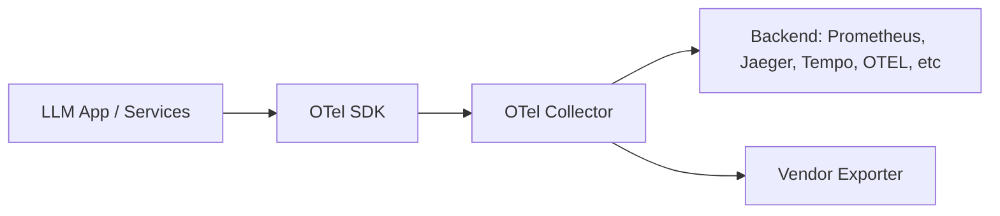

# OpenTelemetry

> **Learning Path:** LLMOps / AI Observability
> **Section:** 15.1.4 — Observability

**OpenTelemetry**

### 1. The problem

You ship an LLM app. A single user request fans out to: API gateway → orchestrator → vector DB → LLM provider → tool call → retrieval. Each hop is a different service, often a different vendor.

When latency spikes or cost balloons, you need to ask: Was it prompt size? Token usage? Tool latency? Which model version? Which user segment?

Without a common language, you get:
* Proprietary traces in Datadog, metrics in Prometheus, logs in ELK, LLM telemetry in LangSmith
* No correlation across systems. A trace ID in your app doesn't match the LLM provider's trace.
* Vendor lock-in. Switching backends means re-instrumenting everything.

For AI systems this gets worse: you need AI-specific signals — prompt, completion, tokens in/out, model name, cost, tool calls — alongside traditional logs/metrics/traces.

### 2. Mental model

OpenTelemetry is a vendor-neutral instrumentation standard, not a backend.

Think of it as a common electrical outlet for telemetry. Your app emits signals in a standard format. A collector routes them. You can plug the collector into any backend later.

Three signals:
* **Traces** — request flow across services
* **Metrics** — time series like token usage, latency
* **Logs** — events

### 3. How it works

* SDKs in your language instrument code and export spans/metrics/logs.
* Semantic conventions define *what* to emit. For GenAI there are conventions for `gen_ai.request`, `gen_ai.response`, model name, prompt tokens, completion tokens, cost.
* The Collector receives, processes, samples, batches, and exports. It decouples instrumentation from storage.
* Backends are interchangeable. You can change from A to B without touching app code.

### 4. Architectural reasoning

When it helps:
* You have polyglot, distributed systems and need correlated traces across boundaries
* You need portability. Keep instrumentation standard, push vendor choice to the collector
* You want AI observability standardized. Emit model, prompt version, tokens, latency as spans attributes, not as custom logs

Alternatives:
* Vendor APM SDK. Faster start, but locks you in and often lacks AI semantic conventions
* Custom logging. Flexible, but no correlation, high cardinality, no standard queries

Decision rule: Standardize at the edge, specialize at the backend. Instrument once with OTel, decide storage and analysis later.

### 5. Trade-offs and failure modes

* **Cardinality explosion.** Tagging spans with prompt text, user ID, or full tool output creates unbounded cardinality. Keep high-cardinality data in logs, not metrics. Use attributes for model name, version, operation, not full prompt.
* **Sampling cost.** LLM calls are expensive to trace fully. You need tail-based sampling: sample all errors, sample a fraction of successes, always sample expensive operations.
* **Operational overhead.** Collector is another service to run, upgrade, and scale. In serverless, you push directly to backend or use managed collector.
* **Semantic drift.** Teams invent their own attribute names. Without a convention, you can't query across services. Adopt the GenAI semantic conventions.

### 6. Example

Enterprise RAG chatbot:
Gateway receives request → Orchestrator span starts → Child span for vector DB retrieval with `db.system` and query latency → Child span for LLM call with attributes: `gen_ai.system=openai`, `gen_ai.request.model=gpt-4o`, `gen_ai.usage.input_tokens`, `gen_ai.usage.output_tokens`, `gen_ai.operation.name=chat`. Tool call is a nested span.

All spans share the same trace ID. Metrics for tokens per request and p95 latency are emitted as counters/histograms. Logs for full prompts are linked via trace ID.

Now you can ask: "Show me p95 latency for model gpt-4o vs claude-3 when prompt version = v2 and retrieval >200ms". One query, one backend.

### 7. Reasoning challenge

You are building a multi-model router that switches between OpenAI, Anthropic, and a self-hosted model based on cost/latency. You need to compare cost per successful response by user tier.

Do you instrument cost at the SDK level with custom metrics, or emit a standard GenAI span with token counts and compute cost downstream? What attributes would you *not* put on the span?

### 8. Key takeaway

* OpenTelemetry solves fragmentation: one instrumentation standard for logs, metrics, traces, now with GenAI semantics
* Standardize signals at the app edge, keep backend choice flexible via collector/exporters
* Correlate AI-specific data — model, tokens, prompt version, tools — with system traces, not siloed logs
* Design for cardinality and sampling early; AI workloads amplify both cost and noise
