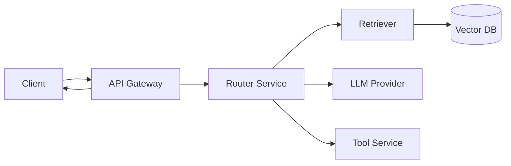

# Distributed tracing

> **Learning Path:** LLMOps / AI Observability
> **Section:** 15.1.5 — Observability

**The Problem**

A single user request in a modern AI system doesn't hit one service. It hits an API gateway, auth, a router, a retrieval service, a vector DB, a prompt builder, an LLM provider, a tool call, and a post-processor. Each writes its own logs with its own timestamp and request ID.

When latency spikes to 4 seconds or a response is wrong, you have 10 log files and no way to reconstruct which hop was slow, which LLM call failed, or which tool call added the cost. Logs tell you *what happened inside a service*. Metrics tell you *how much*. Neither tells you *the path*.

**Mental Model**

A trace is the complete journey of one request. A span is one unit of work within that journey.

Think of a tree: root span = incoming HTTP request. Children = downstream calls, LLM invocation, DB query, tool execution. Each span has start time, duration, status, and attributes.

Distributed tracing stitches those spans together across process boundaries using a propagated context.

**How it Works**

1. **Start and propagate.** Entry service creates a TraceID and SpanID. The context is injected into outbound calls via headers like `traceparent` in W3C Trace Context.
2. **Record a span.** Each service starts a child span on receipt, does work, records attributes, ends span.
3. **Export.** Spans are shipped via OpenTelemetry exporter to a collector, then to storage.
4. **View.** Backend joins spans by TraceID and renders a waterfall.

All spans share the same TraceID. You can see Router 120ms, Retriever 85ms, LLM 2100ms, Tools 450ms.

**Architectural Reasoning**

Distributed tracing helps when:

* A request crosses >2 ownership boundaries and latency is a business metric.
* You need to attribute cost. In LLM systems, LLM call duration and token count per request is a cost signal.
* You need to debug non-deterministic failures in agents where the same prompt can take different paths.

Alternatives:

* **Correlated logs.** Works for 2-3 services, breaks with async queues and retries.
* **Metrics per service.** Good for SLOs, useless for *why* request 123 was slow.
* **Full request capture.** Expensive and privacy risky.

Choose tracing when you need causal ordering across services, not just aggregates.

**Trade-offs and Failure Modes**

* **Sampling vs fidelity.** 100% tracing in production is expensive in storage and ingest. Head-based sampling keeps cost down but can miss rare errors. Tail-based sampling keeps slow/error traces but requires buffering.
* **Cardinality explosion.** Dynamic span names like `llm.call.openai.gpt-4o-2024-08-06` create unbounded tag values. Keep attributes high-cardinality out of indexed fields.
* **Context loss.** Async queues, message brokers, and some LLM SDKs drop headers. You get orphan spans.
* **Clock skew.** Duration calculation is wrong if services have unsynchronized clocks. Use monotonic timestamps where possible.
* **Privacy.** Spans often capture prompts, tool inputs, user IDs. That is PII and model data leaving your boundary. Redact or hash.

**Example**

RAG chatbot request:

Root span: `POST /chat`. Child: `retriever.search` with attributes `query`, `top_k`. Child: `llm.generate` with attributes `model=gpt-4o`, `prompt_tokens=512`, `completion_tokens=128`. Child: `tool.weather.get` with attributes `city`.

Trace shows LLM is 2.1s, retriever 90ms, tool 400ms. The slowdown correlates with prompt version v3 which increased tokens. You can also see that 5% of traces have a retry on the vector DB due to timeouts.

Without tracing you would see API p95 up, LLM provider error rate up, and guess.

**Reasoning Challenge**

You run an agentic workflow with 3 LLM calls per request, plus 2 tool calls. Cost is $0.02 per request. Tracing at 100% adds $0.001 per request in ingest/storage. Your error rate is 0.1% and latency SLO breaches happen in 0.5% of requests.

Do you trace 100%, sample 1%, or use tail sampling for errors and slow requests only? What do you lose with each choice?

**Key Takeaway**

* Tracing exists to reconstruct causality across service boundaries, not to replace logs or metrics.
* A trace is a tree of spans linked by propagated context; the value is the waterfall view of latency and failure.
* Sampling, attribute hygiene, and context propagation are architectural decisions, not implementation details.
* In AI systems, trace attributes must capture model, prompt version, token counts, and tool calls to make cost and quality observable.
