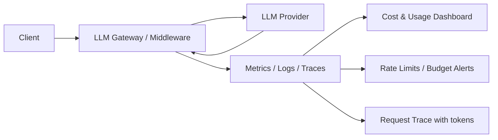

# Token usage

> **Learning Path:** LLMOps / AI Observability
> **Section:** 15.1.6 — Observability

**Token usage observability**

### The problem

LLM calls are expensive, variable, and opaque. The same user query can cost 1 cent or $1 depending on prompt length, model choice, and output length. Latency grows with output tokens. Failures often look like "timeout" or "bad answer" but root cause is token bloat, context overflow, or a prompt that triggers a much larger completion.

Without token-level observability you cannot answer basic operational questions: Why did costs spike yesterday? Which feature is driving usage? Is a user abusing the system with giant prompts? Did a prompt change increase average completion tokens by 40%?

You need token usage as a first-class observability signal, not an afterthought in provider logs.

### Mental model

Think of tokens as fuel and the LLM call as a vehicle trip.

* Input tokens = fuel loaded into the tank. Prompt + system message + tools + conversation history.
* Output tokens = fuel consumed on the road. The generated response.
* Total tokens = billable consumption.
* Context window = tank capacity. Overfill = error.

You wouldn't run a fleet without fuel gauges and per-trip logs. Token observability is the fuel gauge, odometer, and cost-per-mile for LLM inference.

### How it works

Instrumentation sits at the LLM gateway, not inside the model. Every request is wrapped to capture:

* **Counts:** prompt_tokens, completion_tokens, total_tokens
* **Cost:** model-specific price per 1k tokens * count, with cached tokens discounted
* **Context:** model, provider, user_id, session_id, feature, prompt template version
* **Latency:** time-to-first-token, total duration, tokens-per-second

For streaming, counts are accumulated from usage metadata at the end of the stream. For tools/function calls, count tokens for both the tool call and the tool result injection.

These signals are emitted as metrics, logs, and traces:



The key architectural decision is to normalize token usage at the edge so you can compare across providers with different tokenizers and pricing.

### Architectural reasoning

When it helps:
* Cost control per tenant/user/feature
* Debugging quality regressions tied to prompt length
* Capacity planning for rate limits and context windows
* Detecting prompt injection or abuse via abnormal input token spikes

Alternatives:
* Rely on provider dashboards only. Works for total spend, fails for per-feature attribution and real-time guardrails.
* Log raw prompts and count offline. Accurate but high latency, PII risk, and expensive storage.
* Count tokens client-side with tiktoken. Fast but drifts from provider tokenizer and misses cached tokens.

Choose gateway-level capture with provider-reported counts. You get ground truth for billing and the ability to correlate tokens with business context.

### Trade-offs and failure modes

* **Granularity vs privacy.** Attributing tokens to user_id is powerful for abuse detection and quotas, but prompts may contain PII. Hash or redact prompts; keep token counts and metadata, not full text by default.
* **Tokenizer drift.** OpenAI, Anthropic, and open models tokenize differently. Never assume 1 token ≈ 4 chars. Always use provider-reported counts for billing, use local tokenizer only for estimation.
* **Streaming and retries.** Token counts arrive at completion. If you emit metrics mid-stream you will undercount. Emit a final usage event and also track partial counts for latency signals.
* **Cache blindness.** Cached prompt tokens are cheaper. If you don't record `prompt_tokens_details.cached_tokens`, you will overestimate cost and mis-attribute savings from prompt caching.
* **Context window overflow.** High input tokens are a leading indicator of failures. Track p95 input tokens per feature and alert before you hit the limit.

Common failure mode: sudden cost spike after a prompt change. Without versioned prompt templates in your telemetry, you cannot tell if the change increased average output tokens, increased retries, or both.

### Example

Enterprise support chatbot with per-tenant billing.

Gateway middleware wraps each request:

```
request -> enrich with tenant_id, feature="support_v2", prompt_version="a3"
-> call provider
-> capture usage, cost, latency
-> emit metric: llm.tokens.total{tenant,feature,model}
-> emit log with trace_id, tokens, cost
```

Dashboard shows tenant A cost +300% week-over-week. Drill down: average input tokens rose from 800 to 2,400. Root cause: new prompt template added full ticket history instead of summary. Fix: summarize history, cap input tokens, add alert at p95 input > 3k.

Same telemetry powers a hard quota: reject request if tenant's rolling 1h token usage > limit, with a graceful fallback.

### Reasoning challenge

Your AI search feature shows stable request count but cost doubled in 24h. Token metrics show output tokens per request unchanged, input tokens up 2x. Latency is unchanged. What do you investigate first, and what signal would confirm your hypothesis?

*Hint: think about what changes input token size without changing request volume or output length.*

### Key takeaway

* Token usage is an operational signal, not just billing. It explains cost, latency, and quality.
* Capture provider-reported token counts at the gateway with business context, and emit as metrics/logs/traces.
* Track input vs output separately, model, and prompt version. Correlate with cost and latency.
* Design for privacy and caching: attribute without storing raw prompts, and surface cached token savings.
* Alert on input token growth and cost per request, not just total spend.
