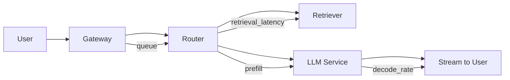

# Latency

> **Learning Path:** LLMOps / AI Observability
> **Section:** 15.1.7 — Observability

**Latency in LLMOps is not request duration. It's user-perceived time to value.**

### The problem

A user hits enter in an AI assistant. They expect first token fast, and a complete answer soon. In a traditional API, latency is `request in → response out`. In an AI system it's:

Queue → Prompt build → Retrieval → LLM prefill → LLM decode streaming → Post-processing → Network

Each step is variable. Prefill scales with prompt + context length. Decode scales with output tokens and contention. Retrieval latency depends on vector DB load and reranking. The model itself is non-deterministic.

Without observability you see: "p95 is 4.2s". You don't know if that's slow retrieval, a cold start, GPU queue, or a 4k token prompt.

Constraints created by AI:
* Non-deterministic output length and time
* Streaming changes the definition of "done"
* Costs and throughput are coupled to latency via token rate
* User experience is shaped by Time To First Token, not just total time

That forces a different observability model.

### Mental model

Think of latency as a budget, not a metric.

You have an SLO like p95 TTFT < 800ms and p95 E2E < 5s. The budget is allocated across spans:

TTFT = queue + routing + retrieval + prefill
E2E = TTFT + decode time

If you only measure the total, you can't spend the budget wisely.

### How it works

Observability for latency in LLMOps is metrics + traces + logs correlated by request.

**Metrics** give the distribution you alert on: p50/p95/p99 for TTFT, time to first token, tokens per second, request duration. Histogram buckets matter more than averages.

**Traces** give the breakdown. One root span per user request, child spans for each component: router, retriever, reranker, LLM prefill, LLM decode, streaming.

**Logs** give the context that explains variance: prompt tokens, context tokens, model version, deployment, GPU utilization, cache hit.

Key instrumentation points:
* Ingress timestamp
* Queue wait time
* Retrieval latency and number of chunks
* LLM call start, prefill duration, first token timestamp, tokens/sec
* Streaming chunks sent

You tag every span with dimensions that explain variance: model_id, deployment, prompt_tokens, context_tokens, user_tier, region. Without those tags you cannot root cause tail latency.

### Architectural reasoning

When does detailed latency observability help?

* You have multiple hops that you don't control: vector DB, LLM provider, post-processor
* You need to meet user experience SLOs while controlling cost
* You want to detect regressions from model swaps, prompt changes, or context growth

Alternatives:
* Just log request duration. Cheap, but blind to root cause.
* Only measure at the gateway. Misses internal contention.
* Full tracing on every token. Accurate, expensive.

Decision: Sample heavily for metrics, trace a representative 1-5% with full context, and trace 100% for errors and high latency tails. Keep high-cardinality dimensions in traces, not metrics.

### Trade-offs and failure modes

* **Sampling vs cost.** LLM traces are large. Full tracing costs real money and adds overhead. Tail-based sampling preserves signal.
* **Cardinality explosion.** Tagging by prompt text is useless. Tag by prompt length bucket, model version, deployment. Too many tags = unqueryable metrics.
* **Streaming skews perception.** p99 total duration can look fine while TTFT is terrible. Measure both.
* **Cold starts and GPU contention** create latency spikes that average hides. You need p99 and distribution.
* **Context length creep.** Users paste more context over time. Without correlating latency to prompt_tokens, you attribute the slowdown to the model.

Failure mode: You optimize average latency by batching requests. p99 gets worse because queue wait grows for unlucky requests.

### Example

Enterprise RAG assistant with p95 TTFT SLO 800ms.

Observability shows p95 TTFT = 1.2s. Trace breakdown:
* Gateway queue 40ms
* Retriever 350ms
* Prefill 650ms
* First token emitted 1.04s

Prompt tokens avg 2,800, context tokens avg 6,000. Prefill dominates.

Decision: Implement prompt compression and a retrieval cache for hot docs. After change, p95 prefill drops to 420ms, TTFT to 760ms. You also see tokens/sec drop during peak hours → GPU contention. That triggers autoscaling rule based on queue depth + p95 TTFT.

Without span breakdown you would have tried a faster vector DB first.

### Reasoning challenge

You have two options:
A. Reduce p99 TTFT from 2.5s to 1.2s by adding a dedicated LLM replica for premium users, cost +30%.
B. Accept p99 TTFT but improve p50 TTFT from 600ms to 400ms by aggressive prompt caching, cost +5%.

Your business metric is user retention, and you see drop-off correlates with TTFT >1s. Which do you choose and what latency signals do you need to confirm the decision?

### Key takeaway

* Latency in AI is a budget split across TTFT and E2E, not a single number.
* Observability requires traces that break down queue, retrieval, prefill, decode with tags that explain variance.
* Optimize distribution tails, not averages. p99 tells you about user pain.
* Correlate latency to prompt/context length, model version, and load to find root cause.
* Sampling and tail-based tracing balance signal with cost; high-cardinality data belongs in traces.
