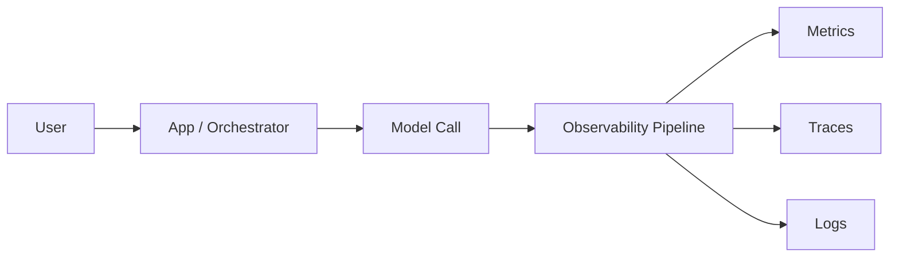

# Model calls

> **Learning Path:** LLMOps / AI Observability
> **Section:** 15.1.8 — Observability

**Model calls** are the critical external dependency in an AI system. Unlike a database query, they are non-deterministic, expensive, slow, and opaque. Observability is what makes them operable.

### 1. The problem

You ship an agent. Latency spikes, costs double, and a user reports a bad answer. Where is the problem?

A model call is a black box from the app's perspective. You know you sent a prompt and got a completion, but you don't know:
* Which model/version/parameters were used
* How long it took and how much it cost
* What prompt led to what output
* Whether the call succeeded, was retried, or was throttled
* If the same request is being repeated wastefully

Without this, you cannot debug, cost-control, or guarantee safety. You are flying blind on your most expensive and variable component.

### 2. Mental model

Treat a model call like a distributed RPC with side effects.

The call has inputs: prompt, system message, tools, temperature, model id, version.
It has outputs: completion, tokens used, latency, cost, error code.
Observability ties them together in time, so you can reason about cause and effect.

### 3. How it works

Observability for model calls is three signals, correlated by a request ID:

* **Traces.** One trace per user request, spans per model call. Capture model name, version, provider, parameters, input/output token counts, latency, retries, and tool calls. This is your request flow.
* **Metrics.** Aggregated counters and histograms: requests/sec per model, p95 latency, tokens/min, cost/min, error rate, cache hit rate. This is your alerting surface.
* **Logs.** Structured logs for forensic detail: prompt hash, completion, guardrail decisions, routing choice. Log at a lower sampling rate than traces to control cost and PII.

The key is correlation. A user complaint ID -> trace -> exact prompt + model + parameters + cost. Without correlation, logs and metrics are noise.

### 4. Architectural reasoning

When does this help?

* **Cost control.** Token usage is your unit economics. You need per-route, per-user, per-feature cost.
* **Latency SLOs.** Model calls dominate end-to-end latency. You need to know tail latency per provider and per prompt size.
* **Correctness & safety.** Bad outputs often trace to bad prompts, wrong model version, or missing context. You need prompt -> completion provenance.
* **Routing decisions.** You can A/B models, canary a new version, or fallback on errors only if you can observe the outcome.

Alternatives: logging only completions, or relying on provider dashboards. Provider dashboards show provider health, not your application logic. Logging only loses the request context and creates a PII/compliance risk.

Decision rule: instrument at the client wrapper, not inside each caller. One SDK/telemetry layer emits all three signals consistently.

### 5. Trade-offs and failure modes

* **Cost vs fidelity.** Full prompt/completion capture is expensive to store and risky for PII. Hash prompts for dedup, sample full text, redact PII at ingest.
* **Latency overhead.** Synchronous instrumentation adds ms. Emit async, batch, and keep critical fields in-process.
* **Cardinality explosion.** Tagging traces by raw prompt creates unbounded cardinality. Tag by route, model, version, and use attributes for dynamic fields.
* **Data retention.** Model outputs are sensitive. Define retention per data class: metrics long-term, traces 7-30 days, raw prompts ephemeral.
* **Failure mode:** You observe the model call but not the orchestration. A retry storm looks like high traffic, not a bug in your retry logic. Span the whole workflow.

### 6. Example

Enterprise support agent.

User asks about refund policy. Orchestrator retrieves ticket, builds prompt, calls `gpt-4o` with tools.

With observability:
* Trace shows retrieval took 120ms, model call 1.8s, total 2.1s. p95 for this route is 2.5s, so OK.
* Metrics show cost $0.012 per request, 40k requests/day = $480/day.
* A spike in errors correlates to a new system prompt deployed at 09:12. Rollback restores error rate.

Without it: you see "slow responses" and guess.

### 7. Reasoning challenge

Your compliance team forbids storing full prompts containing customer PII. You need to debug a hallucination incident from yesterday.

Do you:
A. Store full prompts for 24h then auto-delete
B. Store only prompt hash + metadata, and enable on-demand sampling with user consent
C. Disable observability for that flow

What do you lose with each option and what architectural control do you need?

### 8. Key takeaway

* Model calls are first-class distributed dependencies. Observe them like you observe APIs.
* Correlate traces, metrics, and logs by request ID; model metadata is as important as latency.
* Observability enables cost control, routing, and safety, not just debugging.
* Design for PII, cost, and cardinality up front; you cannot retrofit observability after an incident.

You should be able to answer: why did this request cost this much, take this long, and produce this output, and what would change if we swapped the model.
