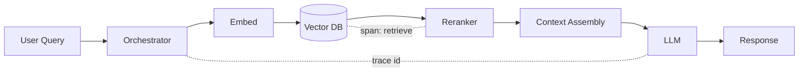

# Retrieval traces

> **Learning Path:** LLMOps / AI Observability
> **Section:** 15.1.9 — Observability

**Retrieval traces**

### 1. The problem

In a RAG system the LLM is only as good as the context you give it. When an answer is wrong, slow, or ungrounded, you have two possible culprits: bad retrieval or bad generation.

Without visibility you cannot tell which. The LLM call log shows the prompt and the output, but not *why* those 4 chunks were chosen, whether they were relevant, or if the retriever was even asked the right question.

This creates an observability gap. You can trace a REST request, but you cannot debug grounding, drift, or recall without the retrieval path.

### 2. Mental model

A retrieval trace is a distributed trace span for the retrieval step of a RAG pipeline.

Think of it as the equivalent of a database query plan for RAG: what query was issued, with what parameters, what was returned, and how it was transformed before reaching the LLM. It ties embedding version, vector DB call, reranking, and context assembly to the final generation span.

The trace id links retrieval metrics to generation quality.

### 3. How it works

A retrieval trace captures the decision data, not just the data.

Essential attributes:
* **Query signal:** raw query, rewritten query, embedding model + version, filters
* **Retrieval params:** top-k, similarity threshold, vector DB, index name, latency
* **Results:** doc_id, chunk_id, source, score, reranker score, token count per doc
* **Context shaping:** which docs were kept/dropped, truncation reason, total context tokens
* **Linkage:** trace_id, user_id, session_id, generation span id

You do not log full document text by default. You log references + scores + a hash, and keep full text in an object store linked by id for selective replay. This keeps traces cheap and privacy safe.

### 4. Architectural reasoning

When it helps:
* **Debugging grounding failures.** Bad answer → inspect retrieved set and scores. Was recall zero? Was a stale doc returned?
* **Measuring retrieval quality.** Correlate retrieval metrics like hit rate, mean reciprocal rank, and context relevance with generation metrics like faithfulness and user rating.
* **Compliance and audit.** Prove which sources were used for a financial or medical answer.
* **Cost control.** Large context windows cost money. Trace shows token bloat from overly permissive top-k.

Alternatives:
* Simple logs: cheap but not correlated to requests, hard to query by trace.
* Full prompt logging: captures context but loses why a doc was chosen and how scores changed.
* No observability: works until first production incident.

Choose retrieval traces when retrieval is a first-class dependency with business risk, not just a helper call.

### 5. Trade-offs and failure modes

* **Privacy vs fidelity.** Full chunks in traces leak PII. Store references and sample, not everything.
* **Volume.** Retrieval returns many candidates. Logging top-k with scores is enough; logging all candidates explodes storage.
* **Correlation drift.** If trace id is not propagated through embed → vector → rerank → LLM, you get orphaned spans. Enforce context propagation in the orchestrator.
* **Score misinterpretation.** Similarity score is model-specific. Track model version per trace or comparisons become meaningless.
* **Latency.** Synchronous tracing adds overhead. Emit spans async and sample high-value traffic.

### 6. Example

Enterprise support bot for an API docs site.

Query: “How do I paginate list_users?”

Trace shows:
* Embedding model v2.3, vector DB pinecone-prod, filters: `product=auth, version>=2`
* Top-k=10, retrieved 10, reranker kept 4
* Doc scores: `auth-pagination.md#32` score 0.91, `auth-pagination.md#45` 0.88, `legacy-pagination.md#12` 0.62
* Context tokens 1,842, dropped 2 docs due to token budget

Generation was correct but slow. Trace reveals reranker latency 420ms and one low-relevance legacy doc sneaking in due to weak filter. Architect tightens filter and reduces top-k to 6. Latency drops, faithfulness rises.

Without the trace you would have tuned the LLM temperature.

### 7. Reasoning challenge

You are seeing a spike in “no relevant context found” answers for a new region. Retrieval traces show high similarity scores but the LLM still says it has no relevant info. Where do you look first, and what attribute in the retrieval trace would confirm your hypothesis?

### 8. Key takeaway

* Retrieval traces make the retrieval step observable and debuggable, not just the LLM.
* Log decision metadata — query, params, scores, kept/dropped docs — not raw data dumps.
* Correlate retrieval quality to generation outcomes to reason about root cause.
* Design for privacy, volume, and model versioning from day one; traces are useless if they cannot be compared over time.
