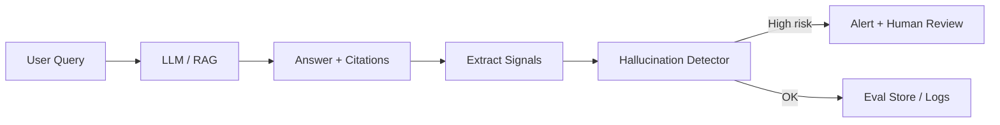

# Hallucination

> **Learning Path:** LLMOps / AI Observability
> **Section:** 15.2.1 — AI-specific monitoring

**Hallucination in production is not a model bug, it's an observability gap.**

### The problem

You ship a RAG chatbot or agent. It answers confidently, cites sources, and passes demo. In production it invents facts, misattributes citations, or confidently states pricing that changed last week.

The problem is not accuracy in training. It's that LLM outputs are plausible, not provably true, and the system has no built-in signal for "this is made up". Without detection, bad answers reach users, erode trust, and create compliance risk.

### Constraints

* Non-deterministic outputs for same prompt.
* No ground truth at inference time. You can't unit test all queries.
* Latency sensitive. Users expect <2s responses.
* Hallucination is a distribution, not a binary bug. It spikes with distribution shift, prompt drift, or retrieval failures.

This creates a need for AI-specific monitoring: continuous signals about factuality and grounding, not just latency and error rate.

### Mental model

Think of hallucination as divergence between the model's claim and verifiable context.

* **Intrinsic:** model contradicts itself or known facts.
* **Extrinsic:** model makes claims not supported by retrieved sources.

Monitoring must measure divergence, not just log text.

### How it works

You instrument the inference path and extract signals that proxy for truthfulness, then judge them offline or near-real-time.

Signals to capture per request:
* Retrieval grounding: embedding similarity between claim sentences and retrieved chunks, citation presence and span match
* Consistency: self-consistency across samples, contradiction with previous turns
* Model confidence proxies: token log-probs, refusal patterns
* External verifiability: can the claim be checked against a KB, structured DB, or web source?

Detectors are a mix of cheap heuristics and expensive judges:
* Heuristics: missing citation, low retrieval recall, high perplexity on claim vs context
* Judge model: a smaller LLM or NLI model scoring "supported / unsupported / hallucinated" per claim
* Human feedback: thumbs down, correction edits, support escalations

All of this is written to an eval store tied to prompt, context, model version, and retrieval set for replay.

### Architectural reasoning

When does this help? When the cost of a wrong answer > cost of monitoring.

You need it for customer-facing agents, compliance-sensitive Q&A, and any RAG system where retrieval quality varies.

Decision is not "prevent hallucination", it's "detect, contain, and learn fast".

Alternatives:
* More guardrails at prompt time. Helps but doesn't measure.
* Human review of all outputs. Accurate but not scalable.
* Post-hoc audits only. Too late.

Architectural choice: async detection pipeline. Synchronous checks add latency. Run cheap heuristics inline to flag high-risk requests for immediate fallback, and run full judge + grounding analysis async for trend detection and model improvement.

Implementation shape:
* Telemetry layer emits structured event: prompt, retrieved docs, answer, citations, metadata.
* Feature store computes signals.
* Detector service scores and emits alerts to observability platform.
* Feedback loop feeds flagged examples into evals and fine-tuning.

### Trade-offs and failure modes

* **False positives vs latency.** Aggressive detectors block good answers. Keep inline checks cheap and defer expensive judges.
* **Detector drift.** Your hallucination detector can hallucinate. Monitor its precision against human labels.
* **Signal leakage.** Relying only on retrieval similarity misses intrinsic hallucinations. Need multiple orthogonal signals.
* **Cost.** Logging full context + running judges multiplies token cost. Sample strategically: full coverage for high-risk intents, sampled for low-risk.
* **Privacy.** Logging prompts may contain PII. Mask or tokenize before eval store.

Failure mode to expect: retrieval degrades silently, similarity scores stay high but content is stale. Without freshness signal, monitoring misses it.

### Example

Enterprise support bot for billing FAQs, RAG over policy docs + DB.

Architecture: inline heuristic checks citation span overlap and retrieval recall. If recall < threshold, trigger "I don't know" fallback.

Async pipeline runs judge model nightly on 5% sampled conversations, plus all user-reported bad answers. Alerts fire when hallucination rate per intent rises >0.5% week-over-week or when citation mismatch spikes after a doc update.

This caught a case where a pricing doc update wasn't ingested, causing 12% of answers to hallucinate old prices for 3 hours before rollback.

### Reasoning challenge

Your agent answers medical triage questions with RAG over clinical guidelines. Latency SLO is 1.5s p95. You can run a lightweight NLI judge in ~200ms or a stronger judge in ~900ms. What do you instrument inline vs async, and what metric do you alert on?

### Key takeaway

* Hallucination is an operational risk, measured as divergence from verifiable context, not a one-time model quality issue.
* Monitor signals, not just outputs: grounding, consistency, confidence, and human feedback.
* Detect async, contain inline. Use cheap heuristics for immediate safety, expensive judges for learning.
* Treat hallucination rate as a first-class SLO with per-intent dashboards and feedback loop to retrieval and model updates.
