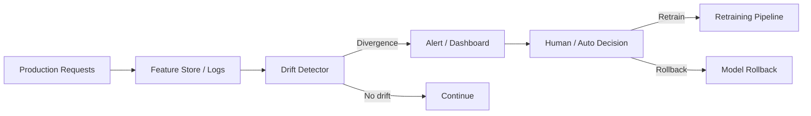

# Drift

> **Learning Path:** LLMOps / AI Observability
> **Section:** 15.2.2 — AI-specific monitoring

### The problem

A model is a contract with a distribution. You train on a snapshot of features X and labels Y, then you assume production will look like that snapshot.

In production it doesn't. User behavior changes, products get added, sensors degrade, the economy shifts, a new competitor launches. The data you score on drifts away from the data you trained on, and the model's error rises silently.

You don't get a compile error. You get worse recommendations, higher fraud loss, or a chatbot that confidently hallucinates because its retrieval corpus moved. Without explicit detection, you find out from business metrics, weeks late.

Drift is the reason AI systems need monitoring that is different from uptime and latency.

### Mental model

Think of a model as a compass calibrated in a lab. Data drift is the magnetic field changing. Concept drift is north itself moving.

* **Data drift / covariate shift:** P(X) changes. Same relationship Y|X, but inputs look different. E.g., average session length doubles after a redesign.
* **Concept drift:** P(Y|X) changes. Same inputs, different correct outputs. E.g., "cheap flight" in winter vs summer means different things.
* **Prediction drift:** P(Ŷ) changes. Model output distribution shifts even if inputs look stable — often the earliest signal.

The key is non-stationarity. The world is not i.i.d. after deployment.

### How it works

You need a baseline and a streaming comparison.

1. **Reference window:** Statistics from training or a known good production period.
2. **Production window:** Rolling window of recent features, embeddings, and predictions.
3. **Divergence metrics:** Compare distributions, not point values.

For tabular features: Population Stability Index, Kolmogorov-Smirnov, PSI > 0.2 is a common alert threshold.
For high-dimensional/text: compare embedding centroids with Wasserstein distance, or monitor prediction confidence histograms.
For concept drift: track error rate on labeled feedback, or proxy signals like user accept/reject.

The detector is not the fix. It is an early warning that creates a decision point: retrain, rollback, or investigate.

### Architectural reasoning

Drift monitoring solves: *when should we invalidate the model's assumptions?*

It helps when:
* Model lifetime > weeks and data is non-stationary
* Cost of silent degradation is high
* You have enough production volume for statistical power

Alternatives:
* Periodic retraining on schedule. Simple, but wasteful and blind to sudden shifts.
* No monitoring. Cheapest until an incident.

Choose drift detection when you need event-driven lifecycle management instead of calendar-driven. It enables a closed-loop ML system: observe → detect → decide → retrain.

Implementation belongs alongside observability, not inside the model server. Decouple collection, detection, and action. Use feature store for consistent feature views, log predictions with context, and run detectors asynchronously to avoid latency impact.

### Trade-offs and failure modes

* **False positives vs lag.** Tight thresholds alert on noise; loose thresholds miss real drift. You need seasonality aware baselines and burn-in periods.
* **What to monitor.** Feature drift is cheap but can be a red herring. Concept drift matters more but needs labels or proxies. Most teams monitor both and correlate.
* **Causation vs correlation.** A drift alert tells you *what* changed, not *why*. A new app version can cause data drift; a fraud ring can cause concept drift. You still need human triage.
* **Feedback loops.** Model outputs influence future inputs. In recommendation or pricing, drift can be self-reinforcing. Monitoring without breaking the loop creates runaway degradation.

Failure mode: alert fatigue. If every minor shift pages on-call, the system gets ignored. Good design: tiered signals, dashboards for trends, paging only for prediction drift + error increase.

### Example

Fraud detection for card transactions. Training data is Q4 2024. In January, merchants add buy-now-pay-later options. Features like `avg_transaction_value` and `merchant_category` shift.

Feature PSI spikes. Prediction distribution also shifts: model outputs more low-risk scores because new transaction patterns look unfamiliar.

Drift detector fires. Analysts confirm the merchant mix changed, not fraud patterns. Decision: no immediate retrain, but increase sampling for labeling and schedule a retrain with Q1 data. If instead error on confirmed fraud labels had risen, rollback to previous model would be warranted.

### Reasoning challenge

Your LLM-powered support classifier routes tickets to teams. You notice prediction drift: the "billing" class share dropped 40% week-over-week. Feature distributions for prompt length and intent embeddings are stable.

Retrain now or investigate first? What data would you check before deciding?

### Key takeaway

* Drift is inevitable in production AI; silent degradation is the default.
* Monitor P(X), P(Y|X), and P(Ŷ) with statistical divergence, not just latency and errors.
* Drift detection enables event-driven model lifecycle, not calendar retraining.
* Alerts are signals, not actions. Design for triage, thresholds, and feedback loop safety.
