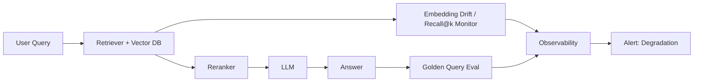

# Retrieval degradation

> **Learning Path:** LLMOps / AI Observability
> **Section:** 15.2.3 — AI-specific monitoring

**Retrieval degradation** is not a crash. It is a silent decay in RAG/Agent quality that shows up as worse answers, not errors.

### 1. The problem

A RAG system launches well. Retrieval recall is good, answers are relevant. Months later, users report "the bot is off" but latency, error rate, and LLM cost are all green.

What changed?
* The corpus grew and shifted: new docs added, old docs deprecated, terminology drifted.
* Embedding model or index config drifted relative to query distribution.
* Query patterns shifted seasonally or after a product launch.
* Re-ranking thresholds tuned for old data now mis-fire.

The LLM will still generate fluent text. Traditional APM will not alert. You only see it via relevance loss, which is lagging and subjective.

The constraint: you need early, observable signal of retrieval quality before user satisfaction collapses.

### 2. Mental model

Think of retrieval as plumbing for the LLM.

If the pipes deliver the wrong water, the kitchen can still make a perfect-looking dish. Monitoring the kitchen temperature tells you nothing.

Retrieval degradation = the pipe is delivering less relevant chunks over time. The signal is not in the LLM output, it is in the gap between what was retrieved and what should have been retrieved.

### 3. How it works

You instrument retrieval as a first-class system, not as an LLM side-effect.

Core signals:

* **Retrieval effectiveness:** recall@k, precision@k, hit rate on golden queries. A fixed set of representative queries with known ideal docs, run continuously.
* **Coverage drift:** distribution of query embeddings vs corpus embeddings. Cosine distance drift, clustering shift, out-of-distribution query rate.
* **Operational health:** p95 retrieval latency, index staleness lag, chunk fragmentation rate, vector DB recall variance across shards.
* **End-to-end proxy:** retrieval-to-answer attribution. Did the generated answer cite a retrieved doc? Was citation grounded? Did reranker score drop?

You need both online and offline loops. Online metrics catch regressions fast. Offline nightly eval against golden set and synthetic queries quantifies drift.

### 4. Architectural reasoning

When it helps: any RAG system with a living corpus, changing query mix, or model updates.

What it solves: gives you a leading indicator for relevance loss, enables rollback decisions, and separates retrieval faults from LLM faults.

Alternatives:
* Only monitor LLM output quality with human reviews. Too slow, expensive, and noisy.
* Only monitor latency/errors. Misses silent relevance decay.
* Rely on user complaints. Reactive.

Why choose retrieval-specific monitoring: retrieval is deterministic enough to measure, and it is the root cause for ~60-70% of RAG quality issues in production.

Architecture decision: treat retriever as a service with SLOs for recall and coverage, not just latency. Promote golden query results to a canary.

### 5. Trade-offs and failure modes

* **Golden query staleness.** Golden set must evolve with the corpus, otherwise you measure against outdated ground truth.
* **Cost vs signal.** Running full recall eval on every query is expensive. Sample strategically and use embedding drift as cheap proxy.
* **False positives from query shift.** A spike in OOD queries can look like degradation. Need baselines per query cohort.
* **Embedding drift ≠ quality drop.** Drift can be benign if corpus intentionally expanded. Correlate drift with recall drop before alerting.
* **Reranker overfitting.** Reranker tuned on old data may start rejecting good candidates. Monitor reranker score distribution shift.

### 6. Example

Enterprise support bot over a Confluence + Jira corpus.

Week 0: recall@5 = 0.82 on golden 200 queries.
Month 3: new product line added, old docs deprecated. Query volume for new product up 40%.
Monitoring shows:
* OOD query rate +18%
* Mean query-to-corpus cosine distance +0.12
* recall@5 on golden set drops to 0.71
* reranker top score distribution shifts down

Action: trigger re-chunking for new docs, add product-specific query embeddings to golden set, increase top-k from 5 to 7 for that cohort. Recall recovers to 0.80 without touching the LLM.

Without retrieval degradation monitoring, the team would have spent weeks tuning prompts.

### 7. Reasoning challenge

Your RAG system shows stable latency and error rate. LLM output toxicity and hallucination scores are flat. Yet CSAT dropped 12% this week.

Golden query recall@5 is unchanged. Embedding drift is up. Query distribution shows a new spike in queries containing "refund policy 2026".

What do you investigate first, and what metric would confirm retrieval degradation vs a prompt issue?

### 8. Key takeaway

* Retrieval degradation is silent relevance loss, not an error.
* Monitor retrieval effectiveness directly with golden queries and embedding drift, not just LLM outputs.
* Separate retrieval SLOs from LLM SLOs to localize faults.
* Degradation signals are leading indicators; user satisfaction is lagging.
* Keep golden sets alive and cohort your metrics by query type.
