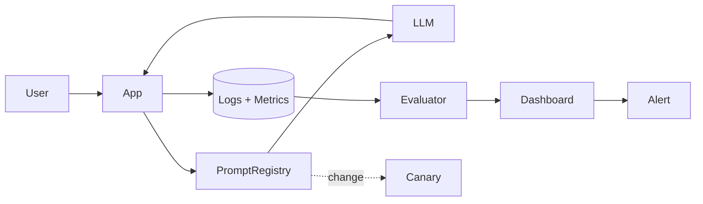

# Prompt changes

> **Learning Path:** LLMOps / AI Observability
> **Section:** 15.2.4 — AI-specific monitoring

### The problem

In traditional software, a change in behavior means a change in code. In AI systems, the same model can produce radically different outputs because the prompt changed.

A product team tweaks wording to improve tone. A guardrail is added. A system prompt is updated for a new feature. The change ships with no code deploy, no PR review, and no test suite run. Then success rate drops, latency spikes, or costs jump — and no one can point to what changed.

You need observability not just for model outputs, but for the prompt that drove them. Without it, you cannot attribute regressions, reproduce failures, or safely iterate.

### Mental model

Treat prompts as versioned, first-class artifacts, not strings in code.

A prompt version = model version + prompt template version + few-shot examples + parameters + tool definitions. Change any of those, and you have a new behavior surface.

AI-specific monitoring means linking every inference request to the exact prompt version that produced it, then correlating that version with quality, cost, and business metrics.

### How it works

The essential mechanism is lineage + telemetry + evaluation.

1. **Lineage capture.** Every request is tagged with `prompt_id`, `prompt_version`, `model_id`, `parameters`. This tag travels with logs, traces, and evaluation results.
2. **Version registry.** Prompts are stored in a registry with immutable versions, author, change reason, and rollout target. No in-place edits.
3. **Telemetry.** Log inputs, outputs, tokens, latency, cost, and tool calls. Emit metrics per prompt version.
4. **Evaluation gate.** On change, run the new version against a golden dataset and shadow traffic before promoting.
5. **Drift alerting.** Compare distributions of quality signals per version over time: e.g., average score, refusal rate, hallucination rate, token usage.

### Architectural reasoning

**When it helps:** You have multiple teams iterating prompts, A/B tests, or production incidents where output quality degrades.

**What it solves:** Attribution. You can answer: did this regression come from model, prompt, data, or traffic shift?

**Alternatives:**
* Git-only prompt storage. Gives version history but no runtime correlation to metrics.
* Manual annotation. Accurate but not scalable.
* Full model retraining monitoring. Misses prompt-only changes.

Choose prompt-level observability when prompt iteration velocity > code release velocity, which is almost always in LLMOps.

### Trade-offs and failure modes

* **Granularity vs noise.** Tagging every request is cheap; storing full prompts and examples per request is expensive. Store hash + reference, not full text.
* **Version explosion.** Rapid edits create many versions. Without pruning and naming conventions, dashboards become unusable. Enforce semantic versions and TTL for experiments.
* **Correlation ≠ causation.** Traffic mix shifts can mimic prompt regression. You need holdout traffic or controlled rollout to isolate prompt effect.
* **Non-determinism.** Same prompt + same input can yield different outputs. Aggregate metrics over windows, not single requests.
* **Security/privacy.** Prompts may contain PII or secrets. Redact before logging, and treat prompt registry as sensitive config.

Failure mode: silent rollback. A developer reverts a prompt in code without updating the registry, so telemetry still points to the old version. The fix is deployment guardrails: the app only loads prompts from the registry, never local strings.

### Example

A customer support bot uses a system prompt for refund policy. Version `v1.4` is in production.

Product adds a clarifying sentence in `v1.5`. Rollout is 10% canary.

Telemetry shows:
* `v1.5` average response length +23%, token cost +18%
* Customer satisfaction score drops from 4.2 to 3.7
* Refusal rate unchanged

The change is reverted before full rollout. Without prompt-version tagging, the team would have blamed model drift and wasted days.

### Reasoning challenge

You run two prompt variants for a summarization feature: `concise` and `detailed`. The `concise` variant shows a 5% drop in user click-through this week.

What do you check first, and what evidence would convince you the prompt is the cause and not traffic shift, model update, or upstream data change?

### Key takeaway

* Prompts are mutable behavior code. Version them immutably and ship them like code.
* Every inference must carry prompt lineage to enable attribution.
* Monitor prompt versions with the same rigor as model versions: quality, cost, latency, and business outcomes.
* Safe iteration requires canary + evaluation gates, not just logging.
