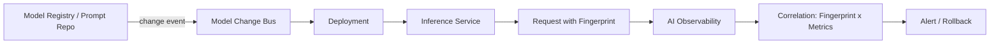

# Model changes

> **Learning Path:** LLMOps / AI Observability
> **Section:** 15.2.5 — AI-specific monitoring

### The problem

Traditional observability tells you *that* an AI service is degrading: latency up, error rate up, user satisfaction down. It rarely tells you *why*.

In LLMOps the service is a moving target. A model can be swapped, re-trained, or have its temperature changed. A prompt template is edited. The retrieval corpus is updated. Feature extractors are tweaked. All of these are code-equivalent changes, but they are often made without a deployment gate, and their effects are non-deterministic.

Without explicit tracking of model changes, you get silent regressions. A prompt optimization that improves latency by 12% also increases hallucinations, but the dashboards show only a dip in “good responses” with no causal link. Rollback becomes guesswork.

### Mental model

Treat the model and its operating context as configuration that changes over time, and make model change a first-class event.

A model change is not just `model_v3 -> model_v4`. It is a bundle:
`model artifact + prompt version + parameters + retrieval snapshot + feature pipeline version`.

If you can fingerprint that bundle on every request and correlate it with AI-specific metrics, you can attribute outcome shifts to a specific change.

### How it works

Capture a model fingerprint at inference time and emit it with telemetry.

```
request -> fingerprint -> inference -> metrics
```

The fingerprint is a small, immutable set: model_id, model_digest, prompt_version, system_prompt_hash, temperature/top_p, retriever_index_version, feature_schema_version.

Store it with the request context and the AI-specific signals you care about: latency, token usage, tool calls, guardrail hits, user rating, embedding drift, output quality proxy.

When a change is deployed, you compare pre/post distributions for the same traffic slice. Change detection is then a difference-in-differences problem, not a threshold alert.

Mermaid for the flow:



### Architectural reasoning

Model change observability helps when you have multiple moving parts and shared ownership.

* When it helps: prompt engineering teams, data teams updating corpora, MLOps releasing retrained models. You need to know who changed what and when quality moved.
* What it solves: attribution, safe rollout, compliance audit. You can answer “did the 3% drop in answer correctness start after prompt v42?”
* Alternatives: log only model name. That misses prompt tweaks and parameter changes. Rely on manual changelogs. That fails at scale.
* Why choose it: the cost of logging a fingerprint is tiny compared to the cost of an undetected regression in production.

### Trade-offs and failure modes

* Granularity vs noise. Fingerprinting every prompt token is too noisy. Fingerprinting only major model version is too coarse. The sweet spot is semantic versioning of prompt templates and config.
* Storage and cost. You are attaching metadata to high-volume inference logs. Sample or aggregate intelligently; keep full fingerprints for a window.
* Missing lineage. If a prompt edit is made in a UI without committing to a registry, the fingerprint is stale. Enforce that inference only loads versioned artifacts.
* False attribution. Data drift can look like model regression. You need to hold retrieval corpus version and input distribution constant in analysis.
* Change fatigue. Too many alerts on every parameter tweak. Gate changes behind canary/shadow and only alert on statistically significant shifts.

### Example

Enterprise customer support RAG.

Prompt v12 uses a single-shot instruction. Product team ships prompt v13 adding a “no hallucination” constraint. Simultaneously, the knowledge base is re-indexed to v7.

With fingerprinting, you see:
* Fingerprint A: model=gpt-4o-2024-08, prompt=v12, index=v6
* Fingerprint B: model=gpt-4o-2024-08, prompt=v13, index=v6
* Fingerprint C: model=gpt-4o-2024-08, prompt=v13, index=v7

Metrics show correctness up +2% for B vs A, latency +8%. Correctness drops -4% for C vs B. Attribution is clear: index update caused regression, not the prompt. Rollback index, keep prompt.

### Reasoning challenge

You are canarying a new fine-tuned model for 10% traffic. Prompt and retriever are unchanged. Latency is flat, but user thumbs-down rate rises from 4.2% to 5.9% with p<0.01. The model team claims the fine-tune improves intent classification on the training set.

What do you check before rolling back, and what additional fingerprint would you want to capture to avoid this debate next time?

### Key takeaway

* Model changes are first-class events. If you cannot identify what changed, you cannot attribute quality shifts.
* Fingerprint the full inference context: model artifact, prompt version, parameters, retriever/index version, feature schema.
* Correlate fingerprints with AI-specific metrics, not just latency/error.
* Use change detection with controlled rollouts, and enforce versioned artifacts so changes are observable by default.
