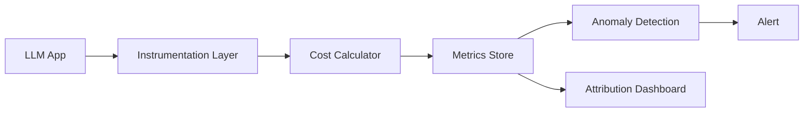

# Cost changes

> **Learning Path:** LLMOps / AI Observability
> **Section:** 15.2.6 — AI-specific monitoring

**Cost changes - AI-specific monitoring**

### 1. The problem

Traditional observability tells you if an API is up, slow, or erroring. LLM applications can be healthy by those metrics and still become unprofitable overnight.

Cost is not a function of request count. It is a function of:
* tokens in vs tokens out
* model choice and its price per token
* prompt length, system prompts, tool calls, retries
* caching hit rate
* user behavior changing average conversation length

A prompt engineer adds a 2k token context to every request. Traffic is flat. Latency is fine. Error rate is fine. Cost per request doubles. You find out on the invoice.

You need monitoring that tracks cost as a first-class signal, attributed to the business context that caused it.

### 2. Mental model

Think of cost as a derived metric, not an infrastructure metric.

`Cost = Σ [tokens_in * price_in + tokens_out * price_out + tool_calls * price_tool] per unit of business value`

The unit matters. Cost per request is noise. Cost per completed user task, per user, per feature, per customer tier is signal.

Cost changes monitoring is anomaly detection on that derived metric over time, with attribution to *why* it changed: model, prompt version, user segment, retrieval size.

### 3. How it works

Instrumentation sits at the inference boundary. Every LLM call is captured with:
* model id, provider, price version
* prompt tokens, completion tokens, cached tokens
* prompt version / system prompt hash
* request metadata: user id, feature, session id, customer tier

From that you compute:
* cost per request, cost per session, cost per successful outcome
* token usage distribution
* cost attribution by tag

These become time series in your metrics store. Alerts fire on deviation from a baseline, not absolute thresholds.

Implementation is thin: a wrapper around the provider SDK that emits a structured event, plus a cost table that maps model+date to price. The hard part is consistent tagging.

### 4. Architectural reasoning

When it helps:
* Production LLM workloads with variable prompts and user behavior
* Multi-model routing where price/performance trade-offs exist
* Product features where cost is a business constraint

What it solves: silent cost drift from prompt changes, context bloat, retrieval over-fetch, retry storms, and model price changes.

Alternatives:
* Invoice-level monitoring. Too late, no attribution.
* Request count * average tokens. Misses distribution shifts.
* Manual spot checks. Doesn't scale.

Choose cost change monitoring when cost is a KPI and the system has multiple levers that change token usage without changing traffic.

### 5. Trade-offs and failure modes

* Attribution vs overhead. Rich tagging enables root cause, but adds cardinality. Keep tags high value, low cardinality: feature, model, prompt version, user tier. Avoid per-user tags in hot metrics.
* Noise. Token usage is naturally bursty. Use session-level smoothing and compare to same-day-last-week, not minute-over-minute.
* Alert fatigue. Alert on cost per business outcome, not cost per token. A spike in tokens that improves success rate may be fine.
* Price drift. Model prices change. Your cost calculator must be versioned and updated independently of code deploys, otherwise you alert on your own pricing bug.
* Hidden costs. Tool calls, embeddings, vector DB reads, and retries are often missed. If you don't instrument them, you won't see the real change.

Failure mode: you alert on absolute cost increase during a marketing campaign. Correct response is to normalize by active users, not to roll back the prompt.

### 6. Example

Enterprise support chatbot with tiered pricing.

Baseline: cost per resolved ticket = $0.18. Prompt v1, retrieval top-k=3, model gpt-4o-mini.

Prompt v2 adds a 1,200 token "style guide" to the system prompt for every turn. Traffic unchanged. Latency unchanged. Error rate unchanged.

Cost per resolved ticket jumps to $0.31. The cost change dashboard shows the jump correlates 100% with prompt version change, not traffic or model. Attribution confirms tokens_in increased 1,200 per request.

Decision: keep style guide but move it to a one-time system message cached across turns, reducing cost back to $0.20.

Without cost change monitoring, the drift would have been discovered at month-end.

### 7. Reasoning challenge

You launch RAG for a premium customer segment. Average cost per query rises 2.2x. Simultaneously, average conversation turns per successful resolution drop from 4.2 to 2.1.

Do you alert, and on what metric? Would you roll back the change?

### 8. Key takeaway

* Monitor cost as a derived business metric, not raw token count.
* Attribute cost to model, prompt version, feature, and user segment to find why it changed.
* Alert on cost per outcome with baselines, not absolute spend.
* Cost observability is a control loop for prompt and routing decisions, not just FinOps.

You should be able to answer: what changed, where, why, and whether it matters to the business.
