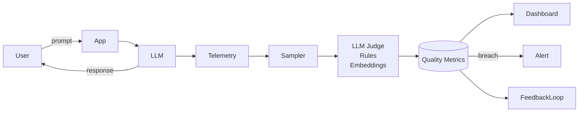

# Quality degradation

> **Learning Path:** LLMOps / AI Observability
> **Section:** 15.2.7 — AI-specific monitoring

## The problem

Your LLM service is green. Latency < 500ms, error rate 0.1%, costs on target. Production traffic is fine.

Outputs are getting worse. Answers are vague, off-brand, hallucinate product prices, or follow old policies. Users churn, but your SLOs don't move.

Traditional monitoring watches the system. AI-specific monitoring must watch the *output quality* over time. Quality degrades silently because models are not static: the world changes, your data distribution shifts, prompts rot, fine-tuning data ages, and user behavior feeds back into the system.

If you only alert on downtime, you find out too late.

## Mental model

Quality is a decaying signal, not a boolean.

Think of it as a control loop: `Input distribution -> Model behavior -> Output quality -> Business outcome`.

Quality degradation is any drift in that loop. It has three common sources:

* **Data drift / concept drift:** real-world inputs change. New slang, new products, new regulations. The model was trained on old distribution.
* **Prompt / system rot:** the prompt was optimal for launch data. As tasks evolve, instructions become misaligned. A/B tests, new tools, and guardrails change behavior.
* **Feedback loop poisoning:** the model generates outputs that become training or retrieval data for itself, amplifying errors.

You can't measure this with HTTP 200s. You need continuous, outcome-aligned quality signals.

## How it works

Quality monitoring is sampling + scoring + comparison.

**Sampling:** Capture a representative stream of real traffic, not just all traffic. Stratify by route, user segment, and risk. Keep a frozen golden set for regression.

**Scoring:** Because ground truth is rare for LLMs, you use layered proxies:
* **LLM-as-judge** for criteria like factuality, relevance, style adherence. Cheap and scalable, with known bias.
* **Embedding drift** on inputs and outputs vs baseline. Detects distribution shift early.
* **Rule-based checks** for hard constraints: PII leakage, policy violations, citation presence.
* **Business proxies:** task completion rate, escalation rate, user thumbs down, conversion.

**Comparison:** Track scores over time with statistical control limits. Alert on sustained degradation, not one-off variance.

## Architectural reasoning

When to invest in this? When quality variance costs more than monitoring cost.

It helps when:
* The model is exposed to open-ended user input and changing world knowledge.
* Outputs are subjective and business-critical: support, sales, medical triage, compliance.
* You ship iterative prompt changes, tool use, or fine-tunes.

Alternatives:
* **Static offline benchmarks.** Cheap, but lag real usage by weeks.
* **Human review only.** Ground truth, but too slow and expensive for continuous signals.
* **No monitoring.** Works until it doesn't; failure mode is silent reputational damage.

Decision: keep a cheap automatic signal always on, and sample expensive human review to calibrate it.

## Trade-offs and failure modes

* **Signal vs cost.** LLM-as-judge is cheap but drifts itself. Human labels are gold but sparse. You need a calibration loop.
* **Latency vs coverage.** Real-time scoring adds cost and latency. Most teams score async on sampled traffic.
* **False positives.** Natural variance in prompts causes jitter. Use rolling windows and control limits, not point alerts.
* **Goodhart.** Optimizing for proxy metrics can degrade real quality. If you reward low token count, answers get terse.
* **Label staleness.** Golden datasets become outdated. Rotate them quarterly and refresh with recent real examples.

Common failure: monitoring only outputs. Input drift often precedes output degradation. Track both.

## Example

Enterprise support chatbot.

Baseline quality measured by: relevance, correct product reference, and resolution without escalation.

Monitoring pipeline samples 5% of conversations. LLM judge scores relevance and policy adherence. Embeddings compare today's query distribution to last week's baseline. Business proxy = escalation rate to human agent.

Week 3: embedding drift spikes on "new pricing plan" queries. Judge relevance drops 8 points. Escalation rate rises from 12% to 19%. Alert fires before NPS drops.

Action: update retrieval index with new pricing docs, patch system prompt with new plan names, and re-run golden set regression.

Without quality monitoring, the team would have seen only stable latency and rising cost.

## Reasoning challenge

You have budget for 100 human ratings per day. Production handles 100k requests/day. Your automatic LLM judge correlates 0.72 with human on historical data.

Do you use those 100 ratings to:
A) Randomly sample production for drift detection, or
B) Focus ratings on the tail where automatic score is low or uncertain, and use them to recalibrate the judge?

What does your choice imply for detection latency vs calibration accuracy?

## Key takeaway

* Quality degrades from distribution shift and system changes, not just outages.
* Monitor outputs with layered proxies: automatic judges, embedding drift, rules, and business KPIs.
* Keep a cheap continuous signal always on, and use sparse human labels to calibrate it.
* Alert on sustained drift against a rolling baseline, not single samples.
* The goal is to detect *why* quality moved, not just *that* it moved.
