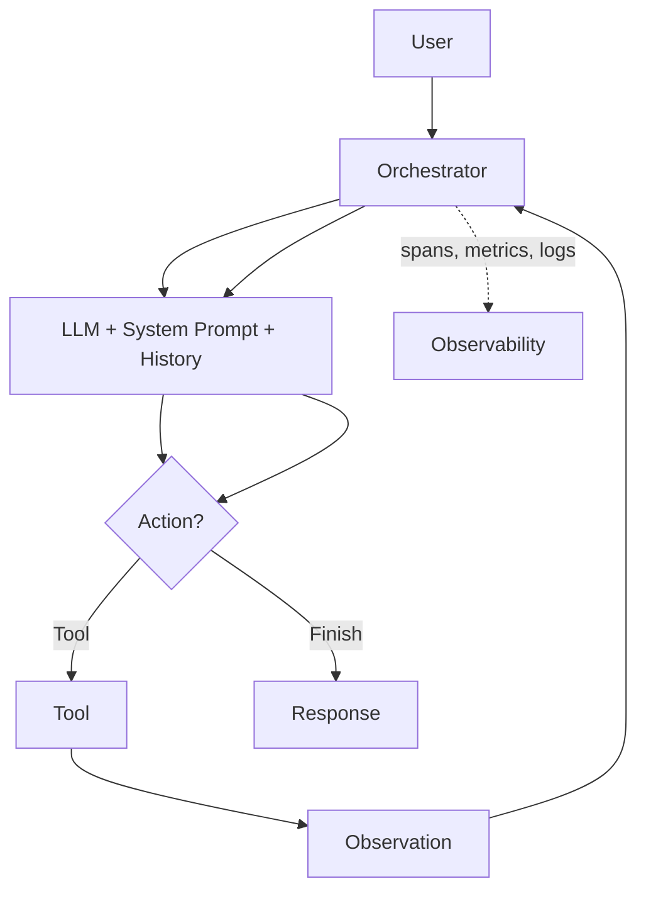

# Agent loops

> **Learning Path:** LLMOps / AI Observability
> **Section:** 15.2.8 — AI-specific monitoring

**Agent loops**

### 1. The problem

A single user prompt to an agent is not one inference. It is N inferences chained together with tool calls, retrieval, and state updates, where N is unknown until runtime.

Traditional request/response monitoring assumes: one input → one processing step → one output, deterministic latency, clear success/failure.

Agent loops break all three:
* **Variable length.** The same prompt can take 2 steps or 20 steps.
* **Stateful non-determinism.** The LLM decides what to do next based on previous tool outputs.
* **Side effects.** Each loop iteration can call external systems, write data, or spend money.

Without step-level visibility you cannot answer: Why did this request cost $1.20 and take 18s? Where did it stall? Did it hallucinate a tool result and loop forever?

### 2. Mental model

Think of an agent loop as a controller loop with an LLM as the controller.

State + Prompt → LLM → Decision: `Finish` or `Call Tool X with args` → Tool executes → Observation → State updates → back to LLM.

The loop terminates on `Finish`, max iterations, error, or context overflow. The observable unit is not the request, it is the iteration.

### 3. How it works

Each iteration produces three artifacts you must capture:
* **Reasoning trace:** what the LLM thought it needed and why
* **Action:** tool name, arguments, and execution metadata
* **Observation:** tool output, latency, success/error, token usage

Architecturally this is a parent span for the user request with child spans per iteration. The parent span aggregates cost, latency, and loop count. Child spans let you see which tool or prompt caused divergence.

AI-specific monitoring adds semantic signals on top of standard traces: loop count, tokens in/out per iteration, tool success rate, retrieval relevance, and policy guardrail hits.

### 4. Architectural reasoning

You instrument agent loops when the cost and risk are non-linear with steps.

When it helps:
* Tool-using agents, ReAct, multi-hop RAG, autonomous workflows
* Production where latency SLO and cost per request matter
* Safety/compliance where you must prove what the agent did

Alternatives:
* Request-level logging only. Cheaper, but you lose root cause for failures and cost spikes.
* Sampling. Works for high volume but misses rare long loops that drive cost.

Why choose fine-grained loop observability: the failure mode is rarely the LLM itself, it is the interaction between LLM decisions and tools over time. You need iteration-level causality to debug it.

### 5. Trade-offs and failure modes

* **Granularity vs overhead.** Capturing full prompts and tool I/O per iteration is expensive to store and PII-sensitive. Keep raw payloads short-lived, keep aggregated metrics long-term.
* **Infinite / runaway loops.** No natural stop condition. Monitor loop count distribution and set hard caps with alerting on p95 loop count growth.
* **Error amplification.** A flaky tool returns partial data → LLM retries with bad assumption → more calls. You need tool error rate correlated with loop length.
* **Context drift.** Each iteration grows context. Monitor tokens per iteration and context utilization. Sudden jumps signal prompt injection or retrieval pollution.
* **Non-determinism.** Same input can produce different paths. Use deterministic tracing IDs and store the exact prompt version + tool versions to reproduce.

### 6. Example

Enterprise support agent: retrieve ticket, call billing API, summarize.

Request arrives. Iteration 1: LLM retrieves ticket. Iteration 2: calls billing API with customer id. API times out. Iteration 3: LLM retries with different id format. Iteration 4: retrieves again, hallucinates a refund. Loop terminates.

With loop observability you see: parent latency 14.2s, 4 iterations, 3,200 input tokens, billing API p99 latency spike at iteration 2, tool success rate drop. Without it you only see “slow request”.

### 7. Reasoning challenge

Your agent’s p50 cost is $0.08, p99 is $2.40. Loop count p50 is 3, p99 is 19. No errors are logged. Where do you look first?

Think about what metric would explain cost divergence without explicit errors, and what loop-level signal would reveal it.

### 8. Key takeaway

* Agent monitoring is loop monitoring, not request monitoring. The unit of observability is the iteration.
* Capture parent request + child iteration spans with LLM decision, tool call, observation, tokens, latency, and cost.
* Watch loop count distribution, token growth per iteration, and tool error → loop amplification as early warning signals.
* Cap loops, version prompts/tools, and correlate semantic signals with traditional traces to make agentic systems operable.
