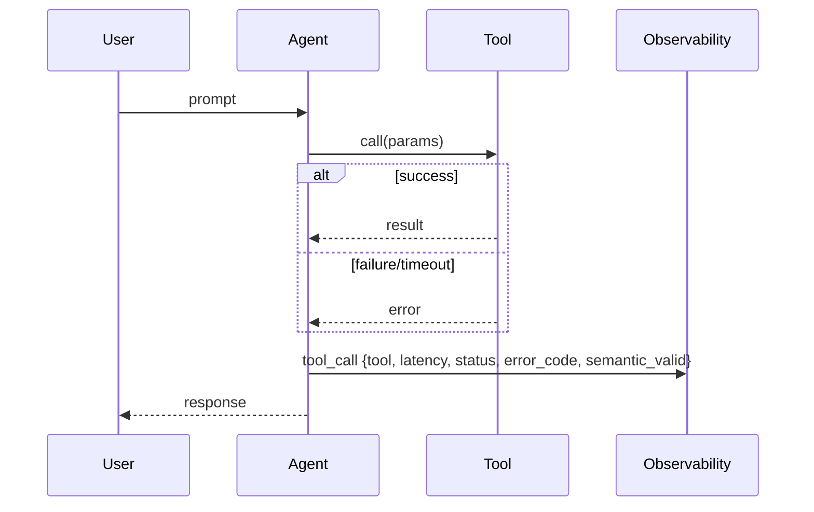

# Tool failures

> **Learning Path:** LLMOps / AI Observability
> **Section:** 15.2.9 — AI-specific monitoring

**Tool failures**

### The problem
An agent is only as good as the tools it can call. A search, DB query, API, or code executor can time out, return 5xx, rate limit, or return data that doesn't match the schema the LLM expects. 

The failure is not just an HTTP error. The LLM still has to produce an answer, so it will either hallucinate, retry with bad params, or silently degrade quality. Traditional uptime monitoring misses this because the tool is "up" but semantically useless for that turn.

You need observability into the tool *call* as a first-class event, not just service health.

### Mental model
Think of a tool call as an RPC with two failure domains:
1. **Transport**: network, timeout, rate limit, auth
2. **Semantic**: tool returned 200 but data is empty, stale, truncated, or schema-violated

The agent is a consumer with no backpressure control. One flaky tool can poison the whole reasoning chain.

### How it works
AI-specific monitoring treats each tool invocation as a trace span with:
* **Call metadata**: tool name, arguments, model turn id, latency
* **Outcome**: success / error type / retry count
* **Semantic validation**: did output satisfy the function schema? Was it empty? Did it change vs previous call?
* **Downstream effect**: did the agent continue, retry, switch tools, or hallucinate?

These events are emitted to your observability pipeline alongside LLM traces so you can correlate a bad answer to a bad tool.

### Architectural reasoning
When to care: any agent with external tools, especially RAG, web search, internal APIs, or code execution.

Options:
* **Retry with backoff** for transient errors
* **Fallback tool** for redundancy, e.g., web search if vector DB fails
* **Circuit breaker** to stop hammering a degraded tool
* **Validation + guardrail** to reject semantically bad outputs before they reach the LLM

Why choose observability first? You cannot decide between retry vs fallback without knowing *which* failure mode dominates, its blast radius, and its correlation with bad user outcomes.

### Trade-offs and failure modes
* **Retry storms**: naive retries amplify load during an outage. You need jitter + budget.
* **Masking**: catching errors and returning empty results makes the tool look healthy while quality drops.
* **Latency budget**: tool calls are on the critical path. Long tail latency forces the agent to choose between waiting or degrading.
* **Semantic drift**: tool works but returns stale data. You need freshness signals, not just HTTP 200.
* **Cost vs fidelity**: more validation and retries improve answer quality but increase LLM tokens and latency.

### Example
Enterprise support agent with three tools: vector_search, web_search, ticket_api.

Vector DB starts timing out at p95 > 4s during peak. The agent retries twice, then falls back to web_search. Observability shows:
* tool_call success rate drops from 98% to 61%
* agent fallback rate spikes
* user satisfaction drops only on queries needing internal KB

Decision: circuit breaker for vector_search after 2 failures/30s, with a fallback to a cached snapshot and an alert to SRE. Without tool-level traces, you would have seen only "LLM latency up".

### Reasoning challenge
Your agent uses a calculator tool and a web search tool. Calculator is 99.9% reliable but slow at 800ms p95. Web search is fast but returns malformed JSON 5% of the time.

You have a 2s end-to-end latency SLO. Do you validate and retry web search, drop it, or accept malformed outputs and let the LLM repair? What metric would you watch to decide?

### Key takeaway
* Tool failures are semantic failures, not just HTTP errors. Monitor call outcome + output validity.
* Correlate tool health to agent behavior and user outcomes, not just service uptime.
* Design failure modes explicitly: retry budget, circuit breaker, fallback tool, and graceful degradation.
* Observability must be in the request path; you cannot fix what you cannot attribute to a specific tool call.
