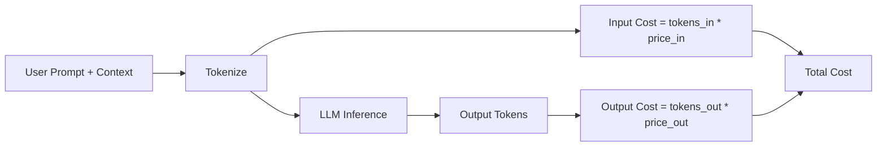

# Token economics

> **Learning Path:** AI Cost Architecture
> **Section:** 16.1.1 — Learn to reason about

**Token economics**

### 1. The problem

LLM inference is not priced per request, it is priced per token. One user prompt can be 200 tokens, another 4,000. One answer can be 100 tokens, another 2,000.

That means cost is variable, non-linear, and invisible at design time. A feature that works in a demo can bankrupt you in production when users write long prompts, upload documents, or chain multiple model calls.

The architect's problem is not just accuracy, it is controlling a metered resource that scales with user behavior, context size, and model choice.

### 2. Mental model

Think of tokens as a currency you spend per interaction.

* Input tokens = cost to read. Output tokens = cost to write, usually 2-5x more expensive.
* Context window = your wallet size. Every token you keep in context is a token you pay to re-process on every call.
* Latency and cost are coupled. Larger inputs = more compute.

Token economics is budgeting that currency across the system: per request, per user, per session, per product.

### 3. How it works

A request is tokenized, priced, and executed.

Key levers:
* **Model tier:** Same task on `gpt-4o-mini` vs `gpt-4o` can be 10x cost difference.
* **Context efficiency:** Retrieval, summarization, and truncation reduce tokens_in.
* **Output control:** Max tokens, stop sequences, structured output reduce tokens_out.
* **Caching:** Repeated system prompts and retrieved chunks can be cached, often at 50-90% discount.

### 4. Architectural reasoning

Token economics forces decisions early.

* **When it helps:** Any production AI feature with unbounded user input, multi-turn conversation, or RAG.
* **What it solves:** Unpredictable cost, latency spikes, rate limit exhaustion.
* **Alternatives:** Fixed compute like traditional APIs. You cannot.

Architectural pattern: put a Token Budget Enforcer in front of the model.

User → Gateway → Budget Check → Router → LLM

The router chooses model and context strategy based on budget remaining, task complexity, and SLA.

### 5. Trade-offs and failure modes

* **Quality vs cost.** More context and bigger models improve quality but increase cost super-linearly. The sweet spot is usually smaller model + better retrieval, not bigger model + more context.
* **Latency vs context.** Streaming helps perceived latency, but total tokens still cost the same. Large context windows increase time-to-first-token.
* **Prompt compression vs fidelity.** Summarizing history saves tokens but loses nuance. Truncating loses recency.
* **Failure modes:** Cost explosion from prompt injection with huge payloads, runaway agents that loop calling themselves, and “context bloat” where conversation history grows unbounded.

Common anti-pattern: treating the LLM like a free function. No token caps, no model routing, no observability.

### 6. Example

Enterprise support chatbot with RAG.

Naive: full conversation history + full document chunks per turn. 6k input tokens, 500 output tokens per request. 10k users/day = $1,200/day.

Architected:
* History summarized to 500 tokens after 5 turns
* Retrieval limited to top 3 chunks, 800 tokens
* Router: simple routing → `mini`, complex troubleshooting → `large`
* System prompt cached

Result: ~1.2k input tokens, 300 output tokens. Cost ~ $220/day with comparable CSAT.

The decision was not “better prompt”. It was token budget as a first-class constraint.

### 7. Reasoning challenge

Your summarization API costs spiked 4x last week. Logs show average input tokens per request grew from 2k to 7k.

Do you:
A) Increase rate limits and absorb cost
B) Cap input size and reject long requests
C) Add a pre-processing step that extracts key sections before summarization and route by document type

What do you measure first, and what architectural change do you make?

### 8. Key takeaway

* Token cost is a system design constraint, not an ops surprise.
* Optimize tokens_in before tokens_out: retrieval quality, context pruning, and caching beat bigger models.
* Route by task complexity and enforce per-user/session token budgets.
* Measure tokens per request, per user, per feature, and alert on distribution shifts, not just averages.
