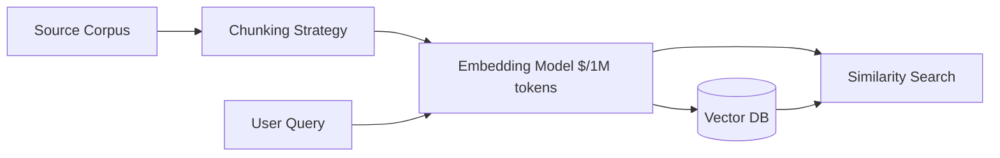

# Embedding costs

> **Learning Path:** AI Cost Architecture
> **Section:** 16.1.10 — Learn to reason about

**Embedding costs**

### 1. The problem

You want semantic search, RAG, or classification over your own data. That requires turning text into vectors. The vectorization step is cheap per request, expensive at scale.

The problem is not the model call for one query. It is the *ingestion* cost: every document, every chunk, every update must be embedded once, and then stored and maintained. For a corpus of millions of documents, embedding costs dominate the AI bill long before LLM inference does.

You are forced to reason about: how much text to embed, how often, with which model, and where to stop.

### 2. Mental model

Embedding cost = **Token volume × Model price** + **Storage + Compute overhead**.

Token volume is driven by corpus size, chunk size, and refresh frequency. Model price is driven by dimensionality and quality tier. Storage is driven by vector count × dimensionality × precision.

Think of it as a pipeline tax. Every byte you push through the embedder is billed, and it stays in your vector DB forever unless you delete it.

### 3. How it works

Ingestion is one-way and batchable. Query is real-time and small.

Costs accrue in three places:
* **Ingestion:** `sum(tokens per chunk) * price_per_token`. Chunk size and overlap multiply tokens.
* **Storage:** `num_vectors * dimensions * bytes_per_dim`. A 1536-dim float32 vector is ~6KB. 10M vectors = 60GB before indexes.
* **Ops:** Re-embedding on updates, re-chunking on schema changes, and cache misses.

### 4. Architectural reasoning

Embedding costs force explicit decisions about fidelity vs economy.

When it helps:
* You need semantic recall beyond keyword search
* You have a stable corpus with infrequent updates
* You can tolerate a one-time ingestion cost amortized over many queries

Alternatives and why you might choose them:
* **Smaller model, larger chunks:** e.g., 384-dim vs 1536-dim. Cuts storage and ingestion price 2-4x. Acceptable when recall is coarse.
* **Selective embedding:** Only embed high-value objects. Summaries, FAQs, tickets with SLA. Skip raw logs.
* **Cache embeddings:** Content hash → vector. Avoid re-embedding identical chunks.
* **Tiered models:** Cheap model for first-pass retrieval, expensive model for reranking.
* **Batch and off-peak:** Ingestion is bursty. Batching reduces latency pressure and lets you use spot compute for preprocessing.

Decision rule: Embed the minimal representation that satisfies recall requirements for the query distribution.

### 5. Trade-offs and failure modes

* **Quality vs cost:** Bigger models improve recall but cost linearly more per token and increase storage. Most teams over-spec the model for the first pass.
* **Chunk size:** Smaller chunks improve granularity but increase token count and vector count. Overlap adds 10-30% extra tokens for minimal gain.
* **Freshness vs spend:** Re-embedding the whole corpus on every update is simple and ruinous. Use incremental updates + versioned embeddings.
* **Dimensionality vs precision:** Quantization to int8 cuts storage ~4x with small recall loss. Worth it at >10M vectors.
* **Hidden cost:** Vector DB read/write and egress, not just the embed model. A cheap embedder with an expensive DB can be worse.

Common failure: Embedding everything forever with the largest model and no cache. You get great offline benchmarks and an unpredictable bill.

### 6. Example

Enterprise support knowledge base: 2M articles, average 2k tokens per article.

Naive: 2k token chunks with 20% overlap → ~1.2M chunks. Embed with 1536-dim model at $0.10 / 1M tokens = $120 ingestion. Storage ~7GB. Acceptable.

Scale to 20M customer tickets, daily updates. Same naive approach = $12k ingestion + re-embedding churn.

Architected: Hash-dedupe chunks, embed only tickets closed >30 days with high search volume, 512 token chunks no overlap, 384-dim model for first pass. Cost drops 10x, recall on top queries stays within 3%.

### 7. Reasoning challenge

You have 5M product descriptions that change weekly. Queries are short and high-volume. Do you:
A) Embed the full description with a large model every week
B) Embed a 200-token summary with a small model daily and full description with large model on-demand
C) Embed once with large model and never update

What metric would you monitor to know you are over-embedding?

### 8. Key takeaway

* Embedding cost is driven by token volume, not query count. Optimize ingestion first.
* Model size and dimensionality drive both inference price and storage cost. Match fidelity to retrieval tier.
* Chunking strategy is a cost lever. Larger chunks, less overlap, and deduplication cut spend with minimal recall loss.
* Treat embeddings as a data asset with lifecycle: version, cache, incremental update, and retire.

You should be able to reason: given a corpus size, update cadence, and query quality target, what is the cheapest embedding pipeline that still meets recall.
