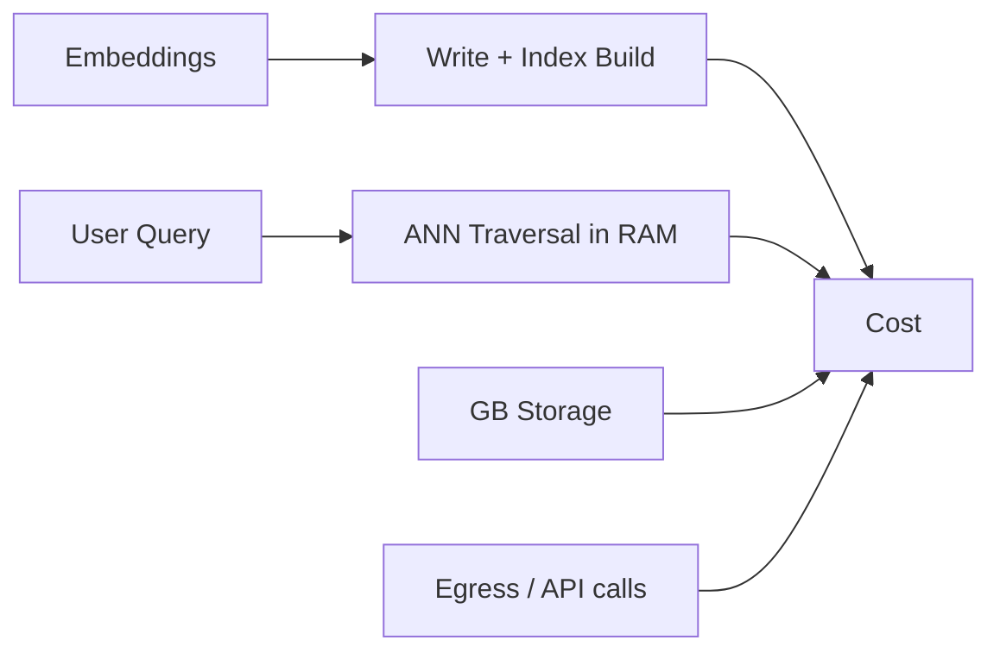

# Vector database costs

> **Learning Path:** AI Cost Architecture
> **Section:** 16.1.11 — Learn to reason about

**Vector database costs**

### 1. The problem

You shipped a RAG prototype. It works. You put it in production and the bill arrives. The vector database is the line item you didn’t model.

The problem isn’t “vectors are expensive”. The problem is that vector search cost is driven by things you don’t see in a relational DB: query-time compute for approximate nearest neighbor, memory-resident indexes, write amplification from index rebuilds, and dimensionality.

A relational DB cost model is roughly: storage + IOPS + compute. A vector DB cost model is: storage + memory + ANN compute per query + ingestion cost per vector + update cost. All of them scale non-linearly.

### 2. Mental model

Think of a vector DB as a search engine with two cost centers:

* **Ingestion path:** embed → write vector → build/maintain ANN graph. This is write-amplified. One vector insert can touch dozens of graph nodes.
* **Query path:** read the graph from RAM, traverse it, re-rank. Cost is per query, per recall target, per filter complexity.

Cost = f(QPS, dimensionality, index type, recall, update frequency, replication, retention)

Storage is the smallest part.

### 3. How it works

Pricing models vary but map to the same primitives:

* **Managed services:** Pinecone, Weaviate Cloud, Qdrant Cloud charge per server/node, per hour, and often per million vector operations. You pay for memory because HNSW lives in RAM.
* **Self-hosted:** you pay for instance class, memory, and ops. Cost is hidden in over-provisioning for peak QPS and for rebuilds.
* **Disk-ANN options:** pgvector, LanceDB, Milvus disk-indexed tiers trade latency for lower memory cost.

Key drivers:
* **Dimensionality:** 1536-d vs 768-d ≈ 2x memory and compute per query.
* **Recall target:** top-k with ef_search=200 vs 50 is a 3-4x compute difference.
* **Filters:** post-filtering scans many neighbors; pre-filtering prunes the graph but reduces selectivity.
* **Updates:** HNSW is append-friendly but deletions create tombstones. Full re-indexing is expensive.

### 4. Architectural reasoning

When does a vector DB cost matter?

* High QPS retrieval in a product feature, not a nightly batch.
* Large corpus with frequent updates. Rebuilding an index on 100M vectors is not free.
* Multi-tenant with strict latency SLOs.

Alternatives:
* **SQL + vector:** pgvector is cheap for <10M vectors and low QPS. You pay in latency and recall.
* **Hybrid:** store vectors in object storage, use a small hot index for recent items, and do coarse filtering in SQL first.
* **Self-hosted vs managed:** managed buys elasticity and ops; self-hosted buys control and predictable cost at scale.

Choose managed when QPS is spiky and team is small. Choose self-hosted when cost per query dominates and you can batch ingest and tolerate ops overhead.

### 5. Trade-offs and failure modes

* **Recall vs cost:** Higher ef_search / M increases recall but linearly increases CPU and P99 latency. Most teams over-provision recall in dev.
* **Memory vs latency:** HNSW in RAM is fast and expensive. Disk-ANN cuts memory 5-10x but adds tail latency.
* **Write frequency vs index freshness:** Real-time ingest keeps index hot and costs more. Batch + periodic rebuild is cheaper but stale.
* **Filter abuse:** `WHERE user_id = X` on a 10B vector index without partition keys forces a full graph scan. Architects often pay for this.
* **Embedding bloat:** Storing 3072-d float32 vectors = 12KB per vector. At 100M vectors that’s 1.2TB RAM before replication. Quantization to int8 cuts cost ~4x with minor recall loss.

Failure mode: cost spikes from a marketing campaign driving QPS 10x, with no autoscaling limit and no query cost guardrails.

### 6. Example

Enterprise support RAG with 50M support articles, 1536-d embeddings, 200 QPS peak.

Option A: Fully managed Pinecone p2 pods, 3 replicas, HNSW in RAM. Cost dominated by memory + QPS. Works, expensive.

Option B: Hot/warm split. Last 12 months in managed vector DB for low latency. Older corpus in S3 + LanceDB with IVF-PQ, queried only on misses. SQL filters by product line first to reduce candidate set. Cost drops ~60%, P99 rises from 40ms to 180ms on cold hits, acceptable for support.

The decision was driven by access pattern, not vector DB features.

### 7. Reasoning challenge

You have a customer-facing semantic search with 500 QPS peak, 20M vectors, daily updates of ~50k vectors, 100ms P99 SLO.

Option 1: Managed HNSW, 2 replicas, autoscaling.
Option 2: Self-hosted Qdrant on 3x r6g.2xlarge, nightly incremental merge, with a read cache.

Which cost driver would you measure first before choosing, and what guardrail would you put in place to prevent surprise spend?

### 8. Key takeaway

* Vector DB cost is query compute and memory, not storage.
* Dimensionality, recall settings, and filter design are cost levers, not just accuracy knobs.
* Update frequency dictates whether a live ANN index is worth it or a batch rebuilt index is cheaper.
* Design for hot/warm data and filter pushdown before scaling the vector cluster.
